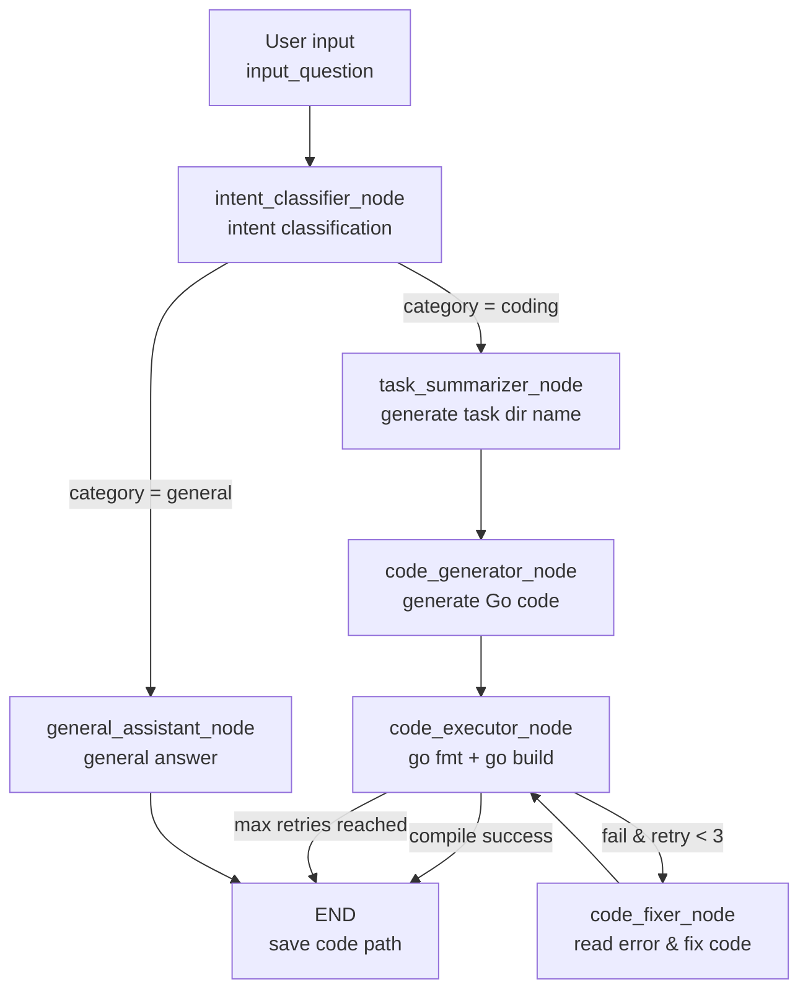

# CodeEngine

A LangGraph-based agent workflow that automatically **classifies user intent**. For coding questions it generates compilable **Go (Golang)** code and automatically fixes compilation errors; for general questions it provides a brief answer.

The entire pipeline is orchestrated by a state graph (`StateGraph`), and every node performs inference by calling a local Ollama-served LLM.

---

## ✨ Features

- **Intent classification**: automatically determines whether a question is `coding` (programming) or `general` (general Q&A).
- **Task naming**: summarizes a programming question into a `snake_case` directory name, used to isolate the code generated for each task.
- **Go code generation**: produces complete, runnable Go code (with a `main` function) for LeetCode-style algorithm problems.
- **Compile self-check + auto-fix**: after generating code, automatically runs `go fmt` and `go build`. On compile failure, an LLM reads the error and fixes the code, **retrying up to 3 times**.
- **Per-node logging/tracing**: built-in decorators `trace_node` / `trace_node_detailed` record each node's entry, duration, and state input/output for easy debugging.
- **Decoupled prompts**: all prompts live in Markdown files under `prompts/`, so they can be tuned without touching business logic.

---

## 🏗️ Workflow



---

## 📁 Project Structure

The repo is organized into three layers: a **web** main line, **feature** packages
(problems enrichment + the solver pipeline), and a **shared infrastructure** package.

```
code-engine/
├── web/                     # Web service main line (uvicorn web.main:app)
│   ├── main.py              # uvicorn entry point
│   ├── api.py               # FastAPI app factory (registers routers, middleware, static UI)
│   ├── schemas.py           # Pydantic request/response models
│   ├── dependencies.py      # Shared paths + cross-cutting helpers
│   └── routes/
│       ├── meta.py          # /health, /api/stats
│       ├── problems.py      # /api/problems/* (list, detail, pull, generate)
│       └── go_code.py       # /api/go-code/* (list, detail, raw)
│
├── features/                # Business feature packages (also runnable standalone)
│   ├── problems/            # LeetCode problem-set enrichment (GraphQL -> Markdown)
│   │   ├── client.py        # GraphQL HTTP client
│   │   ├── models.py        # normalize_problem / render_problem_markdown / Go template
│   │   ├── storage.py       # save / load / index
│   │   ├── service.py       # resolve_problem / enrich_problem_set / problem_to_input
│   │   └── example/         # CLI: python -m features.problems.example.main
│   └── solver/              # LangGraph code-generation pipeline
│       ├── state.py         # AgentState (TypedDict)
│       ├── executor.py      # Go code extract -> write -> go fmt -> go build
│       ├── nodes.py         # Node logic (classify / generate / execute / fix)
│       ├── workflow.py      # StateGraph orchestration (nodes + routing)
│       ├── service.py       # run_pipeline / generate_for_problem
│       └── example/         # CLI: python -m features.solver.example.main
│
├── infrastructure/          # Shared, dependency-light internals
│   ├── paths.py             # PROJECT_ROOT / PROMPT_DIR / DEFAULT_PROBLEMS_DIR / DEFAULT_GO_CODE_DIR
│   ├── logger.py            # Logging and node-tracing decorators
│   ├── constants.py         # State keys, node names, categories, prompt keys
│   ├── config.py            # Prompt loading + model registry (models.yaml)
│   └── models.yaml          # Model registry: per-model params (model tag, base_url, thinking toggle, ...)
│
├── prompts/                 # Prompts for each node (Markdown)
│   ├── intent_classifier.md
│   ├── task_summarizer.md
│   ├── code_generator.md
│   ├── code_fixer.md
│   └── general_assistant.md
├── frontend/                # Static UI (served at /ui/)
└── output/
    ├── go-code/             # Generated Go code (one folder per task)
    │   └── <task_name>/<task_name>.go
    └── problems/            # Enriched LeetCode problem set (see below)
        ├── problems_index.json  # Lightweight index for fast lookup
        ├── README.md        # Problem index (table of all problems)
        ├── <slug>.json      # Canonical record (machine-readable)
        └── <slug>.md        # Human-readable view (optional, derived)
```

---

## 📋 Requirements

- **Python** >= 3.10
- **Go** toolchain (the `go` command must be available, used for `go fmt` / `go build` compile checks)
- **Ollama**: running locally, listening on `http://127.0.0.1:11434`
  - Default model: `minimax-m3:cloud` (configured in `models.yaml`)
  - Alternative local model: `reecdev/qwen3.5-lowvram:9b`

---

## 🚀 Installation

```bash
# 1. Install Python dependencies
pip install -r requirements.txt
#    (or manually: pip install langgraph langchain-ollama pyyaml)

# 2. Install and start Ollama, then pull the required model
ollama pull minimax-m3:cloud
# or the local small model
ollama pull reecdev/qwen3.5-lowvram:9b

# 3. Make sure Go is installed and on your PATH
go version
```

---

## ⚙️ Configuration

Model configuration lives in **`infrastructure/models.yaml`** (separated from
`infrastructure/config.py` so each model can carry its own invocation parameters).
`infrastructure/config.py` loads it on import and builds one `ChatOllama` instance
per model. Project paths (root, prompts, output dirs) are centralized in
`infrastructure/paths.py` so no business module derives paths from `__file__`.

```yaml
default: minimax          # which model `config.llm` uses
timeout: 300              # global wall-clock cap (s) per model call; per-model override below

models:
  local:                  # local model: reasoning OFF -> lower latency
    model: reecdev/qwen3.5-lowvram:9b
    thinking: false
    timeout: 300          # abort & escalate if a single call exceeds 5 min
  minimax:                # online model: reasoning ON  -> higher accuracy
    model: minimax-m3:cloud
    thinking: true
    timeout: 300
```

| Key in `models.yaml` | Meaning |
| --- | --- |
| `type` | `local` or `online` (semantics only) |
| `provider` | Currently only `ollama` is supported |
| `model` | Ollama model tag |
| `base_url` | Ollama endpoint (default `http://127.0.0.1:11434`) |
| `temperature` / `top_p` | Sampling params passed to `ChatOllama` |
| `thinking` | Reasoning toggle — `false` for local (speed), `true` for online (accuracy). Mapped to langchain-ollama's `reasoning` field (or `thinking` on older versions) |
| `timeout` | Wall-clock cap (seconds) for a single model call. On timeout, escalatable roles retry on `escalate_to` instead of hanging. Defaults to the top-level `timeout:` (300s). |
| `extra_params` | Extra Ollama options forwarded as `model_kwargs` (`num_ctx`, `repeat_penalty`, `stop`, ...) |

`infrastructure/config.py` exposes:

| Symbol | Description |
| --- | --- |
| `llm` | The default model's `ChatOllama` instance (used by all nodes) |
| `MODELS` | `dict` mapping model name → `ChatOllama` |
| `get_llm(name=None)` | Returns a specific model's instance, or the default |
| `available_models()` | List of model names defined in `models.yaml` |
| `invoke_model(role, prompt, ...)` | Resolve the right model (role + retries + difficulty), enforce timeout |
| `PROMPTS` | The loaded prompt dictionary |

`infrastructure/paths.py` exposes:

| Symbol | Description |
| --- | --- |
| `PROJECT_ROOT` | Repo root directory |
| `PROMPT_DIR` | `PROJECT_ROOT / "prompts"` |
| `MODEL_CONFIG_PATH` | `PROJECT_ROOT / "infrastructure" / "models.yaml"` |
| `DEFAULT_PROBLEMS_DIR` | `PROJECT_ROOT / "output" / "problems"` |
| `DEFAULT_GO_CODE_DIR` | `PROJECT_ROOT / "output" / "go-code"` |

> To switch the active model, change `default:` in `models.yaml` (e.g. to `local`).
> To route a specific node to a different model, call `get_llm("local")` inside that node.

### Per-node model routing

`models.yaml` also has a `routing` section that balances local vs online usage
across the workflow, so cheap/low-risk steps don't burn online quota:

```yaml
routing:
  roles:
    intent_classifier: local     # rarely wrong -> always local
    task_summarizer: local       # rarely wrong -> always local
    code_generator: local        # start local; escalate on failure
    code_fixer: local            # start local; escalate on failure
    general_assistant: local      # flip to 'minimax' for online-quality answers
  escalate_after_retries: 1      # after 1 failed build, coder/fixer go online
  escalate_to: minimax
  escalate_roles: [code_generator, code_fixer]
  hard_escalate_roles: [code_generator, code_fixer]  # LeetCode "Hard" -> online immediately
```

How it behaves:

- **intent_classifier / task_summarizer** → always the **local** model.
- **code_generator / code_fixer** → **local** on the first attempt (easy problems
  solved fast/cheap). Once the local model has failed `escalate_after_retries`
  build attempts — or the problem is a LeetCode **"Hard"** one (difficulty is
  threaded into the workflow from the resolved problem record) — the coder/fixer
  escalate to the **online** model (`escalate_to`) for the remaining attempts.
  This means a hard problem the local model can't crack within its VRAM/capability
  limits automatically gets online help, and hard problems skip the slow local
  attempt entirely.
- **Every model call** is capped by its `timeout` (default 5 min). If the **local**
  model blows the budget, escalatable roles automatically retry on the **online**
  model rather than hanging the whole workflow (the production log once showed a
  local call running ~13 minutes — this guard prevents that).

`config.invoke_model(role, prompt, retry_count=..., difficulty=...)` is what the
nodes call; it resolves the right model (role + retries + difficulty), enforces the
timeout, and logs `🔀 [Model Route] <role> -> <model>` (with `retry`, `difficulty`,
and `timeout`) at runtime so you can watch the balancing happen.

---

## 💻 Usage

The solver is run via **`features/solver/example/main.py`**, which accepts a
**flexible input** — either a custom question or a LeetCode problem resolved from
your local cache (or fetched live).

```bash
# Built-in example problem (binary tree serialization/deserialization).
python -m features.solver.example.main

# Run a specific LeetCode problem by slug / ID / title / URL.
python -m features.solver.example.main --problem two-sum
python -m features.solver.example.main --problem 2
python -m features.solver.example.main --problem "https://leetcode.com/problems/two-sum/"
python -m features.solver.example.main --problem "add two numbers"          # title substring match

# Run from a saved problem file (.json or .md).
python -m features.solver.example.main --file output/problems/two-sum.json

# Run an arbitrary custom question.
python -m features.solver.example.main --custom "Implement an LRU Cache in Go"

# List cached problems and exit.
python -m features.solver.example.main --list-problems

# Only resolve from the local cache; never fetch from LeetCode.
python -m features.solver.example.main --problem two-sum --no-live
```

If no source is given, the built-in example problem is used. The resolved text
becomes the ``input_question`` fed to the workflow:

```python
from features.solver.service import run_pipeline

result = run_pipeline(input_question, difficulty, leetcode_slug)
```

After running, the logs will output:

- On compile success: `save code to: <code_path>` and `compile check result`
- For general questions: `final_output` is printed directly

Generated Go code is saved to `output/go-code/<task_name>/<task_name>.go`.

---

## 🔁 Compile-Fix Strategy

`features/solver/executor.py` (`execute_go_code`) extracts the Go code block from
the response via regex, writes it to a file, and runs:

1. `go fmt`: format the code;
2. `go build -o /dev/null`: compile check only;
3. If `returncode != 0`, pass the error and original code to `code_fixer_node`, which fixes it via the LLM and recompiles;
4. If the retry counter `retry_count` reaches **3** without success, stop to avoid an infinite loop.

---

## 📚 LeetCode Problem Enrichment

`features/problems` enriches the local problem set by querying LeetCode's public
GraphQL API (using the same queries as
[akarsh1995/leetcode-graphql-queries](https://github.com/akarsh1995/leetcode-graphql-queries)).
Each problem is stored as a **canonical JSON record** (`<slug>.json`), which is
the machine-readable source of truth the workflow reads when you pass
`--problem` to `features/solver/example/main.py`. A human-readable **Markdown view**
(`<slug>.md`) and a lightweight **index** (`problems_index.json` + `README.md`) are
derived from it.

- `output/problems/<slug>.json` — the canonical record (title, difficulty, tags,
  link, cleaned description, examples, hints, and a reconstructed **Go template**).
- `output/problems/<slug>.md` — the same content rendered as Markdown for browsing.
- `output/problems/problems_index.json` — a lightweight index for fast lookup.
- `output/problems/README.md` — the full problem index (a table of all fetched problems).

> The Go template is rebuilt from the problem's `metaData` because LeetCode does
> not return a Go snippet server-side.

It is dependency-free — only the Python standard library is used (HTTP via
`urllib`, HTML→Markdown via a small regex pipeline).

### Command line

```bash
# Fetch the first 50 problems (default) and write the index + per-problem files.
python -m features.problems.example.main

# Fetch a specific number, with a polite delay between detail requests.
python -m features.problems.example.main --limit 200 --delay 0.3

# Fetch EVERY available problem (thousands — can take a while).
python -m features.problems.example.main --all --delay 0.3

# Only write the index, skip per-problem detail files.
python -m features.problems.example.main --no-details

# Write JSON + index only, skip the per-problem .md view.
python -m features.problems.example.main --no-md
```

### As a library

```python
from features.problems.service import enrich_problem_set, resolve_problem, problem_to_input

# Default: first 50 problems to output/problems.
summary = enrich_problem_set()

# Everything, into a custom directory.
summary = enrich_problem_set(output_dir="output/problems", max_problems=None, delay=0.3)
print(summary)  # {'output_dir': '...', 'problem_count': 4018, 'index_path': '...', 'index_json_path': '...'}

# Build a workflow input from a LeetCode problem (local cache, then live fetch).
record = resolve_problem("two-sum")
input_question = problem_to_input(record)
```

> **Note:** LeetCode's list endpoint is paginated; the script pages through it
> automatically. Paid-only problems are marked in the index but their full
> description is not always returned by the public API.

---

## 🌐 Web Service

The web layer is the production main line. It serves the generated artifacts
(problems + Go code) over a FastAPI app and mounts the static UI at `/ui/`.

```bash
# Production start (uvicorn entry point: web.main:app)
uvicorn web.main:app --reload --port 8000

# Or equivalently:
python -m web.main
```

Then open **http://localhost:8000/ui/** in a browser. The API docs live at
**/docs**. Key endpoints:

| Method | Path | Description |
| --- | --- | --- |
| `GET` | `/health` | Health / endpoint list |
| `GET` | `/api/stats` | Overview counts (problems, go-code) |
| `GET` | `/api/problems` | List problems (filter + sort + paginate) |
| `GET` | `/api/problems/{identifier}` | Full problem record (slug / id / title / URL) |
| `GET` | `/api/problems/{identifier}/go-code` | Best-effort Go code linked to a problem |
| `POST` | `/api/problems/pull` | Pull NEW problems from LeetCode (bulk) |
| `POST` | `/api/problems/{identifier}/pull` | Pull a single problem by slug / URL |
| `POST` | `/api/problems/{identifier}/generate` | Generate Go code for a cached problem |
| `GET` | `/api/go-code` | List generated Go code (search + paginate) |
| `GET` | `/api/go-code/{task_name}` | Full Go code (metadata + source) |
| `GET` | `/api/go-code/{task_name}/raw` | Raw `.go` file (`FileResponse`) |

The `/generate` route (and the solver pipeline generally) is imported **lazily**
inside the handler, so the API starts even if `langgraph` / `langchain-ollama`
are not installed — those are only required when you actually call `/generate`.

## 📝 Notes & Limitations

- Currently only **Go** code generation and compile checking are supported (the regex and commands in `features/solver/executor.py` are Go-specific).
- Intent classification relies on the prompt instructing the model to output only the words `coding` / `general`, so it places some demand on the model's instruction-following ability.
- The project ships a `requirements.txt`; install it with `pip install -r requirements.txt`.
- `output/` and `__pycache__/` are already ignored in `.gitignore`.
