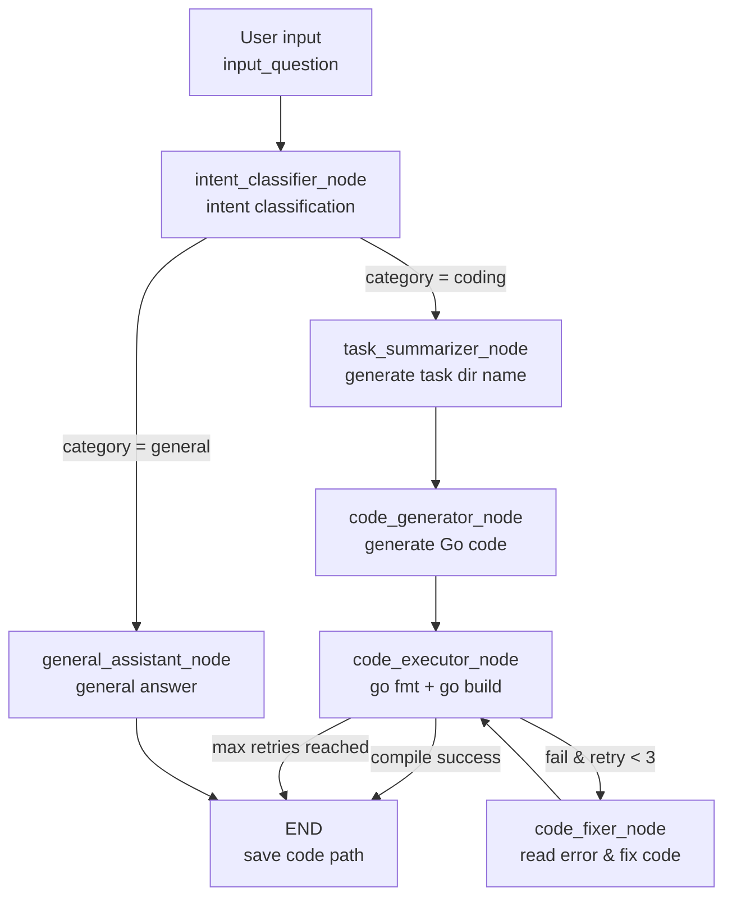

# CodeEngine

A LangGraph-based agent workflow that automatically **classifies user intent**. For coding questions it generates compilable **Go (Golang)** code and automatically fixes compilation errors; for general questions it provides a brief answer.

The entire pipeline is orchestrated by a state graph (`StateGraph`), and every node performs inference by calling a local Ollama-served LLM.

---

## ✨ Features

- **Intent classification**: automatically determines whether a question is `coding` (programming) or `general` (general Q&A).
- **Task naming**: summarizes a programming question into a `snake_case` directory name, used to isolate the code generated for each task.
- **Go code generation**: produces complete, runnable Go code (with a `main` function) for LeetCode-style algorithm problems.
- **Compile self-check + auto-fix**: after generating code, automatically runs `go fmt` and `go build`. On compile failure, an LLM reads the error and fixes the code, **retrying up to 3 times**.
- **Per-node logging/tracing**: built-in decorators `trace_node` / `trace_node_detailed` record each node's entry, duration, and state input/output for easy debugging.
- **Decoupled prompts**: all prompts live in Markdown files under `prompts/`, so they can be tuned without touching business logic.

---

## 🏗️ Workflow



---

## 📁 Project Structure

```
code-engine/
├── main.py                  # Entry point: build the question and trigger the workflow
├── workflow.py              # StateGraph-based workflow orchestration (nodes + routing)
├── nodes.py                 # Node logic (classify / generate / execute / fix)
├── state.py                 # AgentState definition (TypedDict)
├── constants.py             # Constants: state keys, node names, categories, prompt keys
├── config.py                # LLM init, prompt loading, model & path configuration
├── logger.py                # Logging and node-tracing decorators
├── problems.py              # LeetCode problem-set enrichment (GraphQL -> Markdown)
├── prompts/                 # Prompts for each node (Markdown)
│   ├── intent_classifier.md
│   ├── task_summarizer.md
│   ├── code_generator.md
│   ├── code_fixer.md
│   └── general_assistant.md
└── output/
    ├── go-code/             # Generated Go code (one folder per task)
    │   └── <task_name>/<task_name>.go
    └── problems/            # Enriched LeetCode problem set (see below)
        ├── problems_index.json  # Lightweight index for fast lookup
        ├── README.md        # Problem index (table of all problems)
        ├── <slug>.json      # Canonical record (machine-readable)
        └── <slug>.md        # Human-readable view (optional, derived)
```

---

## 📋 Requirements

- **Python** >= 3.10
- **Go** toolchain (the `go` command must be available, used for `go fmt` / `go build` compile checks)
- **Ollama**: running locally, listening on `http://127.0.0.1:11434`
  - Default model: `minimax-m3:cloud` (see `config.py`)
  - Alternative local model: `reecdev/qwen3.5-lowvram:9b`

---

## 🚀 Installation

```bash
# 1. Install Python dependencies
pip install langgraph langchain-ollama

# 2. Install and start Ollama, then pull the required model
ollama pull minimax-m3:cloud
# or the local small model
ollama pull reecdev/qwen3.5-lowvram:9b

# 3. Make sure Go is installed and on your PATH
go version
```

---

## ⚙️ Configuration

Main configuration lives in `config.py`:

| Option | Description |
| --- | --- |
| `model_local` / `model_minimax` | Available model names |
| `llm` | A `ChatOllama` instance; `model` selects the model actually used, `temperature=0.1` keeps output stable |
| `BASE_DIR` | Project root directory, used to locate `prompts/` and `output/` |
| `PROMPTS` | Dictionary of prompts loaded from `prompts/` |

> To switch models, just change the `model` argument in `llm = ChatOllama(model=..., ...)`.

---

## 💻 Usage

`main.py` accepts a **flexible input** — either a custom question or a LeetCode
problem resolved from your local cache (or fetched live).

```bash
# Built-in example problem (binary tree serialization/deserialization).
python main.py

# Run a specific LeetCode problem by slug / ID / title / URL.
python main.py --problem two-sum
python main.py --problem 2
python main.py --problem "https://leetcode.com/problems/two-sum/"
python main.py --problem "add two numbers"          # title substring match

# Run from a saved problem file (.json or .md).
python main.py --file output/problems/two-sum.json

# Run an arbitrary custom question.
python main.py --custom "Implement an LRU Cache in Go"

# List cached problems and exit.
python main.py --list-problems

# Only resolve from the local cache; never fetch from LeetCode.
python main.py --problem two-sum --no-live
```

If no source is given, the built-in example problem is used. The resolved text
becomes the ``input_question`` fed to the workflow:

```python
result = app.invoke({"input_question": input_question})
```

After running, the logs will output:

- On compile success: `save code to: <code_path>` and `compile check result`
- For general questions: `final_output` is printed directly

Generated Go code is saved to `output/go-code/<task_name>/<task_name>.go`.

---

## 🔁 Compile-Fix Strategy

`code_executor_node` extracts the Go code block from the response via regex, writes it to a file, and runs:

1. `go fmt`: format the code;
2. `go build -o /dev/null`: compile check only;
3. If `returncode != 0`, pass the error and original code to `code_fixer_node`, which fixes it via the LLM and recompiles;
4. If the retry counter `retry_count` reaches **3** without success, stop to avoid an infinite loop.

---

## 📚 LeetCode Problem Enrichment

`problems.py` enriches the local problem set by querying LeetCode's public
GraphQL API (using the same queries as
[akarsh1995/leetcode-graphql-queries](https://github.com/akarsh1995/leetcode-graphql-queries)).
Each problem is stored as a **canonical JSON record** (`<slug>.json`), which is
the machine-readable source of truth the workflow reads when you pass
`--problem` to `main.py`. A human-readable **Markdown view** (`<slug>.md`) and a
lightweight **index** (`problems_index.json` + `README.md`) are derived from it.

- `output/problems/<slug>.json` — the canonical record (title, difficulty, tags,
  link, cleaned description, examples, hints, and a reconstructed **Go template**).
- `output/problems/<slug>.md` — the same content rendered as Markdown for browsing.
- `output/problems/problems_index.json` — a lightweight index for fast lookup.
- `output/problems/README.md` — the full problem index (a table of all fetched problems).

> The Go template is rebuilt from the problem's `metaData` because LeetCode does
> not return a Go snippet server-side.

It is dependency-free — only the Python standard library is used (HTTP via
`urllib`, HTML→Markdown via a small regex pipeline).

### Command line

```bash
# Fetch the first 50 problems (default) and write the index + per-problem files.
python problems.py

# Fetch a specific number, with a polite delay between detail requests.
python problems.py --limit 200 --delay 0.3

# Fetch EVERY available problem (thousands — can take a while).
python problems.py --all --delay 0.3

# Only write the index, skip per-problem detail files.
python problems.py --no-details

# Write JSON + index only, skip the per-problem .md view.
python problems.py --no-md
```

### As a library

```python
from problems import enrich_problem_set, resolve_problem, problem_to_input

# Default: first 50 problems to output/problems.
summary = enrich_problem_set()

# Everything, into a custom directory.
summary = enrich_problem_set(output_dir="output/problems", max_problems=None, delay=0.3)
print(summary)  # {'output_dir': '...', 'problem_count': 4018, 'index_path': '...', 'index_json_path': '...'}

# Build a workflow input from a LeetCode problem (local cache, then live fetch).
record = resolve_problem("two-sum")
input_question = problem_to_input(record)
```

> **Note:** LeetCode's list endpoint is paginated; the script pages through it
> automatically. Paid-only problems are marked in the index but their full
> description is not always returned by the public API.

---

## 📝 Notes & Limitations

- Currently only **Go** code generation and compile checking are supported (the regex and commands in `code_executor_node` are Go-specific).
- Intent classification relies on the prompt instructing the model to output only the words `coding` / `general`, so it places some demand on the model's instruction-following ability.
- The project does not yet ship a `requirements.txt`; install dependencies manually as described in "Installation" (adding one is recommended).
- `output/` and `__pycache__/` are already ignored in `.gitignore`.
