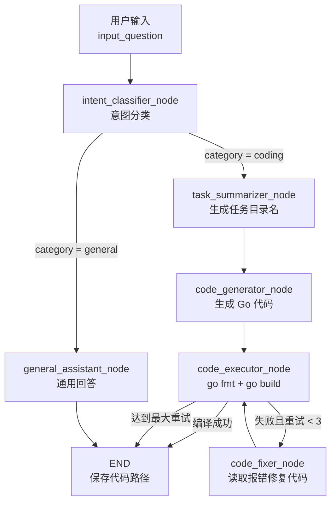

# CodeEngine

基于 [LangGraph](https://github.com/langchain-ai/langgraph) 的智能体工作流，能够自动**识别用户意图**，对编程类问题生成可编译的 **Go (Golang)** 代码并自动修复编译错误，对通用问题给出简短回答。

整个流程由一个状态图（`StateGraph`）编排，所有节点调用本地 Ollama 提供的 LLM 完成推理。

---

## ✨ 功能特性

- **意图分类**：自动判断问题是 `coding`（编程）还是 `general`（通用问答）。
- **任务命名**：将编程问题归纳为 `snake_case` 目录名，用于隔离每次生成的代码。
- **Go 代码生成**：针对 LeetCode 风格的算法题生成完整、可运行的 Go 代码（含 `main` 函数）。
- **编译自检 + 自动修复**：生成代码后自动执行 `go fmt` 与 `go build`，编译失败时由 LLM 读取报错信息修复代码，**最多重试 3 次**。
- **节点级日志追踪**：内置装饰器 `trace_node` / `trace_node_detailed`，记录每个节点的进入、耗时与状态输入输出，便于调试。
- **提示词与代码解耦**：所有提示词存放在 `prompts/` 目录的 Markdown 文件中，方便调整而无需改动业务代码。

---

## 🏗️ 工作流



---

## 📁 项目结构

```
code-engine/
├── main.py                  # 入口：构造问题并触发工作流
├── workflow.py              # 基于 StateGraph 的工作流编排（节点 + 路由）
├── nodes.py                 # 各节点逻辑（分类 / 生成 / 执行 / 修复）
├── state.py                 # AgentState 状态定义（TypedDict）
├── constants.py             # 状态键、节点名、分类、提示词键等常量
├── config.py                # LLM 初始化、提示词加载、模型与路径配置
├── logger.py                # 日志与节点追踪装饰器
├── problems.py              # LeetCode 题库富化（GraphQL -> Markdown）
├── prompts/                 # 各节点的提示词（Markdown）
│   ├── intent_classifier.md
│   ├── task_summarizer.md
│   ├── code_generator.md
│   ├── code_fixer.md
│   └── general_assistant.md
└── output/
    ├── go-code/             # 生成的 Go 代码（按任务目录分文件夹）
    │   └── <task_name>/<task_name>.go
    └── problems/            # 富化后的 LeetCode 题库（见下文）
        ├── README.md        # 题目索引（全部题目的表格）
        └── <slug>.md        # 每道题一个 Markdown 文件
```

---

## 📋 环境要求

- **Python** >= 3.10
- **Go** 工具链（需 `go` 命令可用，用于 `go fmt` / `go build` 编译检查）
- **Ollama**：本地运行，监听 `http://127.0.0.1:11434`
  - 默认模型：`minimax-m3:cloud`（见 `config.py`）
  - 备选本地模型：`reecdev/qwen3.5-lowvram:9b`

---

## 🚀 安装

```bash
# 1. 安装 Python 依赖
pip install langgraph langchain-ollama

# 2. 安装并启动 Ollama，拉取所需模型
ollama pull minimax-m3:cloud
# 或本地小模型
ollama pull reecdev/qwen3.5-lowvram:9b

# 3. 确保 Go 已安装并加入 PATH
go version
```

---

## ⚙️ 配置

主要配置位于 `config.py`：

| 配置项 | 说明 |
| --- | --- |
| `model_local` / `model_minimax` | 可选模型名称 |
| `llm` | `ChatOllama` 实例，`model` 决定实际使用的模型，`temperature=0.1` 保证输出稳定性 |
| `BASE_DIR` | 项目根目录，用于定位 `prompts/` 与 `output/` |
| `PROMPTS` | 从 `prompts/` 加载的提示词字典 |

> 切换模型只需修改 `llm = ChatOllama(model=..., ...)` 中的 `model` 参数即可。

---

## 💻 使用

直接运行入口脚本：

```bash
python main.py
```

`main.py` 中内置了一个二叉树序列化/反序列化的算法题示例。如需自定义问题，修改 `main.py` 中的 `input_question` 字符串，然后运行：

```python
result = app.invoke({"input_question": "你的题目或问题"})
```

运行后会通过日志输出：

- 编译成功时：`save code to: <code_path>` 与 `compile check result`
- 通用问题时：直接输出 `final_output`

生成的 Go 代码会保存到 `output/go-code/<task_name>/<task_name>.go`。

---

## 🔁 编译修复策略

`code_executor_node` 通过正则提取响应中的 Go 代码块，写入文件并执行：

1. `go fmt`：格式化代码；
2. `go build -o /dev/null`：仅做编译检查；
3. 若 `returncode != 0`，将报错与原始代码交给 `code_fixer_node`，由 LLM 修复后重新编译；
4. 重试计数 `retry_count` 达到 **3** 次仍失败则终止，避免无限循环。

---

## 📚 LeetCode 题库富化

`problems.py` 通过查询 LeetCode 公开 GraphQL API（使用与
[akarsh1995/leetcode-graphql-queries](https://github.com/akarsh1995/leetcode-graphql-queries)
相同的查询语句）富化本地题库，并将结果以 Markdown 形式保存到 `output/problems/`：

- `output/problems/README.md` — 完整题目索引（所有已抓取题目的表格）。
- `output/problems/<slug>.md` — 每道题一个文件，包含标题、难度、标签、链接、清洗后的题目描述、示例、提示，以及根据 `metaData` **重建的 Go 模板**（LeetCode 服务端不返回 Go 代码片段，因此由题目 `metaData` 重新生成）。

该模块**零依赖**——仅使用 Python 标准库（通过 `urllib` 请求 HTTP，通过轻量正则将 HTML 转为 Markdown）。

### 命令行

```bash
# 抓取前 50 道题（默认）并写出索引与每题文件。
python problems.py

# 抓取指定数量，并在每次抓取详情之间设置礼貌延迟。
python problems.py --limit 200 --delay 0.3

# 抓取全部题目（数千道，耗时较长）。
python problems.py --all --delay 0.3

# 只写索引，跳过每题的详情文件。
python problems.py --no-details
```

### 作为库调用

```python
from problems import enrich_problem_set

# 默认：抓取前 50 道题到 output/problems。
summary = enrich_problem_set()

# 抓取全部题目，输出到自定义目录。
summary = enrich_problem_set(output_dir="output/problems", max_problems=None, delay=0.3)
print(summary)  # {'output_dir': '...', 'problem_count': 4018, 'index_path': '...'}
```

> **说明：** LeetCode 的题目列表接口是分页的，脚本会自动翻页；索引中会标记付费题目，但公开 API 不一定返回其完整描述。

---

## 📝 说明与限制

- 当前仅支持 **Go** 代码的生成与编译校验（`code_executor_node` 中的正则与命令均为 Go 定制）。
- 意图分类依赖提示词要求模型只输出 `coding` / `general` 两个词，对模型指令遵循能力有一定要求。
- 项目暂未提供 `requirements.txt`，依赖请按上文「安装」手动安装（建议后续补充）。
- `output/` 与 `__pycache__/` 已在 `.gitignore` 中忽略。
