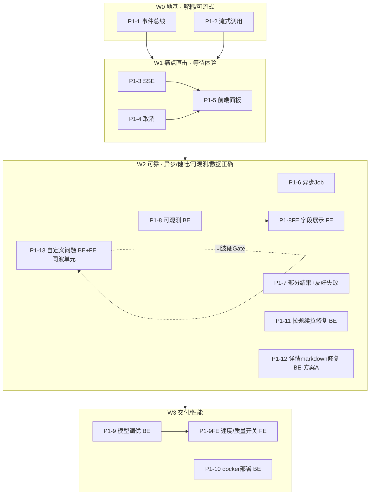

# CodeEngine 阶段一（可用化）细化计划

> 视角：Role 1 PM（`.workbuddy/agents/pm.md`）
> 性质：跨领域细化计划（`specs/NAME.md`），对应 `ROADMAP.md` 的阶段一。
> 目标：把「可用化」拆成**可开发、可验收**的 Epic + 依赖排序；不含商业化。
> 出口：见 §4 Gate 1 验收清单。

---

## 0. 一句话与范围

让原型变成「用得下去」的真实工具。**只做生产化，不碰账号/计费/多租户/合规。**
核心度量：用户在生成期间「**有事做、能预期、能停**」。

---

## 1. 切分：4 个 Wave（按依赖排序）

| Wave | 主题 | Epic（含前后端标注） | 前后端同波？ | 为什么在这 |
|------|------|----------------------|------------|-----------|
| **W0 地基** | 解耦 / 可流式 | P1-1 事件总线(BE)、P1-2 流式调用(BE) | ✅ 纯后端 | 解锁所有用户可见项的前提，可并行 |
| **W1 痛点直击** | 等待体验 | P1-3 SSE(BE)、P1-4 取消(BE+FE停止按钮)、P1-5 前端面板(FE) | ✅ 同波 | **直接消灭「时间长/没事干」**；FE/BE 同波交付验收 |
| **W2 可靠** | 异步/健壮/可观测/数据正确 | P1-6 异步Job(BE)、P1-7 部分结果(BE)、P1-8 可观测(BE)+**P1-8FE 字段展示(FE)**、P1-11 拉题续拉(BE)、P1-12 markdown(BE，方案A)、**P1-13 自定义问题(BE+FE tab/确认)** | ⚠️ 已修 | 服务不卡、出错不崩、数据不重复、显示正确；P1-8FE/P1-13FE 与各自 BE 同波验收 |
| **W3 交付/性能** | 部署/调优 | **P1-9 模型调优(BE)+P1-9FE 速度/质量开关(FE)**、P1-10 docker(BE) | ⚠️ 已修 | 缩短原始耗时、一键可用；P1-9FE 与 BE 同波验收 |

**关键排序决策（重要）**：W1 的「SSE 痛点」**不必等 W2 的异步 Job 化**。
SSE 可以直接挂在现有 `asyncio.to_thread(_do_generate)` 之上、由事件总线驱动——
先做 W0+W1 即可解决用户痛点，W2 是可靠性增强、紧随其后即可。
这避免了「为了一个小体验改动先搭一整套 Job 基建」的过度工程。

### 1.1 前后端同波验收矩阵（PM 出口质量红线）

> 原则：一个 feature 的前端与后端**必须排进同一 Wave、同一交付批次**，使其可端到端一次验收；
> 禁止「后端先交付、前端另开分支后补」导致人工只能做半截验收（见 P1-13 历史教训）。
> 下表为 2026-08-14 复核结果：发现 3 处前后端脱钩，已全部重排。

| Epic | 前端归属 | 后端归属 | 同波 | 复核结论 / 动作 |
|------|---------|---------|------|---------------|
| P1-1 事件总线 | — | `infrastructure/events.py`、`features/solver/*`、`infrastructure/logger.py` | ✅ | 纯后端，无前端 |
| P1-2 流式调用 | — | `infrastructure/config.py`、`constants.py` | ✅ | 纯后端 |
| P1-3 SSE | —（驱动 P1-5） | `web/routes/stream.py`、`web/api.py`、`web/schemas.py` | ✅ | 后端端点，验收靠 P1-5 面板 |
| P1-4 取消 | `frontend/`（停止按钮） | `features/solver/service.py`、`executor.py`、`config.py` | ✅ W1 | FE/BE 同波，AT-C1~C3 含前端行为 |
| P1-5 前端面板 | `frontend/index.html` | （由 P1-3/4 供数） | ✅ W1 | 依赖 P1-3/4，同波闭环 |
| P1-6 异步Job | — | `web/`（job 路由+store）、`service.run_pipeline` | ✅ | 纯后端；前端复用 P1-5 面板订阅 job |
| P1-7 部分结果 | — | `features/solver/service.py`、`executor.py` | ✅ | 纯后端正确性 |
| **P1-8 可观测** | **`frontend/`（展示 `used_model`/`escalated`）** | `web/routes/meta.py`、`config.py`、`schemas.py` | ⚠️→✅ **W2** | **补 P1-8FE**：后端字段落 W2，前端展示同波验收（AT-O2「前端可展示」须有 UI 承载） |
| P1-11 拉题续拉 | —（复用现有拉题按钮） | `features/problems/service.py`、`web/routes/problems.py` | ✅ | 纯后端正确性；AC 验证后端计数 |
| **P1-12 markdown** | 仅方案 B 需改 `renderMarkdown` | `features/problems/models.py` | ⚠️→✅ **W2** | **锁定方案 A（生成侧剥离）**：纯后端改动，规避新增前端耦合；若改方案 B 须与前端同波 |
| **P1-13 自定义问题** | **`frontend/index.html`（tab+输入表单+确认面板）** | `features/solver/*`、`features/problems/storage.py`、`web/`（5 端点） | ⚠️→✅ **W2** | **硬 Gate**：后端已交付，前端 UI（`feat/custom-questions-ui`）必须并入 W2 同批、E2E 验收通过方可关闭 W2；禁止「后端绿、UI 无入口」 |
| **P1-9 模型调优** | **`frontend/`（速度/质量优先开关）** | `infrastructure/models.yaml`、`web/`、`features/solver/verifier.py` | ⚠️→✅ **W3** | **补 P1-9FE**：前端开关与后端路由/verifier 同波验收（AT-PF1 端到端耗时对比须 UI 可达） |
| P1-10 docker | — | `deploy/`（Dockerfile、compose） | ✅ | 纯部署 |

---

## 2. Epic 清单

> 每个 Epic 含：目标 / 范围 / 改动点（Dev 只读，PM 仅列位置）/ 验收(AC) / 依赖 / 工作量。
> 验收均二值可判，符合 `pm.md` 出口质量。

### P1-1 进度事件总线（开发就绪）
- **目标**：管线每一步产出结构化事件，供 SSE / 日志 / Job 共用，单一实现。
- **范围**：定义 `PipelineEvent`（type, node, ts, data）；让节点在 进入/结束(含耗时)/重试/模型路由 时 emit；生成节点额外发 token chunk 事件。
- **改动点**：`infrastructure/logger.py`（`trace_node` 加 hook）、`features/solver/{workflow,nodes}.py`（emit 点）、新增 `infrastructure/events.py`（事件定义 + 简单发布订阅）。
- **AC**：
  - AT-E1：跑一次 pipeline，总线按序收到 `node_start→node_end`（含 duration），节点名与 workflow 一一对应。
  - AT-E2：生成节点在结果未完整前即发出 token 事件（若底层流式）；非流式模型至少发「生成开始/结束」两事件。
  - AT-E3：日志与后续 SSE 共用同一总线，不存在两份事件实现。
- **依赖**：无。**工作量：M**。
- **开发就绪 spec**：`specs/realtime-progress/EVENT_BUS_SPEC.md`（EB-01…04 + 回归场景）。

### P1-2 流式模型调用（开发就绪）
- **目标**：`invoke_model` 支持流式输出，**同时保留 wall-clock 超时守护**（解决 `config.py:190` 刻意关流式的权衡）。
- **范围**：新增 `invoke_model_stream(...)` 返回 token 迭代器；后台线程监控 deadline，到期中断流并触发 escalate（同现有逻辑）；非流式模型降级为「先全量再逐块 yield」。
- **改动点**：`infrastructure/config.py`（`_invoke_with_timeout` + 流式变体）、`infrastructure/constants.py`（事件类型）。
- **AC**：
  - AT-S1：调用 `invoke_model_stream`，消费者在完整内容返回前即收到首个 token。
  - AT-S2：模拟 local 超时（极短 budget），流式调用被中断且 escalatable 角色自动升级 online（行为同现有 `invoke_model` 超时）。
  - AT-S3：流式/非流式两种调用对管线终态结果（编译/验证）一致。
- **依赖**：无（可与 P1-1 并行）。**工作量：M**。
- **开发就绪 spec**：`specs/realtime-progress/STREAMING_SPEC.md`（ST-01…05 + 回归场景）。

### P1-3 SSE 进度 / 流式端点
- **目标**：前端实时收到阶段进度 + 代码 token。
- **范围**：新增 `POST /api/generate/stream`（或把 generate 升级为支持 `text/event-stream`）；服务端从事件总线订阅并转发为 SSE（stage 事件 + token 块 + 终态 result）。
- **改动点**：`web/routes/`（新建 `stream.py` 或扩 `go_code.py`）、`web/api.py` 注册、`web/schemas.py`。
- **AC**：
  - AT-SE1：客户端连接后，生成完成前收到 ≥1 条 stage 事件与 ≥1 条 token 事件（或至少 stage 事件）。
  - AT-SE2：流以明确 `done`/`error` 事件结束，且携带与现有 `GenerateResult` 等价的终态数据。
  - AT-SE3：连接中途断开，服务端不崩，终态结果仍被持久化（为 P1-6/7 铺垫）。
- **依赖**：P1-1、P1-2。**工作量：M**。

### P1-4 取消 / 中止
- **目标**：用户随时停止生成。
- **范围**：pipeline 支持 cancellation token（节点/模型调用检查点退出）；SSE 支持客户端发取消（如 `POST /api/generate/{job}/cancel` 或控制帧）；前端「停止」按钮。确保终止时清理 go 子进程（`go build`/`go test`）与模型请求，避免孤儿进程。
- **改动点**：`features/solver/service.py`（cancel flag）、`infrastructure/config.py`（流式可中断）、`features/solver/executor.py`（终止子进程）、`frontend/`。
- **AC**：
  - AT-C1：生成中点取消，pipeline 在下一个可中断点（生成/编译边界）停止，返回 `cancelled` 而非成功。
  - AT-C2：取消后无残留 go 进程（pgrep 验证），模型请求被中断。
  - AT-C3：取消不破坏已落盘 `.go`（若有）。
- **依赖**：P1-1、P1-2。**工作量：M**。

### P1-5 前端实时面板
- **目标**：把「没事做」变成「看着它在写」。
- **范围**：用 SSE 驱动 UI：阶段进度/步骤列表（高亮当前节点+耗时）、代码逐字渲染（typewriter）、累计计时器、停止按钮、终态展示。
- **改动点**：`frontend/index.html`（generate 流程改造）。
- **AC**：
  - AT-FE1：点生成后 UI 立即进入「进行中」并随 SSE 更新当前阶段与计时，期间不空白/死转圈。
  - AT-FE2：代码区在生成节点阶段即开始显示 token（非一次性）。
  - AT-FE3：「停止」按钮生成中可用，点击后 UI 进入已取消态。
- **依赖**：P1-3、P1-4。**工作量：M**。

### P1-6 异步 Job 化
- **目标**：长请求不卡服务，刷新不丢进度，可轮询/订阅。
- **范围**：`POST /generate` 立即返回 `job_id`；后台 worker 跑 pipeline 并把事件/结果写入 job store（内存或文件）；`GET /api/jobs/{id}` 查状态与结果；SSE 可订阅 job。状态机 `pending→running→success/failed/cancelled`。
- **改动点**：`web/`（新增 job 路由 + store）、`features/solver/service.run_pipeline` 接入事件总线与 cancel。
- **AC**：
  - AT-J1：`POST /generate` 在 <1s 返回 `job_id`，此时任务仍在后台 running。
  - AT-J2：`GET /api/jobs/{id}` 完成后返回 success + 等价 `GenerateResult`；running 时返回阶段进度。
  - AT-J3：刷新页面后用 `job_id` 可恢复查看进度/结果（不丢）。
- **依赖**：P1-1（事件/状态）。可与 W1 并行启动，但 SSE 订阅 job 更稳。**工作量：L**。

### P1-7 部分结果保存 + 友好失败
- **目标**：中途失败也有痕迹、报错可读。
- **范围**：生成节点每写出 `.go` 即落盘（已部分满足）；pipeline 异常时保存已产出 artifacts + 结构化错误（超时/编译/验证分类）；映射 `ModelTimeout` 等为可读文案。
- **改动点**：`features/solver/service.py`、`executor.py`、错误映射。
- **AC**：
  - AT-P1：生成中途（如第2次 fix）强制失败，`output/go-code/<task>` 仍保留已写出的 `.go`。
  - AT-P2：返回错误含分类（timeout/compile/verify）与可读文案，非裸异常。
- **依赖**：P1-6 可选；可独立。**工作量：S**。

### P1-8 可观测 /health + 路由暴露
- **目标**：运维能判断「能不能用、慢在哪」。
- **范围**：`/health` 增 readiness（ollama 模型可达、go 在 PATH）；把本次 `used_model` / `escalated` / `per_node_ms` 作为进度事件与结果字段暴露。
- **改动点**：`web/routes/meta.py`、`infrastructure/config.py`（记录每次调用的 model/retry/耗时）、`web/schemas.py`。
- **AC**：
  - AT-O1：`/health` 在 ollama 不可达或 go 缺失时返回 degraded + 原因，而非 200 假健康。
  - AT-O2：生成结果含 `used_model` 与是否 `escalated` 字段，前端可展示。
- **依赖**：P1-1（事件含路由信息）。**工作量：S**。
- **[前后端同波] P1-8FE（前端展示）**：`AT-O2` 的「前端可展示」必须有 UI 承载——在 P1-5 面板的终态区追加 `used_model` / `escalated` 展示（如「本次使用：local / 已升级 online」）。**P1-8FE 与 P1-8 同属 W2、同批验收**，禁止只验收后端字段而留 UI 空白。AC：终态面板可见模型来源与是否升级，与 `GenerateResult` 字段一致。

### P1-9 默认模型 / thinking 调优 + 速度质量开关 + 多解误判
- **目标**：直接缩短「时间长」、减少空跑重生成。
- **范围**：默认首试用更快配置（关 thinking / 用 local），失败再升；UI 提供「速度优先/质量优先」；修 verifier 多解题误判（见 `VERIFIER_ACCEPTANCE.md §8`），避免「对了被判错 → 重生成」拉长等待。
- **改动点**：`infrastructure/models.yaml`（默认/路由）、`web/`（开关参数）、`features/solver/verifier.py`（多解容错）。
- **AC**：
  - AT-PF1：速度优先下，简单题首试用 local+关 thinking，端到端耗时低于质量优先。
  - AT-PF2：two-sum 类多解题正确解不再被判 `verified_fail`（或显式标注「多解，按规范值比对」）。
- **依赖**：P1-8（先有路由可见）、verifier 已有基础。**工作量：M**。
- **[前后端同波] P1-9FE（前端 速度/质量优先 开关）**：UI 提供「速度优先 / 质量优先」切换，参数透传到 `web/` 生成入口，驱动 `models.yaml` 默认路由。**P1-9FE 与 P1-9 同属 W3、同批验收**；`AT-PF1` 的端到端耗时对比须由该开关触发，UI 不可缺失。AC：切换开关后生成行为（首试 local/关 thinking vs 允许 thinking）与终态字段随开关变化。

### P1-10 docker 一键部署
- **目标**：`docker compose up` 即用。
- **范围**：Dockerfile（python 服务）+ 打包 ollama（或 sidecar）+ 预拉模型 + compose；启动校验（模型可达/go 在镜像内）。
- **改动点**：新增 `deploy/`（Dockerfile、docker-compose.yml、启动脚本）。
- **AC**：
  - AT-D1：干净机器 `docker compose up` 后，`/ui` 可用、`/health` 健康、能跑通一次 generate。
  - AT-D2：文档仅含 compose 启动步骤，无需手动装 ollama/go/pip。
- **依赖**：P1-8（/health 校验）、其余功能。**工作量：M**。

### P1-11 拉题续拉 / 去重修复（Fix）
- **目标**：再次拉题时，先跳过已拉取的进度，再拉*新*的；同一 `limit` 重复拉不应始终拉不到新题。
- **根因（已核实）**：`web/routes/problems.py` `_do_pull` 调 `fetch_problem_list(max_problems=limit)`（skip=0），
  永远取 LeetCode 列表**前 `limit` 个**；已缓存的被 `skipped += 1` 跳过 → 若前 `limit` 个已全缓存，`pulled=0`。
  `features/problems/service.enrich_problem_set` 同样以 `max_problems` 截断列表而非按「已拉取数」翻页。
- **范围**：拉题改为「按已落盘数量推进 skip / 持续翻页直到凑满 `limit` 个*新*题或列表耗尽」；`skipped` 只计本批窗口内已缓存者。
- **改动点**：`features/problems/service.py`（`enrich_problem_set` 分页逻辑）、`web/routes/problems.py`（`_do_pull` 翻页推进）。
- **AC**：
  - AT-P11a：本地已缓存前 N 题（如 prior `limit=50` 已拉），再次 `POST /api/problems/pull` 同 `limit=50` 时，
    自动翻页跳过已缓存集，实际新拉 ~50 题（直至列表耗尽），而非 `pulled=0`。
  - AT-P11b：`skipped` 仅计本批新取窗口内的已缓存项；`pulled` 反映真正新增数，无重复写入、无报错。
  - AT-P11c：全部拉完后再次拉题，`pulled=0`、`skipped=全部`，幂等且不重复落盘。
- **依赖**：无。**工作量：S**。

### P1-12 题目详情 markdown 代码块强调渲染修复（Fix）
- **目标**：题目详情中代码块内的强调（bold/italic）正确显示，不再泄漏为字面 `**`/`*`。
- **根因（已核实）**：`features/problems/models.py` `html_to_markdown._stash_pre`（行 32-33）把 `<pre>` 内的
  `<strong>`/`<em>` 转成 `**…**`/`*…*` 写进围栏代码块；而 `frontend/index.html` `renderMarkdown`（行 278）
  先 `esc()` 再按 ```` ``` ```` 切分、代码块内容原样放入 `<pre><code>` → `**` 作为**字面星号**显示，强调丢失/错显。
- **范围（二选一，需拍板 → 见下方 `[scope expansion]`）**：
  - 方案 A（推荐，最低风险）：生成侧在代码块内**剥离** `<strong>`/`<em>` 强调（转纯文本），使代码块干净无 `**`；
  - 方案 B：生成侧在代码块内保留为 HTML `<strong>`/`<em>`，并令前端对代码块内容**不再 esc**（直接信任已生成的安全 HTML）。
- **改动点**：`features/problems/models.py`（生成侧）、或 + `frontend/index.html` `renderMarkdown`（方案 B）。
- **AC**：
  - AT-P12a：含「代码块内强调」的题目，详情渲染后代码块内容**不含字面 `**`/`*` 泄漏**，且不被错误加粗/斜体到无关代码。
  - AT-P12b：代码块外的正常强调（如 `**Note:**`）仍正确显示为粗体。
  - AT-P12c：现有题目（无代码块强调冲突者）渲染结果与修复前一致（无回归）。
- **依赖**：无。**工作量：S**。
- **[scope expansion: 修复形态]** 方案 A（生成侧剥离）与方案 B（前端不 esc 代码块）取舍：
  方案 A 改动小、零 XSS 风险，但代码块内强调变为纯文本；方案 B 保留视觉强调但需保证生成侧代码块内容可信。
  推荐 A，除非产品明确要求代码块内也显示粗体。
- **[前后端同波 · 已定]** **锁定方案 A（生成侧剥离 `<strong>/<em>` 为纯文本）**：纯后端改动（`features/problems/models.py`），**不引入前端改动**，从而规避「后端修、前端另改 `renderMarkdown`」的跨波耦合风险。AC `AT-P12a/b/c` 在浏览器渲染验收，但改动点仅在后端、随 W2 同批交付。若未来改采方案 B，须将 `frontend/index.html` 改动与后端并入同一 Wave 验收。

### P1-13 自定义问题支持（开发就绪）
- **目标**：支持任意自由文本作为问题输入，并正确路由 / 去重确认 / 独立存储。
- **范围**：见独立 feature spec **`specs/custom-questions/CUSTOM_QUESTIONS.md`**（含完整 AC + 测试场景 + 设计决策）。
  要点：(1) `classifier` 路由编程→原代码路径、非编程→问答；(2) `task_summary` 比对已有 problem 列表，
  命中则发「确认」请求，用户确认不相关才走自定义路径；(3) 自定义问题与 LeetCode **分开保存**（独立目录 + `source:"custom"`）。
- **改动点**：`features/solver/{nodes,service}.py`（classifier/task_summary 职责）、`features/problems/storage.py` + `infrastructure/paths.py`（自定义写入路径）、`web/`（自定义输入 + 确认接口）、`frontend/index.html`（「自定义题目」tab + 内嵌确认面板，**非模态弹窗**）。
- **AC**：对应 `CQ-01 … CQ-06`（见 feature spec）。
- **依赖**：`classifier`/`task_summary` 节点（已存在）；W1 的 SSE/异步 Job（CQ-03 管线前预检，需 Job 状态机承载「待确认」态）。**工作量：L**。
- **决策（user 已拍板，见 feature spec §6）**：确认形态=(a)管线前预检；存储=(A)独立目录 `output/custom-questions/`；
  相似度=由 Agent(LLM) 判断（不做独立字符串算法）；非已存在时新建并编号（`C-<seq>`）。
  端点形态已定 = **独立 `/api/custom-questions`**（list/create/open-by-number + precheck/confirm 子资源），用户判断独立端点更易管理与复用；
  其与阶段一 W1 的 Job「待确认」态兼容。
- **前端 UI（已排期）**：「自定义题目」tab + 输入表单 + 内嵌确认面板 + 列表/详情，
  AC `CU-01…CU-18` 见 **`specs/custom-questions/CUSTOM_QUESTIONS_UI.md`**（分支 `feat/custom-questions-ui`）。
  注：后端已交付，但早期 spec 未规划「输入表单」本身，UI 端一度零入口；该遗漏已在 UI spec §1.3 记录并补齐。
- **[前后端同波 · 硬 Gate]** P1-13 是本次复核的**重点整改对象**：历史上是「后端 5 端点全绿、前端 UI 在独立分支无入口」，人工只能验收半截。
  **强制要求**：P1-13 的 `feat/custom-questions-ui` 必须并入 W2 同一交付批次，且 `CU-01`（自定义题目 tab + 输入表单可达）等端到端 AC 跑通后，W2 方可关闭。
  **禁止「后端先合、UI 后补」**——若 UI 未随后端同批验收，W2 不视为完成（见 §1.1 矩阵与 §5 风险表）。

---

## 3. 推荐执行顺序



建议首交付：**W0(P1-1+P1-2) → W1(P1-3/4/5)**，这一刀即解决用户痛点；
随后 **W2** 补可靠性+数据正确+自定义问题，**W3** 做部署与调优收尾。
新增的 P1-11/P1-12 为既有功能修复，可穿插在 W2 任意空闲期，不阻塞主链路。

---

## 4. 阶段一出口验收（Gate 1，可测清单）

- [ ] 端到端一次生成：用户全程可见阶段进度（SSE）、累计计时、可随时中止（P1-3/4/5）。
- [ ] 单机构建/启动：`docker compose up` 即用，无手动装 ollama/go/pip（P1-10）。
- [ ] 生成中途失败：已写出的 `.go` 保留，返回友好分类文案（P1-7）。
- [ ] 运维可判健康：`/health` readiness（模型可达、go 在 PATH）（P1-8）。
- [ ] 拉题续拉正确：同 `limit` 重复拉能继续拉到新题，不卡在 0、不重复落盘（P1-11）。
- [ ] 题目详情代码块强调正确显示、无字面 `**` 泄漏、无回归（P1-12）。
- [ ] 自定义问题可用：任意文本输入按编程/非编程路由；疑似命中已有 problem 时先确认；自定义与 LeetCode 分开保存（P1-13 / CQ-01…05）。
- [ ] 默认配置下耗时可控、多解题不空跑重生成（P1-9）。

---

## 5. 阶段内风险与缓解

| 风险 | Epic | 缓解 |
|------|------|------|
| 流式 + 超时权衡 | P1-2 | 保留 wall-clock deadline 线程，到期中断流并 escalate |
| SSE 断开/重连 | P1-3/6 | 客户端容忍；终态存 job/store，断线可恢复 |
| 本地模型 token 速率仍慢 | P1-2/5/9 | typewriter 改善感知但非原始延迟，须配 P1-9 默认模型调优 |
| 取消安全（孤儿进程） | P1-4 | 确保 go 子进程与模型请求可终止，pgrep 验证无残留 |
| 自定义确认交互形态 | P1-13 | **已全部拍板**：确认形态=(a)管线前预检、存储=(A)独立目录、相似度=Agent(LLM) 判断（见 feature spec §6/§8）；前端形态=输入 tab + 内嵌确认面板（见 `custom-questions/CUSTOM_QUESTIONS_UI.md` §5 D1-D8）。原 `[scope expansion]` 已解除 |
| 后端交付但 UI 无入口 | P1-13 | **已发生并已识别 → 已整改（2026-08-14 复核）**：后端 5 端点全绿，但早期 spec 未规划「输入表单」本身 → UI 端零入口。整改：(1) `CUSTOM_QUESTIONS_UI.md` 补齐 CU-01…CU-18；(2) **P1-13 加「前后端同波硬 Gate」**（§1.1 矩阵 + 本 Epic 标注），`feat/custom-questions-ui` 必须并入 W2 同批、CU-01 E2E 跑通方可关闭 W2；(3) 后续新特性须同时规划「用户可达入口」，避免只验收后端 |
| 过度工程 | 排序 | W1 痛点不必等 W2 异步 Job（见 §1 决策） |

---

## 6. 下一步（Dev 接手前）

- **自定义问题**已有开发就绪 spec 套件：`specs/custom-questions/CUSTOM_QUESTIONS.md`（feature spec，CQ-01…06 + 测试场景）+ `specs/custom-questions/CHECK_SPEC.md`（预检子任务，CK-01…09）。所有设计决策（确认形态 / 存储 / 相似度 / 端点）已拍板，可进入开发。
- **W0 地基**已有开发就绪 spec 套件：`specs/realtime-progress/EVENT_BUS_SPEC.md`（P1-1，EB-01…04）+ `specs/realtime-progress/STREAMING_SPEC.md`（P1-2，ST-01…05）。两者无待定设计项，可进入开发。
- 其余 Epic（P1-3…P1-12）仍按约定落成 `specs/<feature-slug>/<NAME>.md`（含 `## Acceptance Criteria` + `## Test Scenarios`，
  每条 AC 1:1 映射 `features/solver/tests/` 回归用例，遵循 `specs/README.md`）。
  **建议下一步从 P1-3 + P1-5（痛点直击）或 P1-11/P1-12（小修复）立 spec；P1-4/P1-6/P1-7/P1-8/P1-9/P1-10 随后。**
- **[常态化规则 · 前后端同波]** 后续任何新 feature，spec 立项时即须标注「前端归属 / 后端归属 / 同波 Wave」（参照 §1.1 矩阵），
  并把「用户可达入口」列为必须 AC（避免 P1-13 式「后端绿、UI 无入口」）。含前端的 feature，其前端子 Epic 与后端**强制同 Wave、同交付批次、同批 E2E 验收**；禁止后端先合、前端后补分支。

---

## 7. Spec 交付进度（PM 跟踪）

> 更新于 2026-08-14。W0/W1 小修复簇已落地；P1-6/7/8/9/10 待写。
> **格式红线**：每份 spec 须含「人类校验指引（Manual Acceptance）」一节（环境 + 每条 AC 的手动步骤/通过/失败判定），见 `specs/README.md` 约定。已交付 spec（P1-1/2/3/4/5/11/12）均已补齐。

| Epic | Wave | 详细 spec 路径 | 状态 | AC 映射回归 |
|------|------|--------------|------|-----------|
| P1-1 事件总线 | W0 | `specs/realtime-progress/EVENT_BUS_SPEC.md` | ✅ 已交付 | `test_event_bus_regression.py` (EB-01…04) |
| P1-2 流式调用 | W0 | `specs/realtime-progress/STREAMING_SPEC.md` | ✅ 已交付 | `test_streaming_regression.py` (ST-01…05) |
| P1-3 SSE | W1 | `specs/realtime-progress/SSE_SPEC.md` | ✅ 已交付(本次) | `web/tests/test_generate_stream_regression.py` (SE-01…03) |
| P1-4 取消 | W1 | `specs/realtime-progress/CANCEL_SPEC.md` | ✅ 已交付(本次) | `web/tests/test_cancel_regression.py` (CA-01…03) |
| P1-5 前端面板 | W1 | `specs/realtime-progress/FRONTEND_PANEL_SPEC.md` | ✅ 已交付(本次) | `web/tests/test_realtime_panel_contract.py` (FE-01…03, FE-08) |
| P1-6 异步 Job | W2 | — | ⬜ 待写 | `web/tests/test_job_regression.py` (规划) |
| P1-7 部分结果 | W2 | — | ⬜ 待写 | `features/solver/tests/test_partial_result_regression.py` (规划) |
| P1-8 可观测 | W2 | — | ⬜ 待写 | `web/tests/test_health_regression.py` (AT-O1…O2) |
| P1-9 模型调优 | W3 | — | ⬜ 待写 | `features/solver/tests/test_model_tuning_regression.py` (AT-PF1…PF2) |
| P1-10 docker | W3 | — | ⬜ 待写 | 部署验收 (AT-D1…D2) |
| P1-11 拉题续拉 | W2 | `specs/problems-pull/PULL_CONTINUE_SPEC.md` | ✅ 已交付(本次) | `features/problems/tests/test_pull_continue_regression.py` (P11-01…03) |
| P1-12 markdown | W2 | `specs/problems-markdown/MARKDOWN_CODE_BLOCK_SPEC.md` | ✅ 已交付(本次) | `features/problems/tests/test_markdown_codeblock_regression.py` (P12-01…03) |
| P1-13 自定义问题 | W2 | `specs/custom-questions/CUSTOM_QUESTIONS.md` + `CHECK_SPEC.md` + `CUSTOM_QUESTIONS_UI.md` | ✅ 已交付 | CQ-01…06 / CK-01…09 / CU-01…19 |

**下一步建议**：续写 P1-6 → P1-7 → P1-8 → P1-9 → P1-10（按 PHASE1_PLAN 依赖顺序；P1-8 与 P1-9 须各自带前端子 Epic 同波验收，见 §1.1）。
