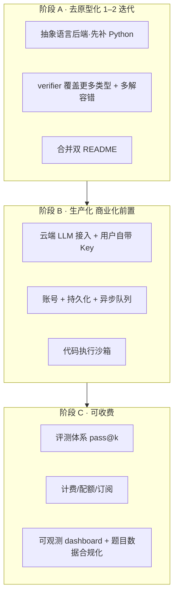

# CodeEngine — 产品进度与商业化评估

> 视角：Role 1 Product Manager（依据 `.workbuddy/agents/pm.md`）
> 依据：git log、实际代码核对、specs/ 三份文档、output/ 产物状态。
> 结论先行：**这是一个功能完整、架构清晰的本地 MVP / 原型，远未到可商业化。**

---

## 0. 一句话定位

本地优先的 **LeetCode 风格 Go 代码生成引擎**：意图分类 → 题目解析 → 代码生成 →
编译自检+自动修复 → 正确性验证。当前价值在于“自动产出可编译且经示例验证的 Go 题解”，
但所有能力都依赖**本地 Ollama**，且只支持 **Go 一种语言**。

---

## 1. 已完成内容（已核实）

| 模块 | 状态 | 证据 |
|------|------|------|
| 三层架构重构（web / features / infrastructure） | ✅ 完成 | `a2ee02a` + 实际目录结构 |
| 核心管线 5 节点（分类 / 命名 / 生成 / 编译 / 修复） | ✅ 完成 | `features/solver/{nodes,workflow}.py` |
| 模型路由 + 升级（local↔online）+ 超时守护 | ✅ 完成 | `infrastructure/models.yaml` 的 `routing` 段 |
| LeetCode 题库富化（GraphQL→JSON 规范记录+索引） | ✅ 完成 | `features/problems/*`，本地已缓存 64 题 |
| Web API（12 个端点）+ 静态前端 | ✅ 完成 | `web/` + `frontend/index.html` |
| **代码验证器 verifier**（解决“编译过≠正确”） | ✅ 完成并接入 | `35f53be`，已接入 `workflow.py`，含验收+回归测试 |
| 节点级日志/追踪、prompt 与逻辑解耦 | ✅ 完成 | `infrastructure/logger.py`、`prompts/*.md` |

**结论**：从“能跑通一条端到端题解”的角度看，MVP 已经成立，且最新交付的 verifier
是质量层面最关键的一次提升（把“编译成功即成功”变成了“示例验证通过才算成功”）。

---

## 2. 成熟度判断

最薄弱的不是“功能有没有”，而是**生产化与商业化所需的外围能力几乎为零**：
账号、云端、计费、安全隔离、评测、监控，全都没有。

---

## 3. 商业化必须补齐的内容（按优先级）

### P0 — 不做就无法上线（ blocker ）
1. **多语言支持**。当前 `executor.py` 的提取正则与 `go build` 是 Go 专用。
   只支持 Go 会让 90% 的目标用户（刷题常用 Python/Java/C++）直接流失。
   需抽象“语言后端”（extract/format/build/run 接口）。
2. **脱离本地 Ollama，上云推理**。商用必须有云端 LLM 接入（OpenAI/Anthropic/自建），
   并支持用户自带 Key。本地 Ollama 无法规模化、无法多租户。
3. **账号体系 + 持久化**。当前代码按 task 目录隔离、无用户概念。SaaS 需要
   用户、会话、历史、配额。
4. **代码执行沙箱**。verifier 会 `go run` 执行 LLM 生成的代码——这是**重大安全风险**，
   必须容器/gVisor 隔离，否则不可商用。

### P1 — 不做就无法收费 / 不可信
5. **评测体系（eval）**。需要 pass@k 基准（用 LeetCode 官方测试集或自有题库），
   否则无法向用户/投资人证明“生成质量”，也无法做回归防劣化。
6. **异步任务队列 + 并发**。当前管线同步阻塞，多用户会互相拖垮。
7. **计费 / 定价 / 用量追踪**。Token 成本、生成次数、订阅档位。
8. **题目数据合规**。LeetCode GraphQL 抓取用于商用存在 ToS/版权风险，
   需改用授权题库或用户自有题目。
9. **正确性边缘问题**（来自 verifier 验收文档 §8）：
   - 多解题（如 `two-sum`）易**误判为失败**（false negative）；
   - 未知 `metaData` 类型会直接 `skip`，不验证。商用前需覆盖更多类型或显式降级提示。

### P2 — 体验与运营
10. **真实产品级 UI**（当前是单文件 `index.html` 演示页）。
11. **多模型供应商 + 成本/延迟路由**的运营面板。
12. **可观测性**：成功率、延迟、成本、失败分布 dashboard。

---

## 4. 冗余 / 可去掉的内容

> 注：`output/` 已被 `.gitignore` 忽略，以下“冗余”多为**本地磁盘**层面的再生成物，
> 不进仓库；真正进仓库的冗余集中在文档与运行时配置。

| 项 | 性质 | 建议 |
|----|------|------|
| **`README.md` + `README.zh.md` 双份** | 仓库冗余（都在 git 跟踪） | 只保留一份（建议中文为权威版，英文由其生成或反之），避免两处失同步 |
| `output/problems/*.md`（64 个派生视图） | 本地冗余，可由 `.json` 按需渲染 | 不进仓库已正确；考虑运行时生成，不落盘 |
| `output/problems/README.md` + `problems_index.json` | 本地冗余，由 `.json` 派生 | 同上，可改为按需生成 |
| **双 Python 运行时槽点**：受管 venv（3.13）装不上 `pyyaml`/`langchain-ollama`，完整管线只能靠系统 3.14 | 非“冗余”但是 footgun | 在受管 venv 内补齐依赖，统一运行时，消除“为什么本地跑不了”的坑 |
| `output/_trial_tmp/`、`uvicorn.log` | 本地临时/日志 | 已 gitignore；建议加定期清理或写临时目录到系统 temp |
| `features/*/example/` CLI mains | dev harness，非产品 | 保留，但在 README 明确“仅供开发调试，非生产入口” |

**最该立刻处理的是双 README**：它既进仓库又需双份同步，是纯维护负担，且无功能价值。

---

## 5. 关键风险（PM 必须向上预警）

1. **正确性幻觉**：verifier 是进步，但“编译过 / 示例过”≠“AC”。多解误判与未知类型 skip 会
   影响用户对“质量”的信任，是商业化前的头号技术债。
2. **合规风险**：LeetCode 数据抓取的商业使用边界。
3. **安全风险**：执行生成代码无隔离。
4. **规模化风险**：本地 Ollama 架构无法支撑多租户并发。

---

## 6. PM 建议的下一步路线（粗粒度）

> 规格与现状若冲突或需求不清，按 pm.md 规则标 `BLOCKER` 交回，不在此文档内静默定调。
