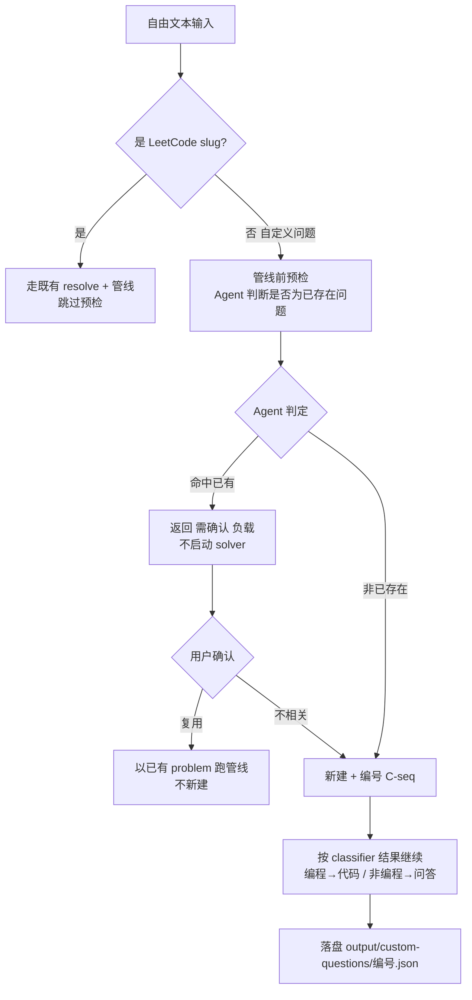

# 自定义问题 · 管线前预检与 Agent 去重判断（P1-13 子任务）

> 归属：Role 1 PM（`specs/<feature-slug>/<NAME>.md`）
> 关联：阶段一 `specs/PHASE1_PLAN.md` 的 P1-13；feature spec `specs/custom-questions/CUSTOM_QUESTIONS.md` 的 CQ-03 / CQ-06。
> 性质：**开发就绪的子任务 spec**（含 `## Acceptance Criteria` + `## Test Scenarios`，每条 AC 1:1 映射回归用例）。
> 已拍板决策（见 CUSTOM_QUESTIONS §6.1）：确认形态=(a)管线前预检；相似度=由 Agent(LLM) 判断；存储=(A)独立目录；非已存在则新建+编号。

---

## 1. 范围与边界

本 spec 只覆盖「**管线前预检 + Agent 去重判断 + 新建编号存储**」这一子任务，不含：

- 实际代码生成 / 编译 / 验证质量（属既有管线）。
- 前端输入 tab + 内嵌确认面板（属 Web/前端层，**已排期、原 `[scope expansion]` 已解除**，
  见 `specs/custom-questions/CUSTOM_QUESTIONS_UI.md` 与 CUSTOM_QUESTIONS §6.3）。
- classifier 路由编程/非编程（既有，本任务仅消费其结果）。

### 要做什么
1. 新增**预检函数**：对任意「非 LeetCode」的自由文本输入，在启动 solver 之前，调用 **Agent（LLM）** 判断它是否命中本地已有 problem。
2. **匹配 → 发确认**：命中则返回「需确认」负载（不直接启动 solver）；用户确认后要么复用已有、要么当作不相关走新建。
3. **不匹配 / 确认不相关 → 新建 + 编号**：在 `output/custom-questions/` 创建新记录，赋予隔离于 LeetCode 题号的编号（如 `C-0001`）。
4. **复用路径**：确认复用时，直接以已有 problem 跑既有管线，不新建。

---

## 2. 处理流程（mermaid）

---

## 3. 组件与契约（供 Dev 实现参考，非代码）

- **预检函数**（建议 `features/problems/service.py` 或新建 `features/solver/preecheck.py`）：
  - 输入：`input_text`、`problems_dir`（用于取现有 problem 的标题/摘要列表）。
  - 行为：用 `invoke_model(role="problem_match", prompt=...)` 调 LLM，prompt 附上现有 problem 的「标题+slug」清单与待判问题，要求**仅输出 JSON**：
    `{ "exists": bool, "matched_slug": string|null, "reason": string }`。
  - 健壮性：LLM 输出非法 JSON / 缺字段 → 降级为 `{exists:false}`，**不抛未捕获异常**。
  - 现有 problem 清单只传标题/slug（不传全文），控制 token 量；列表过大时分批或截断。
- **集成点**：`run_pipeline` / Web 生成入口在解析出输入**非 LeetCode slug** 时，先调预检：
  - `exists=true` → 返回「需确认」状态（Web 层表现为 202 + confirm 负载；CLI 下 `--no-confirm` 直接走新建）。
  - `exists=false` → 进入新建路径。
- **编号存储**：`output/custom-questions/<id>.json`，字段含 `source:"custom"`、`number:"C-<seq>"`；编号由该目录下的自增计数（如 `custom_seq.json` 或据现有文件数+1）保证唯一单调。该目录记录**不**写入 LeetCode 的 `problems_index.json`。

---

## 4. Acceptance Criteria

### CK-01 — Agent 命中已有 problem
- **Given** 一个与本地某 problem 标题高度相关的自定义问题，stub LLM 返回 `{"exists":true,"matched_slug":"<slug>"}`。
- **When** 预检运行。
- **Then** 返回状态 `match` 且 `matched_slug` 正确。

### CK-02 — Agent 判定非已存在
- **Given** 一个明显全新的自定义问题，stub LLM 返回 `{"exists":false}`。
- **When** 预检运行。
- **Then** 返回状态 `no_match`。

### CK-03 — LLM 输出损坏时优雅降级
- **Given** stub LLM 返回非法 JSON / 缺字段。
- **When** 预检运行。
- **Then** 降级为 `no_match`（或安全默认），**不**抛未捕获异常、不阻断流程。

### CK-04 — 命中时发确认、不启动 solver
- **Given** 预检返回 `match`。
- **When** 生成入口处理。
- **Then** 返回「需确认」负载（如 202 + confirm 内容），**不**启动 solver、不创建记录。

### CK-05 — 确认复用 → 不新建
- **Given** 用户确认复用命中 problem。
- **When** 继续。
- **Then** 以该已有 problem 跑管线，**不**创建自定义记录。

### CK-06 — 新建记录独立且带标记
- **Given** `no_match` 或确认不相关。
- **When** 进入新建路径并落盘。
- **Then** 在 `output/custom-questions/` 写入记录，含 `source:"custom"`，且**不**出现在 LeetCode 的 `problems_index.json`。

### CK-07 — 编号唯一单调
- **Given** 连续两次新建。
- **When** 落盘。
- **Then** 编号依次为 `C-0001`、`C-0002`（或等价自增），不重复、不回退。

### CK-08 — headless / `--no-confirm` 不阻塞
- **Given** 以非交互方式运行。
- **When** 遇 `match`。
- **Then** 跳过确认、直接按 `no_match` 走新建，不阻塞。

### CK-09 — LeetCode 输入跳过预检
- **Given** 输入可解析为 LeetCode slug / id / URL。
- **When** 生成入口处理。
- **Then** **不**调用预检（无额外 LLM 判断调用），走既有 resolve + 管线。

---

## 5. Test Scenarios（映射回归用例）

> 回归用例位置：`features/solver/tests/test_custom_check_regression.py`（参照 `test_verifier_regression.py` 用 stub LLM 跑真实管线）。

| 场景 | 覆盖 AC | 说明 |
|------|---------|------|
| 自定义问题命中已有 → match + slug | CK-01 | stub 返回 exists=true，断言 matched_slug 正确 |
| 全新自定义问题 → no_match | CK-02 | stub 返回 exists=false |
| LLM 返回乱码 → 降级 no_match 不抛错 | CK-03 | stub 返回非法串，断言无异常、状态安全 |
| 命中 → 返回确认负载、未启动 solver | CK-04 | 断言未创建记录、返回需确认态 |
| 确认复用 → 复用已有、无新建 | CK-05 | 断言 custom 目录无新文件 |
| 新建 → 独立目录 + source 标记 + 不在 problems_index | CK-06 | 断言文件位置与索引无交叉 |
| 连续新建 → 编号 C-0001 / C-0002 | CK-07 | 断言编号单调唯一 |
| `--no-confirm` 命中 → 直接新建不阻塞 | CK-08 | headless 模式断言跳过确认 |
| LeetCode slug 输入 → 不调预检 | CK-09 | 断言预检函数未被调用（mock 计数） |

---

## 6. 依赖与注意

- 依赖 W1 的 SSE / 异步 Job：CK-04 的「需确认」态建议承载于 Job 状态机（`pending_confirm`），与阶段一 W1 兼容。
- 依赖 `storage` 层新增 `output/custom-questions/` 写入 + 编号计数（CK-06/07）。
- 预检的 LLM 调用计入成本/耗时，须走现有 `invoke_model` 路由（可走 local 模型以控成本）。
- 端点形态**已定 = 独立 `/api/custom-questions`**（用户偏好，更易管理与复用）：本子任务仅实现后端预检 + 存储 + 编号 + 降级，
  不实现 UI/路由壳；precheck/confirm 作为该独立资源的子接口，Web 层于 W2 细化，并与 Job「待确认」态对接。
