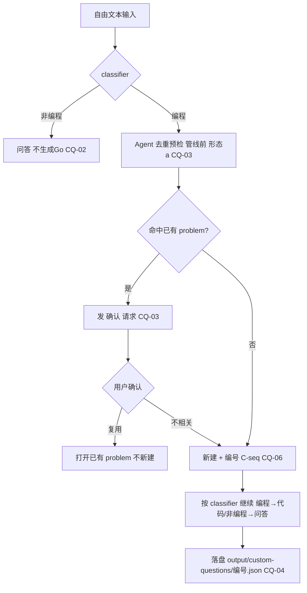

# 自定义问题支持（Custom Questions）

> 归属：Role 1 PM（`specs/<feature-slug>/<NAME>.md`）
> 关联：阶段一细化 `specs/PHASE1_PLAN.md`（Epic P1-13）；用户补充需求。
> 目标：支持「非 LeetCode」的任意问题输入，并正确路由 / 去重确认 / 独立存储。

---

## 1. 背景与问题

当前 `/api/problems/{id}/generate` 与 `run_pipeline` 的输入几乎都围绕 LeetCode 题目
（slug / id / URL / 本地缓存）。用户提出的新需求：

1. 支持**自定义问题**（任意文本，不一定是 LeetCode 题）。
2. 自定义问题经 `classifier` 路由：编程题走原来的代码生成路径；非编程题回到问答（general assistant）。
3. `task_summary` 节点应**先比对已有 problem 列表**：当自定义问题疑似命中某个已存在 problem 时，
   返回让用户确认；用户确认「不相关」才进入自定义问题路径。
4. 自定义问题必须与 LeetCode 问题**分开保存**。

> 备注：用户原话提到「classifier / task_summary 节点大部分时间没事做」——
> 指当前流程下这两个节点的价值未被充分释放；自定义问题恰好让它们承担真实职责
> （路由判断 + 去重确认），本 spec 不将其单列为一处「修复」，而是作为该特性的收益。

---

## 2. 目标（Goals）

- G1：任意自由文本可作为生成输入（不再强依赖 LeetCode slug/URL）。
- G2：`classifier` 正确分流编程 / 非编程；非编程进入问答，不生成 Go 文件。
- G3：`task_summary` 对自定义问题做「是否已有相关 problem」的预检 + 用户确认。
- G4：自定义问题独立存储，与 LeetCode 题库互不污染。

## 3. 非目标（Non-goals）

- 不改动 LeetCode 拉题 / 富化主流程（仅新增自定义输入分支）。
- 本特性不引入账号 / 多租户（属阶段三）。
- 不要求对自定义问题做 verifier 示例验证（无 LeetCode `exampleTestcaseList` 时本就 skip）。

---

## 4. Acceptance Criteria

### CQ-01 — 自定义编程题走原路径
- **Given** 用户输入一个自定义*编程*问题（如「用 Go 实现 LRU Cache」）。
- **When** 管线运行。
- **Then** `classifier` 判定为 `coding`，走原有 生成→编译→(验证) 路径，产出 Go 代码。
- **And** 结果可经 `/api/go-code` 查看，且被存入**自定义问题**存储（见 CQ-04）。

### CQ-02 — 自定义非编程题回到问答
- **Given** 用户输入一个*非编程*问题（如「解释一下 TCP 握手」）。
- **When** 管线运行。
- **Then** `classifier` 判定为 `general`，进入 `general_assistant` 问答路径。
- **And** **不**生成 Go 文件、不调用编译/验证节点。

### CQ-03 — Agent 去重预检 + 确认（自定义问题）
- **Given** 一个自定义问题文本。
- **When** 管线运行（**管线前预检，形态 (a)**）：由 **Agent（LLM，复用现有模型调用）** 比对本地 problem 列表，判断「是否为已存在问题」。
- **Then** 若 Agent 判定**命中已有 problem**：产出「疑似命中：<title>」的**确认请求**，用户明确确认前不进入生成路径。
  - 用户确认复用 → 直接打开/复用该已有 problem（不新建）。
  - 用户确认不相关 → 进入下方「新建」路径（CQ-06）。
- **And** 若 Agent 判定**非已存在**（无匹配）：**不**发确认，直接进入「新建」路径（CQ-06）。
- **And** 「是否已有」的判定**由 Agent（LLM）完成**，不实现独立的字符串/编辑距离算法（见 §6）。

### CQ-04 — 自定义问题独立存储
- **Given** 一个被接纳的自定义问题（无论编程/非编程）。
- **When** 管线完成或确认后落盘。
- **Then** 记录写入**独立于 LeetCode 题库**的位置（`output/custom-questions/`，方案 A），且带 `source: "custom"` 字段。
- **And** 该记录**不**混入 LeetCode 的 `problems_index.json` / `/api/problems` 默认列表（除非显式按 source 过滤）。
- **And** 可被后续按自定义来源查询 / 重新打开（见 CQ-06 的编号）。

### CQ-05 — 非交互（headless / CLI）降级
- **Given** 以非交互方式运行（CLI example、无用户确认通道）。
- **When** 遇到 CQ-03 的疑似命中。
- **Then** 默认跳过确认、直接按自定义问题继续（或在显式 `--no-confirm` 下如此），不阻塞。
- **And** 行为与交互模式一致地落盘到自定义存储（命中则复用、未命中则新建并编号）。

### CQ-06 — 不存在则新建自定义问题并编号
- **Given** 一个经 CQ-03 判定为「非已存在」的自定义问题（用户已确认不相关，或 Agent 直接判定无匹配）。
- **When** 进入新建路径。
- **Then** 在自定义存储中创建新记录，并赋予**编号/标识**（如 `C-<seq>` 自增序号），与 LeetCode 题号体系隔离。
- **And** 该编号可后续引用 / 重新打开（如按 `C-0001` 查询）。
- **And** 随后按 `classifier` 结果（编程→代码路径 / 非编程→问答）继续，结果落盘到该自定义记录。

---

## 5. Test Scenarios（映射回归用例）

| 场景 | 覆盖 AC | 说明 |
|------|---------|------|
| 自定义编程题 → 产出 Go | CQ-01 | stub LLM，断言落盘到 `output/custom-questions/` 且含 Go 代码 |
| 自定义非编程题 → 问答 | CQ-02 | 断言未调用编译/验证，返回问答文本 |
| Agent 判命中已有 problem → 发确认 | CQ-03 | stub LLM 返回「命中 X」，断言产出确认请求且未继续生成 |
| 用户确认复用已有 → 不新建 | CQ-03 | 模拟确认复用，断言未创建自定义记录、复用 X |
| 用户确认不相关 → 新建 | CQ-03/06 | 模拟确认不相关，断言进入新建路径 |
| Agent 判非已存在 → 直接新建并编号 | CQ-03/06 | stub LLM 返回「无匹配」，断言不发确认且新建 `C-<seq>` |
| 新建记录独立、带 source + 编号 | CQ-04/06 | 断言独立目录、不混入 `problems_index.json`、含编号字段 |
| CLI / `--no-confirm` 不阻塞 | CQ-05 | headless 模式断言跳过确认、按判定复用/新建 |

> 回归用例位置：`features/solver/tests/test_custom_questions_regression.py`（参照 `test_verifier_regression.py` 用 stub LLM 跑真实管线）。

---

## 6. 设计决策（已拍板 + 待定）

### 6.1 已拍板（Decided，user 于阶段一评审确认）
- **确认形态 = (a) 管线前预检**：在 `run_pipeline` 之前由 service 层调用 Agent 比对 problem 列表，
  命中则先向 Web 层返回「需确认」状态，用户确认后再启动 solver。与 W1 的 SSE/异步 Job 兼容。
- **存储布局 = (A) 独立目录**：自定义问题写入 `output/custom-questions/<id>.json`，与 `output/problems/` 物理隔离。
- **相似度判定 = 由 Agent（LLM）完成**：不实现独立的字符串/编辑距离/TF 算法；「是否已有」交给模型判断
  （复用现有 `invoke_model` 路由，喂入自定义问题 + 现有 problem 标题/摘要，让其返回命中与否及匹配项）。
- **新建即编号**：经判定为非已存在（或用户确认不相关）时，新建自定义问题并赋予隔离于 LeetCode 题号的编号（如 `C-<seq>`）。

### 6.2 流程（自定义问题，mermaid）

### 6.3 端点形态（已拍板：独立端点）
- **[decided: 端点 = 独立 `/api/custom-questions` 资源]** 用户拍板：独立端点比复用 `/api/problems?source=custom` 更好管理、更易复用。
  故自定义问题拥有**独立的一等资源**，不混入 LeetCode 题目路由。建议形状（Web 层细化，W2 定）：
  - `POST /api/custom-questions/precheck`：输入自由文本 → 返回 `{exists, matched_slug?, reason}`（即 CHECK_SPEC 的预检）。
  - `POST /api/custom-questions`：新建并编号（`C-<seq>`），接受「确认不相关 / 全新」两种来源；返回编号。
  - `GET  /api/custom-questions`：按 `source=custom` 列表（不出现在 `/api/problems` 默认列表）。
  - `GET  /api/custom-questions/{number}`：按编号打开/复用已有记录。
  - **确认步骤**：命中已有 problem 时，前端进入「需确认」态；用户决策经 `POST /api/custom-questions/confirm`
    （复用 | 不相关）回传。预检/确认作为 custom-questions 的**子资源**，与阶段一 W1 的 Job「待确认」态兼容（confirm 解析后启动 Job）。
- 与 LeetCode 题目的边界：自定义问题列表/详情**不**进入 `/api/problems` 默认列表与 `problems_index.json`，
  仅在显式按 `source=custom` 查询时出现 —— 与 CQ-04 存储决策一致。

---

## 7. 与阶段一其他 Epic 的依赖

- 依赖 `classifier` / `task_summary` 节点（已存在，本特性赋予其新职责）。
- 依赖阶段一 **W1 的 SSE / 异步 Job**（CQ-03 确认步骤若采用方案 a，需 Job 状态机承载「待确认」态）。
- 依赖 `storage` 层新增自定义写入路径（CQ-04）。
- 建议排期：放在 **W2（可靠/功能）**，确认交互形态后可与 P1-6（异步 Job）协同设计。

---

## 8. 开放问题（状态）

- ~~CQ-03 确认形态 (a)/(b)~~ → **已定 (a) 管线前预检**。
- ~~自定义存储 方案 A/B~~ → **已定 (A) 独立目录 `output/custom-questions/`**。
- ~~相似度算法口径~~ → **已定：由 Agent（LLM）判断，不做独立字符串/编辑距离算法**。
- ~~自定义问题端点形态~~ → **已定：独立端点 `/api/custom-questions`**（list / create / open-by-number / precheck / confirm 子资源）。
  用户判断：独立端点比复用 `/api/problems?source=custom` 更好管理与复用；确认步骤为其子资源 `confirm`，与 Job「待确认」态兼容。
