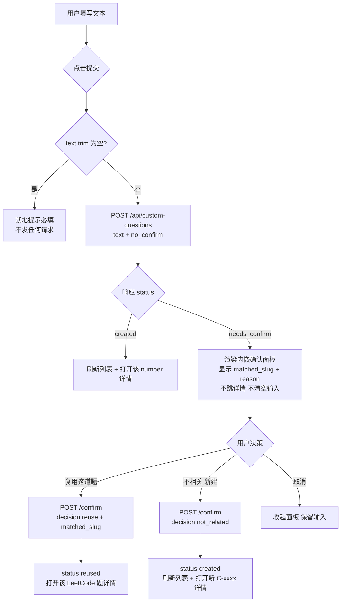

# 自定义问题 · 前端输入 Tab 与确认交互（P1-13 UI 子任务）

> 归属：Role 1 PM（`specs/<feature-slug>/<NAME>.md`）
> 关联：feature spec `specs/custom-questions/CUSTOM_QUESTIONS.md`（CQ-01…CQ-06、§6.3 端点形态）；
> 子任务 spec `specs/custom-questions/CHECK_SPEC.md`（CK-01…CK-09，后端预检已交付）；
> 阶段一 `specs/PHASE1_PLAN.md` 的 P1-13。
> 性质：**开发就绪的 UI 子任务 spec**（含 `## Acceptance Criteria` + `## Test Scenarios`，每条 AC 可二值判定并映射验证方式）。
> 状态：决策已拍板（见 §5），可直接交 Dev 实现。
> 建议分支：`feat/custom-questions-ui`

---

## 1. 缺口确认（已核实）

### 1.1 前端零 custom-questions UI

`frontend/index.html`（501 行，原生 JS 单页应用）现状：

| 项 | 现状 | 位置 |
|----|------|------|
| tab | 仅 2 个：`data-tab="problems"` / `data-tab="gocode"` | L120-121 |
| view | 仅 3 个：`view-problems` / `view-gocode` / `view-detail` | L127 / L160 / L170 |
| view 注册 | `showView()` 硬编码数组 `['problems','gocode','detail']` | L292 |
| custom 相关代码 | 全文件检索 `custom` → **0 命中** | — |

即：**无输入表单、无列表视图、无详情视图、无任何 fetch 指向 `/api/custom-questions`**。

### 1.2 后端已完整就绪

`web/routes/custom_questions.py` 已实现并通过验收的 5 个端点：
`POST /precheck`、`POST /`（create）、`POST /confirm`、`GET /`（list）、`GET /{number}`。
后端语义由 `features/solver/tests/test_custom_check_regression.py`（CK-01…CK-09）
与 `features/solver/tests/test_custom_questions_regression.py`（CQ-01…CQ-06）覆盖。

### 1.3 Spec 规划遗漏（本 spec 要补的洞）

- `CUSTOM_QUESTIONS.md §6.3` 定义了端点形态，但只把「**前端确认弹窗 UI**」留给 W2。
- `CHECK_SPEC.md §1「不含」` 同样只排除了「前端『确认』弹窗 UI」。
- **「自由文本输入表单」本身从未出现在任何 spec 的 Goals / AC / Test Scenarios 中** ——
  既不在 CQ-01…CQ-06，也不在 CK-01…CK-09。

> **结论**：这不是「已规划但延后的 scope expansion」，而是**需求链断裂** ——
> 后端能力 100% 完成，但缺少任何用户可达的入口，功能从 UI 端零可用。
> 属 PM 侧规划遗漏，本 spec 即为该遗漏的补齐（spec 例外记录见 §4.3）。

---

## 2. 产品设计方案

### 2.1 Tab 与 view 骨架（复用现有 SPA 机制）

**HTML 改动**

```
header .tabs 追加：  <button class="tab" data-tab="custom">自定义题目</button>
main 内新增：        <section id="view-custom" class="view"> … </section>
```

- tab 位置：置于「Go 代码」**之后**（三 tab 顺序：题目 → Go 代码 → 自定义题目）。
- `#view-custom` **必须插在 `#view-detail` 之前**，保持「列表类 view 在前、详情 view 收尾」的既有阅读顺序。

**JS 改动 —— 仅 1 行**

- `showView()` 数组扩展为 `['problems','gocode','custom','detail']`（L292）。
- Tab 点击监听 **零改动**：现有 `querySelectorAll('.tab').forEach(...)`（L297-300）是泛化实现，
  靠 `data-tab` 驱动 `setTabs()` + `showView()`，新 tab 自动生效。
- `detail-back` **零改动**：现有实现读 `.tab.active` 回跳（L456-460），
  从自定义题目详情返回会自动回到自定义题目 tab。

> **设计约束（刻意）：tab 切换零新增机制。只扩数据、不扩架构。**

**CSS 改动 —— 仅 1 条**

只需为 `textarea` 补一条样式（现有 `.toolbar input[type="text"]` 选择器不覆盖 `textarea`）。
其余全部复用：`.toolbar` / `.card` / `.detail` / `.badge` / `.pill` / `.tag` / `.empty` / `.err` / `.spinner`。

### 2.2 输入表单字段

| 控件 | 建议 id | 映射请求字段 | 必填 | 说明 |
|------|---------|-------------|------|------|
| 多行文本域 | `c-text` | → `text` | ✅ | 自由文本问题。placeholder 建议 `例如：用 Go 实现一个 LRU Cache / 解释 TCP 三次握手` —— **同时示意编程与非编程两类**，因为 classifier 会分流，用户需知道两类都支持 |
| 复选框「跳过查重确认，直接新建」 | `c-no-confirm` | → `no_confirm` | ❌ | **默认不勾选**（决策 D6）。勾选后即使命中也直接创建，对应 CQ-05 / CK-08 的 headless 语义 |
| 主按钮「提交」 | `c-submit` | — | — | 请求进行中 `disabled` |
| 次按钮「仅试查重」 | `c-precheck` | → `POST /precheck` | — | 次要操作，**绝不进入提交主路径**（决策 D3，理由见 §2.3 与附录 A4） |
| 状态文本 | `c-status` | — | — | 复用 `.meta` 样式，同现有 `pull-status` / `gen-status` 模式 |

**明确不设置的字段**

- ❌ 难度 / 标签 —— 后端 `CustomCreateRequest` 无此入参，`_create_and_run` 内 `difficulty=None` 硬编码，值无处可送（决策 D2）。
- ❌ `problems_dir` —— 该字段在 schema 中标注为 `(testing)` 用途的 override，暴露到 UI 会导致用户可指定任意路径（安全约束，见附录 A5）。

### 2.3 预检 → 确认 交互流程（核心）

**采用单次提交流程**，规避重复查重（理由见附录 A4）：



**确认面板形态：内嵌面板，非模态弹窗**

| 理由 | 说明 |
|------|------|
| 架构一致性 | 现有 SPA 全程无模态组件；唯一 `alert` 是 L491 的失败兜底 |
| 信息承载 | 命中信息含 `matched_slug` + `reason` 两段文本 + 3 个操作，`confirm()` 无法承载 |
| 零新 CSS | 内嵌面板可直接复用 `.card` / `.toolbar` 样式 |

> 这将 `CUSTOM_QUESTIONS.md §6.3` 中「前端确认弹窗 UI」的措辞落地为「**内嵌确认面板**」。
> 相应指针已在该文档 §6.3 修订（见 §4.3）。Dev 侧 `web/routes/custom_questions.py`
> 模块 docstring 中「Frontend confirmation popup UI is deferred to W2.」一句同属过期表述，
> 建议 Dev 在实现本 spec 时顺手更正（**该文件归 Dev，PM 不改**）。

**判定依据（关键）**
分流必须依据 `POST /api/custom-questions` 响应的 `status === "needs_confirm"`（或 `needs_confirm === true`）。
**不得**读取 `/precheck` 响应上不存在的字段（见附录 A2）。

**「仅试查重」按钮**
调 `POST /precheck` 展示 `{status, matched_slug, reason}`，纯只读、不落盘、不创建记录。
价值：让用户在提交前低成本探查。代价：多一次 LLM 调用。
保留但标注为次要操作，**且绝不接入提交路径**（决策 D3）。

### 2.4 长耗时同步请求的加载态

`POST /api/custom-questions` 是**同步全管线**：LLM 查重 → classifier → 代码生成 LLM → 编译 → 验证，
全部在一个 HTTP 请求内完成。路由层的 `asyncio.to_thread` 只是避免阻塞事件循环，**不缩短响应时间**；
W1 的异步 Job / SSE **并未**接入这些路由（见 §4.2 Out of scope）。

前端必须：

1. 提交后立即 `c-submit.disabled = true`，防重复提交。
2. `c-status` 显示**分阶段预期**文案，如 `查重 → 生成 → 编译中，可能需要数十秒…`
   （措辞对齐现有 `gen-status` 的 `生成中（LLM → 编译）…`）。
3. **不设** fetch 超时 —— 现有 `api()` / `apiPost()` 本身无 timeout，保持原样。
4. 失败时恢复按钮可用并显示 `e.message`。
   **直接复用现有 `apiPost` 的错误解析**（L198-209，已处理 FastAPI `detail` 的字符串与数组两种形态），
   不要重写错误处理。
5. 成功或失败后（`finally`）均恢复按钮可用状态。

### 2.5 列表视图

数据源 `GET /api/custom-questions` → **裸数组**（附录 A3）。

| 渲染项 | 数据 | 样式 |
|--------|------|------|
| 标题 | `title`（后端已截断至 80 字，前端**不要**再截） | `.card .title` |
| 元信息 | `# {number} · {created_at}` | `.card .meta` |
| 分类 | `category`（classifier 结果） | `.tag` |
| 代码标记 | `has_code === true` 时显示「有 Go 代码」 | `.pill.go`（与题目列表视觉语言一致） |
| 点击 | → `openCustom(number)` | `.card` 既有 hover/cursor |

- **空态**：返回 `[]` 时显示 `.empty`，文案兼引导，如
  `还没有自定义题目，在上方输入框提交一个。`
  （这是全新功能，首次访问必为空，空态即首屏引导。）
- **不分页**（决策 D5）：后端不支持 `limit` / `offset` / `search` / `order_by`，自定义题目量级小。
  若后续需要，可客户端 `slice` + 复用现有 `renderPager(host, arr.length, …)`。
- **加载时机**：切到该 tab 时按需加载一次（建议 `let cLoaded = false;` 标记，与 `pPage`/`gPage` 同风格）；
  创建成功后强制刷新。

### 2.6 详情视图（编程 / 非编程双分支）

复用 `#view-detail` + 新增 `openCustom(number)`，严格照 `openProblem()` / `openGoCode()` 的既有写法：
`showView('detail')` → 渲染 spinner → `api()` → 拼 `.detail` HTML → 绑定事件 → `catch` 渲染 `.err`。

数据源 `GET /api/custom-questions/{number}` → **裸记录**（附录 A7）。分区渲染：

| 区块 | 字段 | 渲染条件 |
|------|------|---------|
| 标题 | `number` | 总是 |
| 元信息 | `created_at` · `source` · `category` | 总是 |
| 原始问题 | `input_question` | 总是（`esc()` 后置于 `<pre class="code">`） |
| 查重结论 | `precheck.status` / `precheck.matched_slug` / `precheck.reason` | 存在 `precheck` 时 |
| 编译结果 | `build_result` | **编程分支**（存在 `code_path`） |
| 验证结果 | `verify_result` / `verify_details` | 有值时 |
| 回答输出 | `final_output` | **非编程分支**（无 `code_path`），用 `renderMarkdown()` |
| 跳转 Go 代码 | 由 `task_dir` 推导 | 见下方 ⚠️ |

> ⚠️ **必须实现双分支**：`_create_and_run` 对编程题与非编程题**都**落盘、都返回 `status:"created"`，
> 差异仅在 `code_path` / `build_result`（编程）vs `final_output`（问答）。
> 只渲染其中一支，会让另一类记录表现为「空详情」。

> ⚠️ **「查看 Go 代码」跳转为 best-effort（决策 D4，待 Dev 核实）**：
> 记录中只有 `task_dir` / `code_path`（**路径**），而现有 `openGoCode(task)` 需要的是 `task_name`。
> 二者是否等于 `basename(task_dir)` **需 Dev 核实**。
> 若不成立，本期**降级为只展示路径文本、不做跳转** —— 不要硬猜，避免产生点击即 404 的死链。

### 2.7 集成方式与 XSS 转义

| 方面 | 约定 |
|------|------|
| 数据访问 | 原样复用 `api()` / `apiPost()`，**不新增** helper |
| **XSS 转义** | 所有用户输入与 LLM 产出文本（`input_question` / `title` / `reason` / `matched_slug` / `build_result` / `category`）**一律过 `esc()`** |
| Markdown | 仅 `final_output` 走 `renderMarkdown()`；其内部先 `esc()` 再解析（L280），安全 |
| 状态变量 | `let cLoaded = false;`，与 `pPage` / `gPage` 同风格 |
| 事件绑定 | 在既有 `(async function init(){…})()` 内**追加**，不改动任何现有绑定 |
| 改动面预估 | `showView` 1 行 + 1 条 textarea CSS + 1 段 HTML + 1 段 JS（约 120-160 行），**对现有代码零破坏性修改** |

---

## 3. Acceptance Criteria

> 编号前缀 `CU-`（Custom UI），沿用仓库既有 `CQ-0x` / `CK-0x` 风格。
> 验证载体：新建 `web/tests/test_custom_questions_ui_contract.py`（决策 D7），
> 测试函数名沿用既有 `test_ck01_*` 惯例 → `test_cu01_*`。
> - **静态契约断言**：读 `frontend/index.html` 文本做断言（tab / view / 字段名 / `showView` 注册），无需浏览器。
> - **API 契约断言**：FastAPI `TestClient` + stub service，断言请求体字段名与响应分流。
> - 标 `[手动]` 者为浏览器目视验证。
>
> 🔴 = 高风险项，直接防守附录 A1 / A2 / A3 的契约陷阱。

### A. Tab 与骨架

#### CU-01 — 自定义题目 tab 存在
- **When** 打开页面。
- **Then** header 中存在 `data-tab="custom"` 的 tab，文案为「自定义题目」，且位于「Go 代码」之后。
- **验证**：静态断言 `index.html` 含 `data-tab="custom"` 且顺序正确 → `test_cu01_tab_present`

#### CU-02 — tab 可切换且 view 已注册
- **When** 点击「自定义题目」tab。
- **Then** `#view-custom` 获得 `.active`，其余 view 失去 `.active`。
- **验证**：静态断言 `showView` 数组含 `'custom'` 且存在 `id="view-custom"` → `test_cu02_view_registered`；＋ `[手动]` 目视切换

#### CU-03 — 从自定义详情返回回到自定义 tab
- **Given** 处于自定义题目详情视图。
- **When** 点击「← 返回」。
- **Then** 回到自定义题目列表（**非**题目 tab）。
- **验证**：`[手动]`；＋ `test_cu03_detail_back_unchanged`（静态断言 `detail-back` 逻辑未被改写）

### B. 提交与创建

#### CU-04 — 空输入拦截
- **Given** `c-text` 为空或纯空白字符。
- **When** 点击「提交」。
- **Then** **不发起任何网络请求**，并就地提示必填。
- **验证**：`test_cu04_empty_guard`（静态断言存在 `trim()` 空值守卫）；＋ `[手动]` DevTools Network 面板无请求

#### CU-05 🔴 — 请求体字段名必须为 `text`
- **When** 提交表单。
- **Then** 请求体为 `{"text": <输入>, "no_confirm": <bool>}`；**字段名必须是 `text`**（不是 `question`），且**不含** `problems_dir`。
- **验证**：`TestClient` 捕获请求体，断言 `"text" in body` and `"question" not in body` and `"problems_dir" not in body` → `test_cu05_request_field_names`
- **风险**：防守附录 A1 / A5。字段名写错 → FastAPI 422，功能完全不通。**本次最高风险项。**

#### CU-06 — created 分发
- **Given** 提交响应 `status:"created"` 且携带 `number`。
- **When** 处理响应。
- **Then** 列表刷新，且自动打开该 `number` 的详情。
- **验证**：`test_cu06_created_dispatch`；＋ `[手动]`

#### CU-07 — 提交期间禁用与恢复
- **When** 请求进行中。
- **Then** 提交按钮 `disabled` 且状态区显示进行中文案。
- **And** 请求结束（成功或失败）后按钮恢复可用。
- **验证**：`[手动]`（对应 §2.4 长耗时同步请求）

### C. 确认分支

#### CU-08 🔴 — needs_confirm 触发内嵌确认面板
- **Given** `no_confirm` 未勾选，且响应 `status:"needs_confirm"`。
- **When** 处理响应。
- **Then** 展示确认面板，显示 `matched_slug` 与 `reason`，**不跳转详情、不清空输入**。
- **And** 面板提供「复用这道题 / 不相关，新建 / 取消」三个操作。
- **验证**：`TestClient` 返回 `needs_confirm` 桩 → `test_cu08_needs_confirm_panel`；＋ `[手动]`
- **风险**：判定依据必须是 `status === "needs_confirm"`（或 `needs_confirm === true`）。
  防守附录 A2 —— 若读 `/precheck` 上不存在的 `needs_confirm` 字段，确认分支将**永不触发**。

#### CU-09 — 复用决策入参正确
- **Given** 确认面板已展示。
- **When** 点击「复用这道题」。
- **Then** 发出 `POST /api/custom-questions/confirm`，请求体为 `{text, decision:"reuse", matched_slug}`。
- **And** 响应 `status:"reused"` 后打开该 LeetCode 题详情，且**不产生新的 `C-xxxx` 记录**。
- **验证**：断言请求体 `decision == "reuse"` 且携带 `matched_slug` → `test_cu09_confirm_reuse`
- **备注**：「不新建记录」的后端语义已由 `features/solver/tests/test_custom_check_regression.py::test_ck05_confirm_reuse_creates_no_record` 覆盖；前端侧只断言入参正确，**不重复测后端**。

#### CU-10 — 不相关决策入参正确
- **Given** 确认面板已展示。
- **When** 点击「不相关，新建」。
- **Then** 发出 `POST /confirm` 且 `decision:"not_related"`。
- **And** 响应 `status:"created"` 后打开新建的 `C-xxxx` 详情。
- **验证**：断言 `decision == "not_related"` → `test_cu10_confirm_not_related`

#### CU-11 — no_confirm 勾选后跳过确认面板
- **Given** 勾选「跳过查重确认，直接新建」。
- **When** 提交一个会命中已有题目的问题。
- **Then** 请求体 `no_confirm: true`，响应直接为 `created`，**确认面板不出现**。
- **验证**：断言 `body["no_confirm"] is True` → `test_cu11_no_confirm_skips_panel`
- **备注**：后端 headless 语义已由 `test_ck08_headless_no_confirm_creates` 覆盖。

#### CU-12 — 取消确认保留输入
- **Given** 确认面板已展示。
- **When** 点击「取消」。
- **Then** 面板收起、输入内容保留、**不发起新请求**。
- **验证**：`[手动]`

### D. 列表与详情

#### CU-13 🔴 — 列表按裸数组渲染
- **Given** `GET /api/custom-questions` 返回**裸数组**。
- **When** 渲染列表。
- **Then** 每条记录渲染一张 `.card`，**且代码不读取 `.items` / `.total`**。
- **验证**：`TestClient` 分别返回 `[]` 与 2 元素数组两种桩，断言无 `TypeError` → `test_cu13_bare_array_render`
- **风险**：防守附录 A3。若照 `/api/problems` 的分页信封写 `data.items.length` → `TypeError` → 列表白屏。

#### CU-14 — 空数组空态
- **Given** 列表返回 `[]`。
- **When** 渲染。
- **Then** 显示 `.empty` 空态引导文案，不报错。
- **验证**：`test_cu14_empty_state`

#### CU-15 — 编程类详情
- **Given** 一条编程类记录（存在 `code_path`）。
- **When** 打开详情。
- **Then** 显示 `number`、`input_question`、`category`、`build_result`。
- **验证**：`test_cu15_detail_coding`

#### CU-16 — 非编程类详情
- **Given** 一条非编程类记录（无 `code_path`、有 `final_output`）。
- **When** 打开详情。
- **Then** 显示 `final_output` 内容，且**不**显示空的编译结果区块。
- **验证**：`test_cu16_detail_general`
- **风险**：防守 §2.6 的双分支要求。

#### CU-17 — 非法编号 404 优雅降级
- **Given** 请求 `GET /api/custom-questions/{number}` 返回 404
  （如非法编号 `C-1` —— `custom_storage._NUMBER_RE` 要求 `^C-\d{4,}$`，故 `C-1` 不匹配 → `load_custom_question` 返回 `None` → 404）。
- **When** 打开详情。
- **Then** 显示 `.err` 错误态；页面不白屏、不抛未捕获异常。
- **验证**：`test_cu17_detail_404_graceful`

### E. 安全

#### CU-18 — XSS 转义
- **Given** `input_question` / `reason` / `title` 含 `<script>alert(1)</script>`。
- **When** 列表与详情渲染。
- **Then** 内容以**纯文本**显示，脚本不执行。
- **验证**：断言输出经 `esc()` → `test_cu18_xss_escaped`；＋ `[手动]`

---

## 4. Test Scenarios（映射验证方式）

> 回归用例位置：`web/tests/test_custom_questions_ui_contract.py`（新建，决策 D7）。

| 场景 | 覆盖 AC | 验证方式 |
|------|---------|---------|
| tab 存在 / 可切换 / 返回回跳 | CU-01/02/03 | 静态断言 ＋ 手动 |
| 空输入拦截，不发请求 | CU-04 | 静态断言 ＋ 手动 |
| **请求体字段名 = `text`，无 `problems_dir`** | **CU-05 🔴** | **TestClient 断言（最高优先）** |
| created → 刷新列表 + 打开详情 | CU-06 | TestClient 桩 ＋ 手动 |
| 提交中禁用 / 结束恢复 | CU-07 | 手动 |
| **needs_confirm → 内嵌确认面板** | **CU-08 🔴** | **TestClient 桩 ＋ 手动** |
| 复用 → `decision=reuse` + `matched_slug` | CU-09 | TestClient 断言 |
| 不相关 → `decision=not_related` | CU-10 | TestClient 断言 |
| `no_confirm=true` → 跳过面板 | CU-11 | TestClient 断言 |
| 取消 → 收起面板、保留输入 | CU-12 | 手动 |
| **裸数组渲染，不读 `.items`** | **CU-13 🔴** | **TestClient 桩（防白屏）** |
| 空数组 → 空态引导 | CU-14 | TestClient 桩 |
| 编程类详情（`build_result`） | CU-15 | TestClient 桩 |
| 非编程类详情（`final_output`） | CU-16 | TestClient 桩 |
| 非法编号 404 → 错误态 | CU-17 | TestClient 桩 |
| XSS 转义 | CU-18 | 断言 ＋ 手动 |

### 4.1 In scope（本期交付）

1. 「自定义题目」tab + `#view-custom` 骨架（§2.1）。
2. 输入表单：`text` 文本域 + `no_confirm` 复选框 + 提交（§2.2）。
3. **确认流**：内嵌确认面板 + `POST /confirm` 的 `reuse` / `not_related` 两种决策（§2.3，决策 D1）。
4. 列表视图（裸数组、不分页）＋ 详情视图（编程 / 非编程双分支）（§2.5 / §2.6）。
5. 加载态、错误态、空态、XSS 转义（§2.4 / §2.7）。
6. 测试基建：新建 `web/tests/test_custom_questions_ui_contract.py`（决策 D7）。

**确认流为何必须本期做（不接受「仅提交+列表」）**
`POST /api/custom-questions` 在 `no_confirm=false`（默认值）下**随时可能**返回 `status:"needs_confirm"`。
若不实现确认面板，用户提交一个「疑似已有」的问题时，后端既不创建也不报错，
前端拿到一个自己不认识的 status → **表现为「点了提交什么都没发生」的静默死角**，
且用户无任何自救路径（除非回头勾选 `no_confirm`）。
故确认流不是加分项，而是**功能完整性下限**；实现成本仅为一个复用 `.card` 的面板 + 两个按钮 + 两次已就绪的 `apiPost`。

### 4.2 Out of scope（显式排除，不得静默扩张）

| 排除项 | 原因 |
|--------|------|
| ❌ 难度 / 标签入参 | 后端无字段，需改 `CustomCreateRequest` + service 签名 → 独立需求（决策 D2） |
| ❌ 异步 Job / SSE 进度 | W1 的 Job 未接入 custom-questions 路由；本期用同步 spinner（§2.4） |
| ❌ 列表分页 / 搜索 / 排序 | 后端无 `limit` / `offset` / `search`（决策 D5） |
| ❌ 删除 / 编辑自定义题目 | **后端无对应端点** |
| ❌ 模态弹窗组件 | 刻意不引入，改用内嵌面板（§2.3） |
| ❌ `problems_dir` 覆盖入口 | 安全约束（附录 A5） |

### 4.3 Spec 例外记录

- 本 spec 补齐 §1.3 所述规划遗漏（「自由文本输入表单」从未进入任何 AC）。
- `CUSTOM_QUESTIONS.md §6.3` 已追加指针：
  「前端确认弹窗 UI」→「前端输入 tab + 内嵌确认面板（已排期，见 `CUSTOM_QUESTIONS_UI.md`）」。
- `CHECK_SPEC.md §1` 中「端点形态仍 `[scope expansion]`」已更新为已排期状态并指向本文档。
- **遗留（Dev 侧，PM 不改）**：`web/routes/custom_questions.py` 模块 docstring 的
  「Frontend confirmation popup UI is deferred to W2.」为过期表述，建议 Dev 实现本 spec 时顺手更正。

### 4.4 回归不倒退要求

本次仅改 `frontend/index.html` 与新增 `web/tests/`，不触碰后端逻辑。
`features/solver/tests/` 下现有回归用例（CQ-01…CQ-06 + CK-01…CK-09）**必须仍全绿**，
预期零影响，但需实际跑一遍确认。

---

## 5. 已确认决策（user / 主理人已拍板）

| # | 议题 | 决策 |
|---|------|------|
| **D1** | 确认流是否本期做 | ✅ **本期做**（内嵌确认面板 + `/confirm` 两种 decision）。否则存在「提交后无反应」静默死角 |
| **D2** | 难度 / 标签字段 | ❌ **不做**。表单只留 `text` + `no_confirm`；后端无入参，加了即死 UI |
| **D3** | 独立「仅试查重」按钮 | ✅ **保留**，但标为次要操作，**绝不进入提交主路径**（否则触发重复查重，见附录 A4） |
| **D4** | 详情页「查看 Go 代码」跳转 | ⚠️ **交 Dev 核实** `task_name` 能否由 `task_dir` 推导；不成立则本期只显示路径文本、不做跳转 |
| **D5** | 列表分页 | ❌ **不分页**。量级小，且后端不支持 `offset` |
| **D6** | `no_confirm` 默认值 | ☐ **默认不勾选**（= 默认走查重确认），符合 CQ-03 产品意图；默认勾选会使查重能力形同废弃 |
| **D7** | 新建 `web/tests/` 测试基建 | ✅ **新建**（静态 HTML 断言 + `TestClient`，无需浏览器）。否则 CU-* 全为手动验收，AC 无法机械回归 |
| **D8** | 在自定义 tab 粘贴 LeetCode slug | ✅ **接受当前行为**：该路由**不**走 `is_leetcode_reference` 短路（仅 `generate_for_query` 走），会进查重 → 大概率 `needs_confirm` → 用户点「复用」即得原题。placeholder 不引导粘贴 slug |

---

## 附录 A · 真实 API 契约（Dev 实现以此为准）

> 以下为对 `web/schemas.py` 与 `web/routes/custom_questions.py` 的逐行核实结果。
> A1–A3 为已发现并纠正的契约偏差，A4–A5 为设计陷阱与安全约束，A6–A7 为准确响应形状。

### A1 🔴 请求体字段名是 `text`，不是 `question`

`CustomPrecheckRequest` / `CustomCreateRequest` / `CustomConfirmRequest` **三者全部**使用 `text` 字段。

```
CustomCreateRequest  = { text: str（必填）, no_confirm: bool = False, problems_dir: str|None = None }
CustomPrecheckRequest= { text: str（必填）, problems_dir: str|None = None }
CustomConfirmRequest = { text: str（必填）, decision: str（必填）, matched_slug: str|None, problems_dir: str|None }
```

- `decision` 取值：`"reuse"` | `"not_related"`。
- 按 `question` 发请求 → FastAPI **422** 校验失败，功能完全不通。

### A2 🔴 precheck 响应**没有** `needs_confirm`

```
CustomPrecheckResult = { status: str, matched_slug: str|None = None, reason: str = "" }
```

- `status` 取值：`"match"` | `"no_match"`。
- 字段名是 **`matched_slug`**，不是 `matched`。
- **`needs_confirm` 只存在于 `CustomGenerateResult`**（create / confirm 的响应），precheck 上没有。
- 若前端读 `precheckRes.needs_confirm` → 恒为 `undefined` → 确认分支**永不触发**。

### A3 🔴 列表返回裸数组，不是分页信封

`GET /api/custom-questions` 的 `response_model=list[CustomQuestionSummary]` → **裸 JSON 数组**。

- **不是** `/api/problems` 那种 `{total, count, limit, offset, items}` 信封。
- 复用现有 `data.items.length` → `TypeError` → 列表白屏；`renderPager(total)` 亦拿不到 `total`。

### A4 ⚠️ create 内部已执行查重 —— 必须单次提交

`POST /api/custom-questions` → `features/solver/service.py::generate_custom_question()`
**函数体第一行即调用 `precheck_custom_question()`**。

因此「先调 `/precheck`，再按结果决定是否 `POST` 创建」的流程会：

1. **跑两次 LLM 查重** —— 成本翻倍、等待时间翻倍；
2. 两次判定**可能不一致**（LLM 非确定性）→ 出现「预检说没命中，创建却返回 `needs_confirm`」的自相矛盾 UI。

→ **正确流程：直接 `POST /api/custom-questions`，用响应 `status` 分流**（§2.3）。
`/precheck` 仅作为独立的「仅试查重」次要功能存在（决策 D3）。

### A5 ⚠️ `problems_dir` 不得暴露到 UI

三个请求体中的 `problems_dir` 在 schema 中标注为 `Override problems dir (testing)`，是测试用 override。
暴露到 UI 会让用户可指定任意路径。**前端不得发送该字段。**

> 另注：`POST /api/custom-questions` 与 `/confirm` 的路由实现中 `custom_dir=_custom_dir(None)`，
> 即写入目录**始终**为服务端默认 `CUSTOM_QUESTIONS_DIR`，不受请求影响。

### A6 create / confirm 响应形状

两者共用同一个响应模型 `CustomGenerateResult`：

```
{
  status: str,               # "created" | "needs_confirm" | "reused" | "leetcode"
  number: str|None,          # 新建时为 "C-<NNNN>"
  needs_confirm: bool,       # 默认 False
  matched_slug: str|None,
  reason: str,
  input: str|None,
  result: dict|None,         # 管线最终 state
  record: dict|None          # 落盘记录
}
```

- `"created"` —— 已创建并跑完管线，`number` 有效。
- `"needs_confirm"` —— 命中已有题目且 `no_confirm=false`；**solver 未启动、未创建记录**。
- `"reused"` —— 仅来自 `/confirm` 的 `decision:"reuse"`；`number` 为 `None`，**不创建自定义记录**。
- `"leetcode"` —— 仅来自 `generate_for_query` 入口，本 UI 不会遇到。

### A7 列表项与详情记录字段

**列表项** `CustomQuestionSummary`：

```
{ number, source, created_at, category, task_dir, has_code, title }
```

- `title` = `input_question[:80]`（**后端已截断**，前端不要再截）。
- `has_code` = `bool(code_path)`。
- `source` 恒为 `"custom"`。

**详情** `GET /api/custom-questions/{number}` → `response_model=dict`，**裸记录**，
字段为 `features/problems/custom_storage.py::save_custom_question` 落盘的那套：

```
source, number, created_at,
input_question, category, task_dir, code_path,
build_result, final_output, verify_result, verify_details,
precheck            # 嵌套 { status, matched_slug, reason }
```

- 编号正则 `^C-\d{4,}$`；不匹配（如 `C-1`）→ `load_custom_question` 返回 `None` → 路由抛 **404**。
- 非 `source == "custom"` 的记录同样返回 `None` → 404。

---

## 附录 B · 端点速查

| 方法 | 路径 | 请求体 | 响应 | 本 UI 用途 |
|------|------|--------|------|-----------|
| POST | `/api/custom-questions/precheck` | `{text}` | `{status, matched_slug, reason}` | 次要「仅试查重」按钮（D3） |
| POST | `/api/custom-questions` | `{text, no_confirm}` | `CustomGenerateResult` | **提交主路径**（内部已含查重，见 A4） |
| POST | `/api/custom-questions/confirm` | `{text, decision, matched_slug?}` | `CustomGenerateResult` | 确认面板的「复用」/「不相关，新建」 |
| GET | `/api/custom-questions` | — | **裸数组** `[CustomQuestionSummary]` | 列表视图（见 A3） |
| GET | `/api/custom-questions/{number}` | — | **裸记录** `dict` | 详情视图（非法编号 → 404） |

---

## 附录 C · 现有前端可复用资产清单

供 Dev 实现时直接引用，避免重复造轮子（行号基于当前 `frontend/index.html`）。

| 资产 | 位置 | 复用方式 |
|------|------|---------|
| `$(id)` / `el(tag,cls,html)` / `esc(s)` | L181-183 | 直接用；所有文本渲染必过 `esc()` |
| `api(path, params)` | L184-190 | GET 列表 / 详情 |
| `apiPost(path, body)` | L191-211 | POST 提交 / 确认；**已含 FastAPI `detail` 解析（含 422 数组）** |
| `renderMarkdown(md)` | L278-288 | 仅用于 `final_output`；内部先 `esc()` 再解析，安全 |
| `showView(name)` | L291-293 | **唯一需修改处**：数组加 `'custom'` |
| `setTabs(active)` | L294-296 | 无需改动 |
| tab 点击监听 | L297-300 | 泛化实现，无需改动 |
| `renderPager(...)` | L361-370 | 本期不用（D5 不分页）；未来客户端分页时可复用 |
| `detail-back` 回跳 | L456-460 | 无需改动，自动支持新 tab |
| 样式 class | L63-108 | `.card` / `.detail` / `.toolbar` / `.badge` / `.pill(.go)` / `.tag` / `.empty` / `.err` / `.spinner` / `pre.code` |