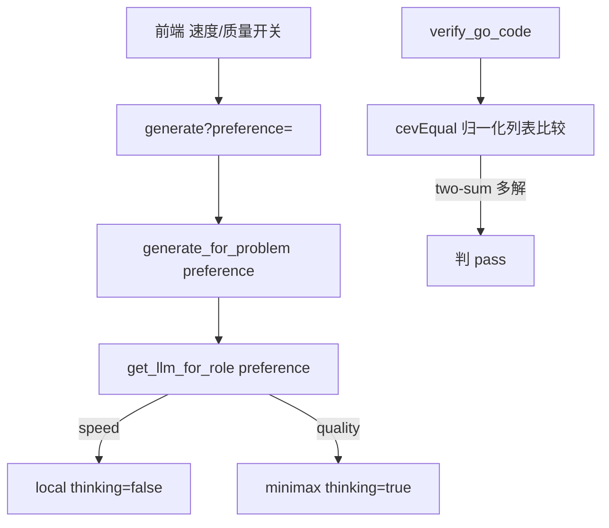

# 默认模型/thinking 调优 + 速度质量开关 + 多解误判（P1-9 子任务）

> 归属：Role 1 PM（`specs/<feature-slug>/<NAME>.md`）
> 关联：阶段一 `specs/PHASE1_PLAN.md` 的 P1-9；依赖 **P1-8**（先有 `used_model` 可见以验证开关生效）、verifier 已有基础。
> 性质：**开发就绪的子任务 spec**（含 `## Acceptance Criteria` + `## Test Scenarios`，每条 AC 1:1 映射回归用例）。
> Wave：W3（**含 P1-9FE 速度/质量优先开关子 Epic，与 P1-9 同波同批验收**，见 §1.1 矩阵）。

---

## 1. 范围与边界

本 spec 只覆盖「**缩短耗时、减少空跑重生成**」：

### 要做什么
1. `infrastructure/models.yaml`：保持 `code_generator`/`code_fixer` 默认 `local`（`thinking:false`）即「速度优先」基线；新增 `preference` 概念——`quality` 优先时 escalatable 角色首试即用 `online`（minimax，`thinking:true`）。
2. `infrastructure/config.py` `get_llm_for_role(role, retry_count=0, difficulty=None, preference=None)`（行 166）：`preference=="quality"` 且 `role in _ESCALATE_ROLES` → 首试即返回 `get_llm(_ESCALATE_TO)`（minimax），跳过 local 尝试。`preference` 由 web 层透传。
3. `web/routes/go_code.py` `generate_problem_code`（行 317）：增 query 参数 `preference: "speed" | "quality"`（默认 `speed`），透传 `generate_for_problem(..., preference=...)` → `run_pipeline` → 节点用 `get_llm_for_role(..., preference)`。（自定义问题 `generate_for_query` 同理透传。）
4. `features/solver/verifier.py` 多解容错（见 VERIFIER_ACCEPTANCE §8）：对 `integer[]` / `string[]` / `integer[][]` 返回类型，比较前对「期望」与「实际」做**归一化**（解析为列表后排序再比较）；two-sum 类允许返回索引对的两种顺序都判对。
   - 实现：`cevEqual`（行 161）改为：若两侧均可解析为「标量元素列表」，解析后排序再比；否则回退原「去空格字符串相等」。

### 不做什么（本任务边界）
- 不改 difficulty 预升级逻辑（行 181 `hard_escalate_roles` 保留）。
- 不改 verifier 的 skip / panic / timeout 分类。
- 不改 P1-8 的 `/health`（本任务只消费其 `used_model` 字段做验证）。

---

## 2. 处理流程（mermaid）



---

## 3. 组件与契约（供 Dev 实现参考，非代码）

### 3.1 preference 透传链
- `GET/POST /api/problems/{id}/generate?preference=speed|quality`（默认 speed）。
- `generate_for_problem(query, ..., preference=None)` → `run_pipeline(..., preference=preference)`；`app.invoke` 的 state 增加 `preference` 键；节点 `code_generator`/`code_fixer` 调 `get_llm_for_role(role, retry_count, difficulty, preference)`。

### 3.2 verifier 归一化（建议改 `features/solver/verifier.py` `cevEqual`）
```python
def cevEqual(got, expected):
    try:
        g = json.loads(got); e = json.loads(expected)
        if isinstance(g, list) and isinstance(e, list) and g and isinstance(g[0], (int, float, str)):
            return sorted(map(str, g)) == sorted(map(str, e))
    except Exception:
        pass
    return got.replace(" ", "") == expected.replace(" ", "")
```
（兜底：无法解析为列表时回退原去空格字符串比较；two-sum `[0,1]` 与 `[1,0]` 排序后相等 → 判 pass。）

---

## 4. Acceptance Criteria

### PF-01 — 速度优先端到端耗时低于质量优先
- **Given** 同一简单题（如 two-sum），分别 `preference=speed` 与 `preference=quality`。
- **When** 跑两次生成并计时。
- **Then** speed 首试 `local`（`thinking=false`）端到端耗时 **低于** quality 首试 `online`（minimax，`thinking=true`）；可用 stub LLM（local 快、online 慢）可测。

### PF-02 — 多解题正确解不再误判 verified_fail
- **Given** two-sum 类多解题，代码返回合法但顺序不同的解（如 `[1,0]` vs 期望 `[0,1]`）。
- **When** `verify_go_code` 在 `assert` 模式运行。
- **Then** 正确解判 `pass`（或显式标注「多解，按规范值比对」），**不再** `verified_fail`。

### PF-FE（P1-9FE）— 速度/质量开关驱动首试模型
- **Given** 前端「速度优先 / 质量优先」开关。
- **When** 切换开关并生成。
- **Then** 生成首试模型随开关变化（`used_model` 反映 `local` vs `minimax`），终态字段随开关变化；`PF-01` 的端到端耗时对比须由该开关触发，UI 不可缺失。

---

## 5. Test Scenarios（映射回归用例）

> 回归用例位置：`features/solver/tests/test_model_tuning_regression.py`（`features/solver/tests/test_verifier_regression.py` 增 two-sum 多解用例）。stub `get_llm_for_role` 记录首试模型；stub LLM 用不同 delay 测耗时。
> 前端契约：`web/tests/test_realtime_panel_contract.py` 增 PF-FE 用例（切换开关后终态 `used_model` 变化）。

| 场景 | 覆盖 AC | 说明 |
|------|---------|------|
| `get_llm_for_role("code_generator", preference="speed")` → local；`preference="quality"` → minimax（首试） | PF-01 | monkeypatch 记录首试模型；断言 speed≠quality |
| stub local 快 / online 慢 → 测 speed 路径总耗时不大于 quality | PF-01 | 用 `time` 量两路径 |
| two-sum 解 `[1,0]` vs 期望 `[0,1]` → `verify_go_code` 返 `pass` | PF-02 | 新增 verifier 用例 |
| 前端切 quality → 终态 `used_model` 含 minimax | PF-FE | 解析渲染 HTML / 接口字段 |

---

## 6. 依赖与注意

- 依赖：P1-8（`used_model` 可见，用以验证开关生效）。verifier 多解修复独立可测。
- 注意：`preference` 仅影响**首试路由**；retry/escalate 逻辑不变（speed 下首试 local 失败仍会升 online）。
- 注意：quality 优先会消耗 online 配额/延迟，文档说明权衡。
- 注意：`used_model` 取值口径（取 code_generator 首次命中）须在 P1-8 与本任务一致，避免验证错位。

---

## 7. 人类校验指引（Manual Acceptance）

除回归测试外，每条 AC 须可手动验收。
**环境**：`uvicorn web.main:app --port 8000`；浏览器开 `/ui`；ollama 本地 two-sum 类模型可达。

| AC | 人类校验步骤 | 通过判定 | 失败判定 |
|----|------------|---------|---------|
| PF-01 | 切「速度优先」生成简单题 vs 「质量优先」→ 看耗时与终态 `used_model` | speed 用 local 且更快；quality 用 minimax 更慢 | speed 反而用 online / 更慢 |
| PF-02 | 用 two-sum（多解）题生成 → 看 verify 结果 | 正确解判 pass，不因索引顺序误判 | 正确解被判 `verified_fail` |
| PF-FE | 切开关 → 终态面板 `used_model` 随开关变 | 速度=local / 质量=minimax，面板同步 | 面板不随开关变 |
