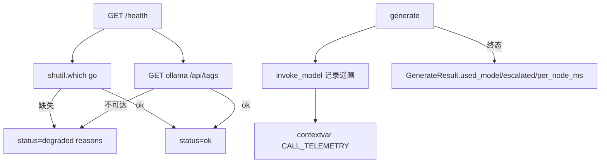

# 可观测 /health + 路由暴露（P1-8 子任务）

> 归属：Role 1 PM（`specs/<feature-slug>/<NAME>.md`）
> 关联：阶段一 `specs/PHASE1_PLAN.md` 的 P1-8；依赖 **P1-1**（事件含路由信息 + `duration_ms`）。
> 性质：**开发就绪的子任务 spec**（含 `## Acceptance Criteria` + `## Test Scenarios`，每条 AC 1:1 映射回归用例）。
> Wave：W2（**含 P1-8FE 前端展示子 Epic，与 P1-8 同波同批验收**，见 §1.1 矩阵）。

---

## 1. 范围与边界

本 spec 只覆盖「**运维能判健康、能看模型路由**」：

### 要做什么
1. `web/routes/meta.py` `/health` 增 **readiness**：
   - `go` 在 PATH（`shutil.which("go")`）；
   - ollama 可达：`GET {base_url}/api/tags`（`base_url` 取自 `infrastructure/models.yaml` 的 `models.*.base_url`，默认 `http://127.0.0.1:11434`）返回 2xx；
   - 任一不满足 → `status:"degraded"` + `reasons:[...]`，**HTTP 503**（非 200 假健康）；正常 → `status:"ok"` + `readiness:{go, ollama}`。
2. `infrastructure/config.py` 增每次调用遥测：在 `invoke_model`（行 217）内记录 `{role, model, escalated, duration_ms}` 到模块级 `CALL_TELEMETRY`（每次 generate 前清空）；暴露 `collect_telemetry()` 返回列表、`was_escalated()` 返回 bool。
3. `web/schemas.py` `GenerateResult`（行 119）增字段：`used_model: str | None = None`、`escalated: bool = False`、`per_node_ms: dict | None = None`。
4. `web/routes/go_code.py` `_do_generate`（行 286~314）：生成后把 `config.collect_telemetry()` 汇总进 `GenerateResult`（`used_model`=主/末次模型名；`escalated`=`was_escalated()`；`per_node_ms` 优先来自 P1-1 `NODE_END` 事件的 `duration_ms`，无则从遥测拼）。
   - 遥测隔离：用 `contextvars` 存 `CALL_TELEMETRY`，保证并发多请求不串；多 worker 下每请求独立（uvicorn 单 worker 即可，见 P1-6 注意）。

### 不做什么（本任务边界）
- 不接 Prometheus / 外部监控（MVP 只 `/health` + 结果字段）。
- 前端 UI 展示（属 P1-8FE，下方子 Epic）。
- 不改路由策略本身（只记录，不改 `get_llm_for_role` 行为）。

---

## 2. 处理流程（mermaid）



---

## 3. 组件与契约（供 Dev 实现参考，非代码）

### 3.1 /health 响应（建议放 `web/routes/meta.py`）
```json
// ok
{"status":"ok","readiness":{"go":true,"ollama":true}}
// degraded
{"status":"degraded","reasons":["ollama unreachable: http://127.0.0.1:11434/api/tags -> ..."]}
```
HTTP：`ok`→200，`degraded`→503（让 LB/探针正确判不健康）。

### 3.2 遥测（建议放 `infrastructure/config.py`）
- `import contextvars`；`_TELE: contextvars.ContextVar = ContextVar("call_tele", default=[])`。
- `invoke_model` 内：`start=time.monotonic()`；`model=...`；`dur=(time.monotonic()-start)*1000`；`escalated = (retry_count>=_ESCALATE_AFTER and role in _ESCALATE_ROLES)`（或命中 online）；`tele=list(_TELE.get()); tele.append({...}); _TELE.set(tele)`。
- `collect_telemetry()` → `list(_TELE.get())`；`was_escalated()` → any `t["escalated"]`。

### 3.3 GenerateResult 新增字段（`web/schemas.py`）
- `used_model: str | None = None`：本次生成实际使用的模型（取 code_generator/code_fixer 实际命中模型，或首末次）。
- `escalated: bool = False`：是否发生 local→online 升级。
- `per_node_ms: dict | None = None`：`{node_name: duration_ms}`，来源 P1-1 `NODE_END.duration_ms`。

---

## 4. Acceptance Criteria

### O-01 — /health 在依赖缺失时 degraded 且非假健康
- **Given** ollama 不可达 **或** `go` 不在 PATH。
- **When** `GET /health`。
- **Then** 返回 `status="degraded"` + `reasons` 指明缺失项；HTTP 状态码为 **503**（非 200 假健康）。

### O-02 — 生成结果暴露 used_model 与 escalated
- **Given** 一次正常生成（speed 优先，首试 local）。
- **When** 读取 `GenerateResult`。
- **Then** 含 `used_model`（与实际路由模型名一致）与 `escalated`（发生升级时为 `true`，否则 `false`）；二者与本次实际路由行为一致。

### O-FE（P1-8FE）— 前端终态面板展示模型来源与是否升级
- **Given** P1-5 面板到达终态。
- **When** 查看终态区。
- **Then** 可见 `used_model` 与 `escalated`（如「本次：local / 已升级 online」），与 `GenerateResult` 字段一致；**P1-8 与 P1-8FE 同属 W2、同批验收**，禁止只验收后端字段而留 UI 空白。

---

## 5. Test Scenarios（映射回归用例）

> 回归用例位置：`web/tests/test_health_regression.py`（用 `TestClient`；mock ollama base_url 不可达 / patch `shutil.which` 返 `None`）；`used_model`/`escalated` 用 stub `invoke_model` 注入遥测断言。
> 前端契约：`web/tests/test_realtime_panel_contract.py` 增 O-FE 用例（终态面板渲染 `used_model`/`escalated`）。

| 场景 | 覆盖 AC | 说明 |
|------|---------|------|
| `GET /health` 时 ollama base_url 不可达 → 断言 503 + `status=degraded` + `reasons` 含 ollama | O-01 | monkeypatch `httpx.get` / `urllib` 抛连接错误 |
| `GET /health` 时 `shutil.which("go")` 返 `None` → 断言 503 degraded | O-01 | patch `shutil.which` |
| 正常生成（stub 让 code_generator 命中 local）→ 断言 `result.used_model` 含 local 模型名、`escalated=False` | O-02 | stub `config.get_llm_for_role` 记录 |
| stub 触发升级（retry>=1 后 online）→ 断言 `escalated=True` | O-02 | 同上 |
| 前端契约：终态面板元素含 `used_model` 文本 | O-FE | 解析渲染 HTML 含模型来源 |

---

## 6. 依赖与注意

- 依赖：P1-1（bus 含 `NODE_END.duration_ms` 与路由信息）。`per_node_ms` 优先取自事件 duration。
- 注意：遥测用 `contextvars` 隔离，**单 worker 下天然正确**；多 worker 不串（per-request ctx）。
- 注意：`/health` 降级返 503 是为「不假健康」；若部署方要求 200 探针，可调为 200+degraded body，但**必须**在 body 标明 degraded（禁止静默 200 ok）。
- 注意：`used_model` 取值口径需在实现时固定（建议取 code_generator 首次实际命中模型），并在 spec/代码注释说明，避免前后端理解分歧。

---

## 7. 人类校验指引（Manual Acceptance）

除 `web/tests/test_health_regression.py` 外，每条 AC 须可手动验收。
**环境**：`uvicorn web.main:app --port 8000`；浏览器开 `/ui`。

| AC | 人类校验步骤 | 通过判定 | 失败判定 |
|----|------------|---------|---------|
| O-01 | 停 ollama（或临时改 `models.yaml` base_url 为不可达）→ `curl /health` | 返回 `status=degraded` + `reasons` 指明缺失；HTTP 503 | 仍 200 `ok`（假健康） |
| O-02 | 正常生成（speed 优先）→ 看返回/Job 结果 `used_model`、`escalated` | 字段存在且与路由一致（local / 未升级=False） | 字段缺失或不一致 |
| O-FE | 生成到终态 → 看 P1-5 面板终态区 | 显示「模型来源/是否升级」，与后端一致 | 面板空白、无此信息 |
