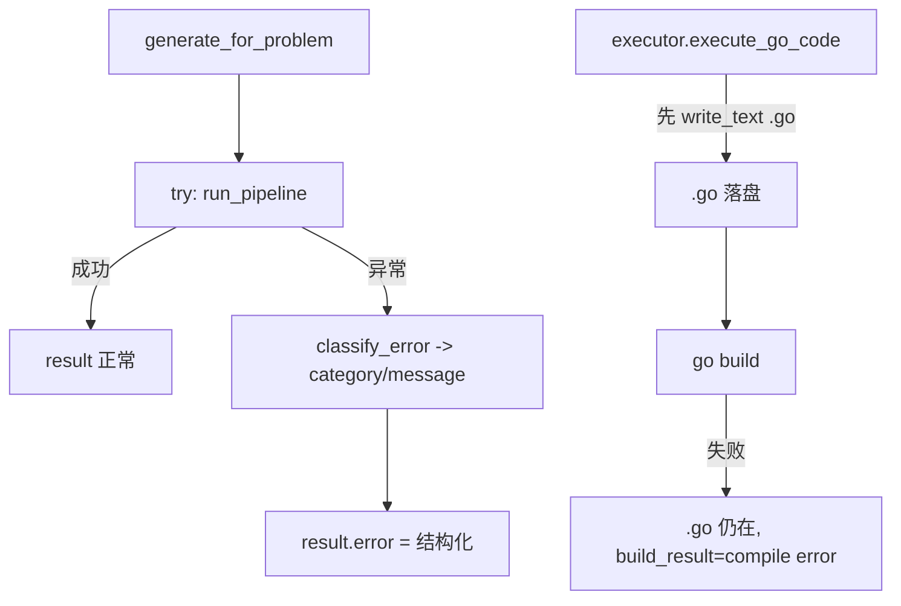

# 部分结果保存 + 友好失败（P1-7 子任务）

> 归属：Role 1 PM（`specs/<feature-slug>/<NAME>.md`）
> 关联：阶段一 `specs/PHASE1_PLAN.md` 的 P1-7；依赖 **P1-6**（可选，承接 `failed` 状态与 `error` 字段），可独立。
> 性质：**开发就绪的子任务 spec**（含 `## Acceptance Criteria` + `## Test Scenarios`，每条 AC 1:1 映射回归用例）。
> Wave：W2（纯后端正确性）。

---

## 1. 范围与边界

本 spec 只覆盖「**中途失败也有痕迹、报错可读**」：

### 要做什么
1. 新增 `features/solver/errors.py`：把管线异常/失败映射为结构化错误 `{category, message}`，`category ∈ {timeout, compile, verify, other}`：
   - `ModelTimeout`（`infrastructure.config` 已定义）→ `timeout`；
   - `build_result` 含 `"compile error"`（`executor.execute_go_code` 返回）→ `compile`；
   - `verify_result` 以 `VERIFY_FAIL_PREFIX` 开头（`infrastructure.constants`）→ `verify`；
   - 其余 → `other`（附可读文案，非裸 traceback）。
2. `features/solver/service.py` 的 `generate_for_problem` / `_create_and_run` / `run_pipeline` 调用处 `try/except`，把结构化错误写入 result 的 `error` 字段（`web/schemas.py:GenerateResult` 已有 `error: str | None` 字段，直接复用）。
3. `features/solver/executor.execute_go_code` 已先写 `.go` 再 `go build`（行 38→42），**保持「先落盘再编译」语义**；每次 fix 迭代写同一 `<task_name>.go`（覆盖），末次保留即部分结果。本任务不改为累积多版本。
4. `web/routes/go_code.py` `_do_generate`（行 286~314）：捕获非 `ValueError` 异常 → 返回 `GenerateResult(error=<结构化>, success=False)` 而非 500；并衔接 P1-6 把 `error` 写入 `JobState.status="failed"`。

### 不做什么（本任务边界）
- 不改 verifier 判定逻辑（属 P1-9）。
- 不改「覆盖式写 `.go`」语义（最新一次即部分结果；若需多版本留档另立 spec）。
- 不实现异步 Job 状态机（属 P1-6），只消费其 `failed`+`error` 约定。

---

## 2. 处理流程（mermaid）



---

## 3. 组件与契约（供 Dev 实现参考，非代码）

### 3.1 错误映射（建议放 `features/solver/errors.py`）
```python
def classify_error(exc, build_result="", verify_result="") -> dict:
    if isinstance(exc, ModelTimeout):
        return {"category": "timeout", "message": "模型调用超时，已中止"}
    if "compile error" in build_result:
        return {"category": "compile", "message": f"编译失败：{build_result}"}
    if verify_result and verify_result.startswith(VERIFY_FAIL_PREFIX):
        return {"category": "verify", "message": "验证未通过（输出与预期不符）"}
    return {"category": "other", "message": str(exc) or "生成失败"}
```

### 3.2 service 层包装
- `generate_for_problem`：`try: return run_pipeline(...) except Exception as exc: return {"error": classify_error(exc, ...), "success": False}`（保持与现有 result dict 兼容的键）。
- `web/routes/go_code.py` `_do_generate`：现有仅 `except ValueError -> 404`；扩展为 `except Exception as exc: return GenerateResult(identifier=..., success=False, error=classify_error(...))`。

---

## 4. Acceptance Criteria

### PR-01 — 中途失败仍保留已写出的 .go
- **Given** 一次生成，在 fix 循环中途（如第 2 次 fix 仍失败 / 强制抛异常）终止。
- **When** 生成结束（失败）。
- **Then** `output/go-code/<task>/<task_name>.go` 仍存在，内容为最近一次写出的代码（非空白、非丢失）。

### PR-02 — 返回结构化可读错误，非裸异常
- **Given** 上述失败生成。
- **When** 读取返回/JobState 的 `error`。
- **Then** `error` 含 `category` 与可读文案（如「编译失败：...」「模型调用超时」）；HTTP 层不为未捕获 500 裸 traceback；`category` 与失败类型匹配（timeout/compile/verify/other）。

---

## 5. Test Scenarios（映射回归用例）

> 回归用例位置：`features/solver/tests/test_partial_result_regression.py`（stub `features.solver.nodes.invoke_model` 注入异常；复用 `test_verifier_regression.py` stub 手法；直接断言落盘文件与 `error` 结构）。

| 场景 | 覆盖 AC | 说明 |
|------|---------|------|
| stub `invoke_model` 抛 `ModelTimeout` → 断言 `output/go-code/<task>/.go` 存在且 `error.category=="timeout"` | PR-01, PR-02 | patch `infrastructure.config.invoke_model` 抛 `ModelTimeout` |
| stub 让 `go build` 失败（产出自带语法错误的代码）→ 断言文件存在且 `error.category=="compile"` | PR-01, PR-02 | 断言 `build_result` 含 `compile error` 被分类 |
| 直接调 `executor.execute_go_code` 写后强制异常 → 断言 `.go` 仍保留 | PR-01 | 验证「先落盘再编译」不变量 |

---

## 6. 依赖与注意

- 依赖：P1-6（`failed` 状态承接 `error`）可选；`classify_error` 不依赖 job，可独立落地。
- 注意：`.go` 为覆盖式写，部分结果 = 末次尝试代码（非累积多版本）。如产品需保留每次 fix 版本，另立 spec。
- 注意：`error` 文案面向用户/运维可读（中文或英文均可），**禁止**把 Python traceback 直接外抛为 500 body。

---

## 7. 人类校验指引（Manual Acceptance）

除 `features/solver/tests/test_partial_result_regression.py` 外，每条 AC 须可手动验收。
**环境**：`uvicorn web.main:app --port 8000`；浏览器开 `/ui`；进入任意题目详情。

| AC | 人类校验步骤 | 通过判定 | 失败判定 |
|----|------------|---------|---------|
| PR-01 | 制造「编译必失败」题（如让模型输出语法错误 Go 代码）→ 点生成 → 结束后看 `output/go-code/<task>/<task_name>.go` | 文件在，含最近一次代码 | `.go` 丢失 / 空文件 |
| PR-02 | 同上 → 看返回/面板错误提示 | 显示「编译失败：<原因>」类分类文案 | 暴露 `Internal Server Error` / Python traceback |
