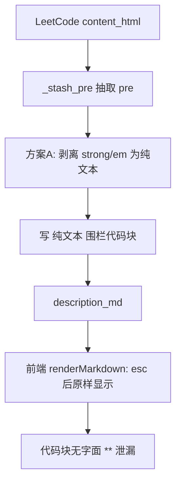

# 题目详情 markdown 代码块强调渲染修复（P1-12 子任务）

> 归属：Role 1 PM（`specs/<feature-slug>/<NAME>.md`）
> 关联：阶段一 `specs/PHASE1_PLAN.md` 的 P1-12；**已锁定方案 A（生成侧剥离 `<strong>`/`<em>`）**——纯后端改动，规避新增前端耦合（§1.1 矩阵结论）。
> 性质：**开发就绪的子任务 spec**（含 `## Acceptance Criteria` + `## Test Scenarios`，每条 AC 1:1 映射回归用例）。
> Wave：W2。前端 `renderMarkdown` 不改（方案 A），但验收在浏览器渲染（AC 仍由前端肉眼/契约验证）。

---

## 1. 根因（已核实）

`features/problems/models.py` 的 `html_to_markdown._stash_pre`（行 27-39）把 `<pre>` 内的 `<strong>`/`<em>` 转成 `**…**`/`*…*` 写进围栏代码块；
而 `frontend/index.html` 的 `renderMarkdown`（行 301-311）先 `esc()` 再按 ```` ``` ```` 切分、代码块内容原样放入 `<pre><code>` → `**` 作为**字面星号**显示，强调丢失/错显。

---

## 2. 范围与边界

### 要做什么（方案 A，已拍板）
- 生成侧在代码块内**剥离** `<strong>`/`<em>` 强调（转纯文本），使代码块干净无 `**`/`*`，从而前端 `esc()` 后不再泄漏字面星号。

### 不做什么
- **不采用方案 B**（前端对代码块内容不再 `esc`）：方案 B 引入前端改动、与「前后端同波」红线相悖，且需保证生成侧代码块内容可信（XSS 风险）。已排除。
- 不改前端 `renderMarkdown`。

---

## 3. 处理流程（mermaid）



---

## 4. 组件与契约（供 Dev 实现参考，非代码）

### 4.1 `features/problems/models.py` 的 `_stash_pre`
- 现状（行 32-33）：
  `code = re.sub(r"<(strong|b)[^>]*>(.*?)</\1>", r"**\2**", code, ...)`
  `code = re.sub(r"<(em|i)[^>]*>(.*?)</\1>", r"*\2*", code, ...)`
- **改为**：把 `<strong>`/`<em>`/`<b>`/`<i>` 在 `<pre>` 内**直接去标签保留文本**（不包 `**`/`*`）：
  `code = re.sub(r"<(strong|b|em|i)[^>]*>(.*?)</\1>", r"\2", code, flags=re.DOTALL|re.IGNORECASE)`
  （放在现有「strip remaining tags」之前或合并处理；确保代码块内不再产生 Markdown 强调标记）。
- 注意：`_fmt_emphasis` 对**代码块外**的强调保持不变（AT-P12b）。

---

## 5. Acceptance Criteria

### P12-01 — 代码块内强调无字面 **/* 泄漏、不错显
- **Given** 一道含「代码块内强调」的题目（如示例里 `<pre>` 内含 `<strong>someVar</strong>`）。
- **When** 详情渲染。
- **Then** 代码块内容**不含字面 `**`/`*` 泄漏**，且不被错误加粗/斜体到无关代码（强调变为纯文本）。

### P12-02 — 代码块外正常强调仍正确显示
- **Given** 题目正文有 `**Note:**` 之类代码块外强调。
- **When** 详情渲染。
- **Then** 该处仍正确显示为粗体（前端 `inline()` 的 `**…**` 规则正常生效）。

### P12-03 — 现有题目无回归
- **Given** 现有题目（无代码块强调冲突者）的 `description_md`。
- **When** 重新生成/渲染。
- **Then** 渲染结果与修复前一致（无回归；可用固定样例的 `description_md` 文本做相等断言）。

---

## 6. Test Scenarios（映射回归用例）

> 回归用例位置：`features/problems/tests/test_markdown_codeblock_regression.py`（纯单元，直接对 `html_to_markdown` 输入含 `<pre><strong>` 的 HTML 片段，断言输出）。

| 场景 | 覆盖 AC | 说明 |
|------|---------|------|
| 输入含 `<pre>...<strong>x</strong>...</pre>`，断言输出代码块不含 `**` 且含 `x` | P12-01 | 正则断言 `**` 不在 pre 围栏内 |
| 输入含正文 `**Note:**`，断言输出仍含 `**Note:**`（供前端加粗） | P12-02 | 断言块外 `**` 保留 |
| 用修复前某固定题目的 content_html 重跑，断言 `description_md` 与基线一致 | P12-03 | 基线快照比对（无回归） |

---

## 7. 依赖与注意

- 依赖：无。
- 注意：方案 A 改动极小、零 XSS 风险，但代码块内强调变为纯文本——若产品未来要求代码块内也显示粗体，须改方案 B 并补前端同波验收（届时回到 §1.1 矩阵重新评估）。
- 注意：`normalize_problem` 在拉题时调用 `html_to_markdown`；修复后**已落盘题目的 `description_md` 需重生成**才生效（或前端改为实时渲染 `content_html`）——Dev 实现时注明是否需回填存量 `description_md`（建议：存量在下次拉取/重渲染时自然更新，不做一次性回填脚本，除非 PM 另有要求）。
- 注意：本任务为纯后端修复（方案 A），但 AC 的最终判据在**浏览器渲染**（P12-01/02），故验收需前端肉眼或契约测试配合——这不改变「方案 A 不引入前端改动」的结论。

---

## 8. 人类校验指引（Manual Acceptance）

环境：浏览器 `/ui` 打开题目详情，看「题目描述」区块渲染。人类校验聚焦「代码块强调不再泄漏」与「无回归」。

| AC | 人类校验步骤 | 通过判定 | 失败判定 |
|----|------------|---------|---------|
| P12-01 | 找一道含「代码块内强调」的题（示例题）→ 看代码块内容 | 代码块为纯文本、无字面 `**`/`*` 泄漏、不被错加粗/斜体 | 代码块内出现 `**`/`*` 字样或无关代码被加粗 |
| P12-02 | 同一题正文有 `**Note:**` → 看是否粗体 | 正常显示为粗体 | 强调未渲染 |
| P12-03 | 任取现有题 → 重新拉取/渲染 → 对比视觉与基线 | 与修复前视觉一致（无回归） | 格式/排版变化 |
