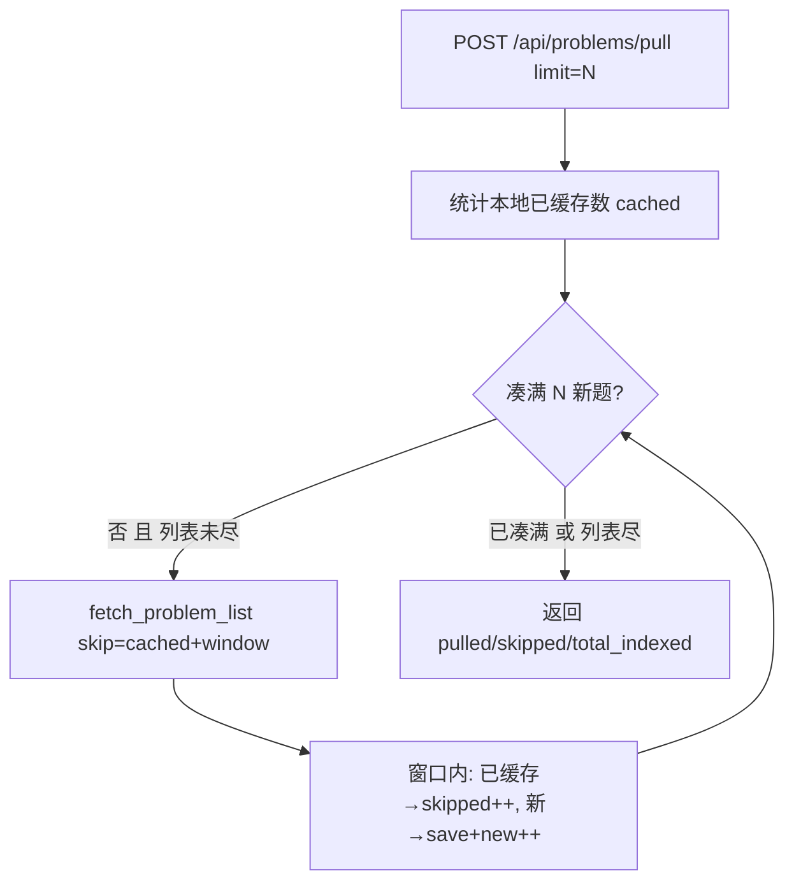

# 拉题续拉 / 去重修复（P1-11 子任务）

> 归属：Role 1 PM（`specs/<feature-slug>/<NAME>.md`）
> 关联：阶段一 `specs/PHASE1_PLAN.md` 的 P1-11；纯后端修复，无前端新增（前端复用现有「拉取新题目」按钮）。
> 性质：**开发就绪的子任务 spec**（含 `## Acceptance Criteria` + `## Test Scenarios`，每条 AC 1:1 映射回归用例）。
> Wave：W2（可穿插，不阻塞主链路）。**无前后端耦合**：前端拉取按钮已有，本任务只修后端翻页逻辑。

---

## 1. 根因（已核实）

`web/routes/problems.py` 的 `_do_pull`（行 188-253）调 `fetch_problem_list(max_problems=q.limit)`（`skip=0`），永远取 LeetCode 列表**前 `limit` 个**；已缓存的被 `skipped += 1` 跳过 → 若前 `limit` 个已全缓存，`pulled=0`。
`features/problems/service.enrich_problem_set`（行 229-231）同样以 `max_problems` 截断列表，而非按「已落盘数」翻页。

---

## 2. 范围与边界

### 要做什么
1. 拉题改为「按已落盘数量推进 `skip` / 持续翻页，直到凑满 `limit` 个*新*题或列表耗尽」。
2. `skipped` 仅计本批新取窗口内已缓存者；`pulled` 反映真正新增数。
3. 全部拉完后再次拉题：`pulled=0`、`skipped=全部`、幂等、无重复落盘、无报错。

### 不做什么
- 不改动 `save_problem` / 索引重建逻辑（已正确）。
- 不引入新端点（复用 `POST /api/problems/pull`）。

---

## 3. 处理流程（mermaid）

---

## 4. 组件与契约（供 Dev 实现参考，非代码）

### 4.1 `web/routes/problems.py` 的 `_do_pull`
- 入参新增翻页推进：先用 `PROBLEMS_DIR` 下 `.json` 数量（或 `problems_index.json` 的 `problems` 长度）作为 `already = 本地已缓存数`。
- 循环：`skip = already` 起，每次 `fetch_problem_list(page_limit=50, max_problems=page_limit, skip=skip)`；窗口内逐条判断 `local_json.exists()`：已存在→`skipped++`；不存在→`save_problem` + `new++`；当 `new >= q.limit` 或列表返回空→停止。
- 注意：`skip` 推进要「已缓存数 + 本批已扫描数」，避免反复取同一页。

### 4.2 `features/problems/service.enrich_problem_set`（可选对齐）
- 若经此路径拉题，同样按「已落盘数」翻页而非 `max_problems` 截断；保持与 `_do_pull` 一致语义。

---

## 5. Acceptance Criteria

### P11-01 — 已缓存前 N 题，同 limit 重拉能继续拉到新题
- **Given** 本地已缓存前 N 题（如 prior `limit=50` 已拉）。
- **When** 再次 `POST /api/problems/pull` 同 `limit=50`。
- **Then** 自动翻页跳过已缓存集，实际新拉 ~50 题（直至列表耗尽），而非 `pulled=0`。

### P11-02 — skipped 仅计本批窗口内已缓存、pulled 反映真新增、无重复
- **Given** 同上。
- **When** 拉取完成。
- **Then** `skipped` 仅计本批新取窗口内的已缓存项；`pulled` 反映真正新增数；无重复写入（同一 slug 不出现两次）、无报错。

### P11-03 — 全部拉完后重拉幂等、不重复落盘
- **Given** 全部可拉题目已落盘。
- **When** 再次拉题。
- **Then** `pulled=0`、`skipped=全部`、幂等、不重复写文件、不报错。

---

## 6. Test Scenarios（映射回归用例）

> 回归用例位置：`features/problems/tests/test_pull_continue_regression.py`（用 fake `fetch_problem_list` 返回可控列表 + 临时 `PROBLEMS_DIR` 模拟已缓存；stub 不联网）。

| 场景 | 覆盖 AC | 说明 |
|------|---------|------|
| 预置前 50 题已缓存，fake 列表 200 题，拉 limit=50，断言 pulled≈50、skipped≈50 | P11-01, P11-02 | 断言 `pulled` 显著 >0 且新文件数 = pulled |
| 同上，断言无 slug 重复写入（目录内 .json 唯一） | P11-02 | 统计 `PROBLEMS_DIR/*.json` 数量 = 100 无重复 |
| 全 200 题已缓存后再拉 limit=50，断言 pulled=0、skipped=50、无新文件 | P11-03 | 断言目录文件数不变、无报错 |

---

## 7. 依赖与注意

- 依赖：无。
- 注意：`fetch_problem_list` 的 `skip` 语义须与 LeetCode GraphQL 分页一致；翻页推进公式要覆盖「已缓存数 + 本批已扫描数」，避免死循环或漏拉。
- 注意：`force=true` 时仍应重拉（覆盖），但新逻辑下 `force` 跳过 `local_json.exists()` 判断直接 save——保持与现有 `force` 语义一致。
- 注意：索引重建（`_safe_rebuild_index`）在拉完后调用一次即可，不随每题重建（性能）。

---

## 8. 人类校验指引（Manual Acceptance）

环境：`uvicorn` 启动 + 浏览器 `/ui` 的「拉取新题目」面板（或 `python -m features.problems.cli` 拉题）。人类校验聚焦「续拉是否正确」。

| AC | 人类校验步骤 | 通过判定 | 失败判定 |
|----|------------|---------|---------|
| P11-01 | 本地已缓存前 N 题（如已 pull limit=50）→ 再点拉取 limit=50 → 看状态文案 | 状态显示「新增 ~50、跳过 ~50」，而非「新增 0」 | pulled=0、卡在已缓存集 |
| P11-02 | 同上 → 检查 `problems_index.json` 与 `output/*.json` 是否重复 | 无重复 slug、目录 `.json` 唯一 | 同一 slug 出现两次/重复落盘 |
| P11-03 | 全量拉完（LeetCode 列表耗尽）后再拉一次 | 状态 pulled=0、skipped=全部、无新文件、无报错（幂等） | 重复落盘 / 报错 |
