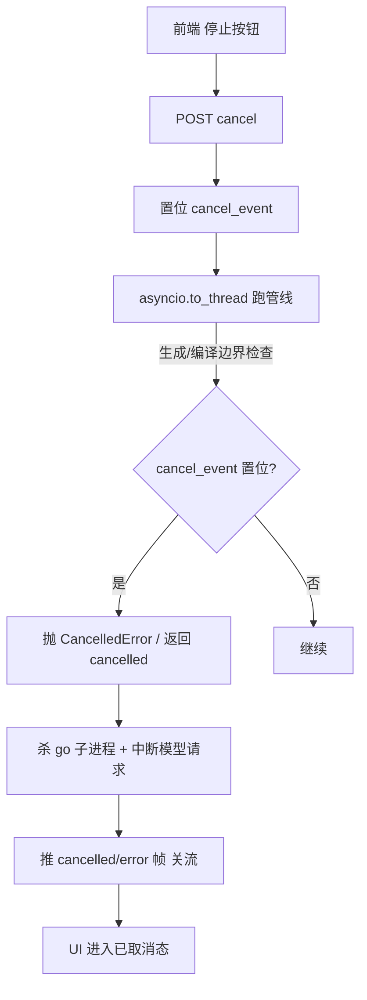

# 取消 / 中止（P1-4 子任务）

> 归属：Role 1 PM（`specs/<feature-slug>/<NAME>.md`）
> 关联：阶段一 `specs/PHASE1_PLAN.md` 的 P1-4；依赖 W0 的 **P1-1 事件总线** 与 **P1-2 流式调用**；前端停止按钮见 `FRONTEND_PANEL_SPEC.md`（P1-5）；SSE 承载见 `SSE_SPEC.md`（P1-3）。
> 性质：**开发就绪的子任务 spec**（含 `## Acceptance Criteria` + `## Test Scenarios`，每条 AC 1:1 映射回归用例）。
> Wave：W1（与 P1-3/P1-5 同波，端到端一次验收：用户点停止 → 生成中止 → UI 进入已取消态）。

---

## 1. 范围与边界

本 spec 只覆盖「**用户随时中止一次进行中的生成**」：

### 要做什么
1. 管线支持 cancellation token：`features/solver/service.generate_for_problem` 增加可选 `cancel_event: threading.Event | None`；节点（尤其 `code_generator_node`、`code_fixer_node`）与 `code_executor_node` 在生成/编译边界检查该 token，置位即抛出可识别的 `CancelledError`（或返回 `cancelled` 状态）。
2. 模型调用可中断：`infrastructure/config.py` 的流式/超时调用在 `cancel_event` 置位时立即中断请求（复用 P1-2 的 deadline 线程机制，把 deadline 替换为 cancel 信号）。
3. 子进程清理：`features/solver/executor.py` 在终止 `go build` / `go test` 时确保子进程树被 kill，避免孤儿进程。
4. 服务端取消入口：新增 `POST /api/problems/{identifier}/generate/{job}/cancel`（W1 阶段 job 可简化为「当前连接对应的生成」），或复用 SSE 控制帧；置位 `cancel_event`。
5. 前端停止按钮：`frontend/index.html` 生成面板增加「停止」按钮，触发取消并进入已取消态（详见 P1-5）。

### 不做什么（本任务边界）
- 异步 Job 状态机（属 P1-6）：W1 的取消作用于「当前这次 `asyncio.to_thread` 生成」，不要求 job store 持久化。
- SSE 转发本身（属 P1-3）：本任务只在取消发生时让 SSE 推一帧 `error`/`cancelled` 并关闭。
- 前端面板完整 UI（属 P1-5）：本任务只定义「停止按钮调用取消接口 + 进入已取消态」的契约。

---

## 2. 处理流程（mermaid）

---

## 3. 组件与契约（供 Dev 实现参考，非代码）

### 3.1 cancellation token（`features/solver/service.py`）
- `generate_for_problem(..., cancel_event: threading.Event | None = None)`：在 `code_generator_node`/`code_fixer_node` 进入前、以及 `code_executor_node` 调 `go` 前检查 `cancel_event.is_set()`；置位则 `raise CancelledError("generation cancelled")`。
- `workflow.py` 的节点包装：在 `try` 内捕获 `CancelledError` 并转为终态 `status="cancelled"`（而非 success/failed）。`GenerateResult` 增加 `cancelled: bool = False` 字段（`web/schemas.py`）。

### 3.2 模型调用中断（`infrastructure/config.py`）
- P1-2 的超时守护线程：增加「cancel_event 置位即 `future.cancel()` / 关连接」分支，与 deadline 共用同一中断路径。

### 3.3 子进程清理（`features/solver/executor.py`）
- `go build`/`go test` 用 `subprocess.Popen` 启动，保存 `proc`；取消时 `proc.kill()` 并回收子进程树（Windows 用 `taskkill /T /F` 或 `psutil`）；`finally` 中确保 `proc.poll() is not None` 无残留。

### 3.4 服务端取消入口（`web/routes/problems.py` 或 `stream.py`）
- W1 简化版：`POST /api/problems/{identifier}/generate/cancel`，body 含 `run_id`（由 SSE 握手返回，或前端用单次生成上下文）；置位对应 `cancel_event`。若前端走 SSE，也可在 SSE 连接上发一个 `cancel` 控制帧（二选一，Dev 拍板，但须与 P1-5 前端一致）。
- 取消后生成循环退出，SSE 推 `event: error`（`category:"cancelled"`）或 `event: done`（`result.cancelled=true`）并关闭。

---

## 4. Acceptance Criteria

### CA-01 — 生成中点取消，下次可中断点停止并返回 cancelled
- **Given** 一次 coding 题生成进行到 `code_generator_node` 或 `code_executor_node` 阶段。
- **When** 客户端发取消。
- **Then** 管线在下一个可中断边界（生成/编译）停止，终态 `cancelled=true` 且 `success=false`，**不**返回成功结果。

### CA-02 — 取消后无残留 go 进程、模型请求被中断
- **Given** 生成中（正在 `go build`/`go test` 或模型流式请求）。
- **When** 取消。
- **Then** 无残留 `go` 子进程（用 `pgrep -f "go (build|test)"` 验证为空）；模型请求连接被关闭（不继续消耗 token）。

### CA-03 — 取消不破坏已落盘 .go
- **Given** 部分 `.go` 已写出到 `output/go-code/<task>`。
- **When** 取消。
- **Then** 已写出的 `.go` 文件保持不变、可被读取，无半截截断或损坏。

---

## 5. Test Scenarios（映射回归用例）

> 回归用例位置：`web/tests/test_cancel_regression.py`（用 `threading.Event` 模拟取消；stub 管线在 code_generator_node 设检查点；`pgrep`/`psutil` 验证无残留）。

| 场景 | 覆盖 AC | 说明 |
|------|---------|------|
| 生成中点置位 cancel_event，断言终态 cancelled=true、success=false | CA-01 | stub 在 generator 中途置位；断言 `GenerateResult.cancelled==True` |
| 取消时 `go` 子进程被 kill，pgrep 为空 | CA-02 | 用真实 `go test` 子进程 + 取消，断言 `psutil` 无 `go` 子进程存活 |
| 取消前写出 .go，断言文件字节未变、可读 | CA-03 | 先写出一个 .go，取消后读回比对哈希一致 |

---

## 6. 依赖与注意

- 依赖：P1-1（事件含节点名，便于在 cancel 时推 stage）、P1-2（流式/超时中断机制可复用为 cancel 中断）。
- 注意：**不要**在取消时 `os._exit` 或强杀整个进程——只终止当前生成的 `to_thread` 子线程与 go 子进程。
- 注意：前端停止按钮的取消契约须与 P1-5 一致；后端取消入口形态（独立 POST vs SSE 控制帧）由 Dev 与 P1-5 一起拍板，但结论须写回本 spec。
- 注意：`GenerateResult.cancelled` 为新增字段，须同步到 `web/schemas.py` 与 P1-3 的 `done` 帧结构，前端据此进入已取消态（P1-5 FE-03）。

---

## 7. 人类校验指引（Manual Acceptance）

环境同 `SSE_SPEC.md` §8（uvicorn + `/ui`）。人类校验聚焦「中止」行为，建议配合 `pgrep` / 文件哈希观察。

| AC | 人类校验步骤 | 通过判定 | 失败判定 |
|----|------------|---------|---------|
| CA-01 | 生成中点（代码区书写中）点「停止」→ 观察 UI 状态 | UI 进入「已取消」态、不再追加；终态 `cancelled=true` | 仍显示「成功」或继续生成 |
| CA-02 | 生成中（正在 `go build/test` 或模型流式）点停止 → 终端 `pgrep -f "go (build\|test)"` 应为空；看 ollama 日志不再出 token | 无残留 go 子进程、模型请求已中断 | 仍有 go 进程存活 / 模型继续吐 token |
| CA-03 | 先让一道题生成写出部分 `.go`，再取消 → 打开 `output/go-code/<task>/xxx.go` 比对取消前后字节（或 `sha256sum`） | 文件字节一致、可读、无截断 | 文件被截断/损坏/消失 |
