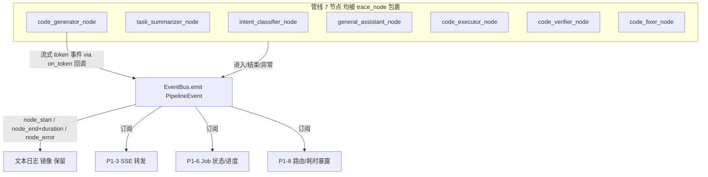

# 进度事件总线（P1-1 子任务）

> 归属：Role 1 PM（`specs/<feature-slug>/<NAME>.md`）
> 关联：阶段一 `specs/PHASE1_PLAN.md` 的 P1-1；与 P1-2（流式调用）为 W0 地基双件。
> 性质：**开发就绪的子任务 spec**（含 `## Acceptance Criteria` + `## Test Scenarios`，每条 AC 1:1 映射回归用例）。
> 已拍板前提：P1-1 无待定设计项。与 P1-2 并行交付；token 事件由 P1-2 的流式层经可选 `on_token` 回调注入（见 §3.3），总线本身不依赖流式实现。

---

## 1. 范围与边界

本 spec 只覆盖「**结构化进度事件的统一产出与分发**」：

### 要做什么
1. 新增 `infrastructure/events.py`：定义 `PipelineEvent` 与 `EventBus`（极简发布/订阅）。
2. 在 `infrastructure/logger.py` 的 `trace_node` / `trace_node_detailed`（即 `_trace` 装饰器）中，于节点 进入 / 结束(含耗时) / 异常 时向总线 emit 对应事件。
3. 事件携带 `type / node / ts / data`；`data` 预留 `duration_ms / error / used_model / escalated` 等字段，供 SSE / Job / 日志共用。
4. 暴露 `subscribe(handler)` 供后续 SSE（P1-3）、Job（P1-6）、可观测（P1-8）订阅，确保**全仓只有一份事件实现**。

### 不做什么（本任务边界）
- token 事件的具体产生（在 `code_generator_node` 流式消费时触发）——属 P1-2 + 节点适配，见 §3.3 回调约定。
- SSE 转发、Job 写入、/health 暴露——分别属 P1-3 / P1-6 / P1-8。
- 删除现有 `logger.info` 的 `🟢/🔴` 文本日志——**保留**文本日志作为降级/调试通道，总线是其结构化镜像，不是替代。

---

## 2. 处理流程（mermaid）

---

## 3. 组件与契约（供 Dev 实现参考，非代码）

### 3.1 事件定义 `infrastructure/events.py`
- `EventType`（`str` 常量或枚举，建议与 P1-2 共用、定义在 `infrastructure/constants.py`）：`NODE_START / NODE_END / NODE_ERROR / TOKEN / RETRY / MODEL_ROUTE`。
- `dataclass PipelineEvent`: `type: str`、`node: str`、`ts: float`(=time.time())、`data: dict`。
- `class EventBus`:
  - `subscribe(handler: Callable[[PipelineEvent], None]) -> token`
  - `unsubscribe(token)`
  - `emit(event: PipelineEvent)` —— 首版同步遍历 handlers（不阻塞 IO）。
  - 模块级单例 `bus = EventBus()`，供各层 `from infrastructure.events import bus`。

### 3.2 注入点 `infrastructure/logger.py`
- 现有 `_trace` 已打 `🟢 [Node Start]` / `🔴 [Node End] Cost: Xs` / `❌ [Node Error]`。在对应分支**追加** `bus.emit(...)`：
  - wrapper 进入时 emit `NODE_START`（data 含 `node=name`）。
  - 正常返回前 emit `NODE_END`（data 含 `duration_ms`，可由 `start` 计算）。
  - except 分支 emit `NODE_ERROR`（data 含 `error=str(exc)`），再 raise（保持原异常传播）。
- 不改动现有 `logger.info` 行，文本日志保持原样（降级通道）。

### 3.3 token 事件约定（与 P1-2 解耦）
- 总线提供 `NODE_START/END/ERROR` 即满足阶段进度；**token** 事件由 P1-2 的 `invoke_model_stream` 经可选 `on_token` 回调 emit，节点 `code_generator_node` 在消费流时传入：
  `on_token=lambda t: bus.emit(PipelineEvent(EventType.TOKEN, NodeName.CODE_GENERATOR, time.time(), {"token": t}))`。
- 因此本任务**不强制依赖** P1-2 完成即可交付（非流式模型只发 `NODE_START/END`，token 由 P1-2 之后补）；但两者通常同批 W0 交付。

### 3.4 节点名来源
- 事件 `node` 字段应取 `infrastructure/constants.NodeName` 的规范名（如 `code_generator_node`），与工作流一一对应，便于 SSE/Job 按名展示阶段。当前 7 个节点名见 `features/solver/workflow.py` 注册：`intent_classifier_node / task_summarizer_node / code_generator_node / general_assistant_node / code_executor_node / code_verifier_node / code_fixer_node`。

---

## 4. Acceptance Criteria

### EB-01 — 单次管线事件按序且节点名一一对应
- **Given** 跑通一次完整 pipeline（如 two-sum 类 coding 题）。
- **When** 用测试 handler 收集总线事件。
- **Then** 收到的 `NODE_START→NODE_END` 序列按执行顺序，且节点名集合与本次路由路径匹配（如 `{intent_classifier_node, task_summarizer_node, code_generator_node, code_executor_node, code_verifier_node}` 或含 `code_fixer_node` 的失败重试路径），每个 `NODE_END` 含 `duration_ms > 0`，无缺失、无重复节点。

### EB-02 — 异常节点发 NODE_ERROR 且不吞异常
- **Given** 某节点抛异常（如 executor 找不到 Go 代码块）。
- **When** 该节点执行。
- **Then** 总线收到 `NODE_ERROR`（data 含 `error`），且异常仍向上传播（原 `raise` 行为不变）。

### EB-03 — 单一事件实现，日志与 SSE 共用
- **Given** 全代码库。
- **When** 检索管线进度事件的 emit 点。
- **Then** 仅 `infrastructure/events.EventBus` 一处产出管线进度事件；不存在第二套手写的「事件/进度」结构（文本 `logger.info` 不算第二套事件实现）。

### EB-04 — 路由信息可承载（为 P1-8 预留）
- **Given** 一次含本地超时升级在线的生成。
- **When** 收集 `MODEL_ROUTE`/NODE_END 的 data。
- **Then** data 含 `used_model: str` 与 `escalated: bool`（即使本任务不消费，字段须存在），供 P1-8 / 前端读取。

---

## 5. Test Scenarios（映射回归用例）

> 回归用例位置：`features/solver/tests/test_event_bus_regression.py`（参照 `test_verifier_regression.py` 用 stub LLM 跑真实管线，handler 收集事件）。

| 场景 | 覆盖 AC | 说明 |
|------|---------|------|
| 跑 coding 题，收集事件序列 | EB-01 | 断言 `NODE_START→NODE_END` 顺序与节点名集合匹配 workgraph 实际路径 |
| 注入节点异常，断言 NODE_ERROR + 异常传播 | EB-02 | 用 stub 强制节点抛错，断言收到 `NODE_ERROR` 且测试捕获到原异常 |
| 全仓 grep 事件实现唯一性 | EB-03 | 断言仅 `infrastructure/events` 有 emit 进度事件 |
| 含升级的在线上下文，data 含 used_model/escalated | EB-04 | stub 设定本地超时升级，断言事件 data 字段存在 |

---

## 6. 依赖与注意

- 依赖：无（W0 地基，可与 P1-2 并行）。
- 注意：`trace_node` 被 7 个节点使用（见 `features/solver/workflow.py` 注册名），改动需确保 7 处均被包裹并正确 emit；`general_assistant_node`（非编程）路径也应 emit，保证非编程问答也有进度。
- 注意：`bus.emit` 首版同步遍历 handlers，不要在其中做阻塞 IO；SSE/Job 订阅在 W1/W2 接入，届时若需异步可改队列。
- 注意：保留现有文本日志（`🟢/🔴`），本任务只「加」emit，不「删」日志。
