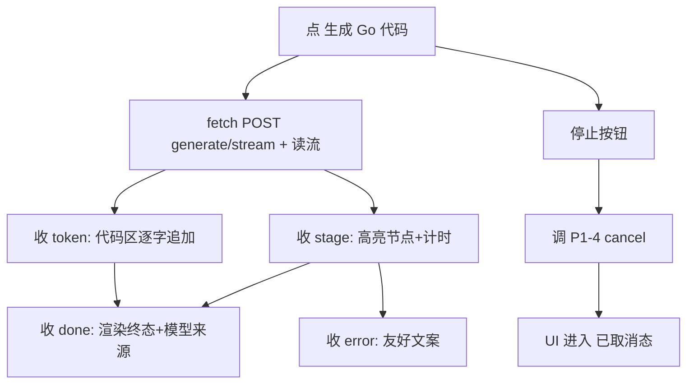

# 前端实时面板（P1-5 子任务）

> 归属：Role 1 PM（`specs/<feature-slug>/<NAME>.md`）
> 关联：阶段一 `specs/PHASE1_PLAN.md` 的 P1-5；依赖 **P1-3 SSE**（`SSE_SPEC.md`）与 **P1-4 取消**（`CANCEL_SPEC.md`）；后端进度字段（used_model/escalated）由 **P1-8** 产出，本 spec 含其展示子项（P1-8FE）。
> 性质：**开发就绪的子任务 spec**（含 `## Acceptance Criteria` + `## Test Scenarios` + 前端契约测试）。
> Wave：W1（与 P1-3/P1-4 同波，端到端一次验收）。**前后端同波硬 Gate**：本面板必须随 P1-3 SSE + P1-4 停止按钮同批交付，禁止「后端 SSE 已通、前端仍走旧阻塞按钮」。

---

## 1. 范围与边界

本 spec 只覆盖「**前端把生成过程实时呈现给用户**」：

### 要做什么
1. 改造 `frontend/index.html` 的 `openProblem` 生成流程：从阻塞式 `POST .../generate` 改为消费 `POST .../generate/stream` 的 SSE（`fetch` + `ReadableStream`，因为 SSE over POST 需手动读流）。
2. 阶段进度区：渲染节点步骤列表，高亮当前节点 + 显示耗时（来自 `stage` 帧的 `node`/`phase`/`duration_ms`）。
3. 代码区：在 `code_generator_node` 阶段按 `token` 帧逐字追加（typewriter），非一次性。
4. 累计计时器：从首个 `stage` 起计时，到 `done`/`error` 止。
5. 停止按钮：生成中可用，点击调用 P1-4 取消接口；UI 进入「已取消」态。
6. 终态展示：渲染 `done` 帧的 `result`（复用现有 Go 代码展示），或 `error` 帧（友好文案）。
7. **[P1-8FE] 模型来源展示**：终态区显示 `used_model` / `escalated`（来自 `done.result`，由 P1-8 填充），如「本次使用：local / 已升级 online」。

### 不做什么（本任务边界）
- SSE 端点实现（属 P1-3）、取消后端逻辑（属 P1-4）、used_model/escalated 后端字段（属 P1-8）。
- 不引入前端框架；保持单文件原生 JS（与现有 `index.html` 一致）。

---

## 2. 处理流程（mermaid）

---

## 3. 组件与契约（供 Dev 实现参考，非代码）

### 3.1 SSE 消费（`frontend/index.html`）
- 替换 `openProblem` 中 `#gen-code` 的 `apiPost('/api/problems/.../generate')` 为：
  `fetch(API_BASE + '/api/problems/' + slug + '/generate/stream', {method:'POST'})` → `response.body.getReader()` → 按行解析 `event:`/`data:` 帧（以 `\n\n` 分隔）。
- 维护 `stageList`（节点→状态映射）与 `codeBuffer`（逐 token 追加到代码 `<pre>`）。

### 3.2 阶段进度 UI
- 每个节点一行：未开始（灰）/ 进行中（高亮 + 转圈）/ 结束（✓ + `duration_ms`）。节点名用中文友好映射（如 `code_generator_node` → 「生成代码」）。
- 计时器 DOM 元素从首 `stage` 起 `setInterval` 更新，终态清除。

### 3.3 停止按钮
- 生成中：`#gen-code` 旁出现「停止」按钮（`#gen-stop`），点击 → 调 P1-4 取消接口（具体形态与后端拍板一致）→ 收到 `cancelled`/`error(category=cancelled)` 帧 → UI 显示「已取消」且禁用按钮。

### 3.4 终态 + 模型来源（P1-8FE）
- `done` 帧 `result` 渲染：成功则复用现有 `openGoCode` 跳转/内联；终态区追加 `used_model`/`escalated` 文案（从 `result.used_model`/`result.escalated` 读）。若字段缺失则静默不显示（向后兼容旧端点）。

---

## 4. Acceptance Criteria

### FE-01 — 点生成后立即进入进行中并随 SSE 更新，不空白/死转圈
- **Given** 点「生成 Go 代码」。
- **When** 生成进行中。
- **Then** UI 立即进入「进行中」态，阶段进度区随 `stage` 帧更新当前节点与计时，期间不出现空白屏或无限死转圈（spinner 仅在首帧到达前短暂出现）。

### FE-02 — 代码区在生成节点阶段即开始显示 token（非一次性）
- **Given** 同上。
- **When** 收到 `code_generator_node` 的 `token` 帧。
- **Then** 代码区随每个 token 帧逐字增长（typewriter），而非等 `done` 后一次性整段出现。

### FE-03 — 停止按钮生成中可用，点击后 UI 进入已取消态
- **Given** 生成进行中。
- **When** 点「停止」。
- **Then** 停止按钮在生成中可用；点击后 UI 进入「已取消」态（明确文案，非「成功/失败」），且不再继续追加 token/阶段。

### FE-08 — [P1-8FE] 终态展示模型来源与是否升级
- **Given** 一次生成结束（`done` 帧）。
- **When** 渲染终态。
- **Then** 若 `result.used_model` 存在，UI 显示「本次使用：<model>」与（若 `result.escalated`）「已升级 online」；字段缺失时不报错、不显示该块。

---

## 5. Test Scenarios（映射回归用例）

> 回归用例位置：`web/tests/test_realtime_panel_contract.py`（沿用 `test_custom_questions_ui_contract.py` 的 Node DOM + fetch 仿真手法：用 `jsdom`/静态 `index.html` 加载脚本，mock `fetch` 返回可控的 SSE 帧序列，断言 DOM 行为）。

| 场景 | 覆盖 AC | 说明 |
|------|---------|------|
| mock fetch 返回 stage→token→done 序列，断言首帧后 UI 进入进行中、阶段列表高亮、计时器在走 | FE-01 | 断言 `#gen-status`/阶段区不为空屏、节点高亮类存在 |
| 同上 token 序列，断言代码 `<pre>` 内容随帧逐步变长（≥2 次增长） | FE-02 | 记录两次 token 后的 `textContent` 长度递增 |
| mock fetch 中途收到 cancelled 帧，点击 `#gen-stop`，断言 UI 显示「已取消」且停止追加 | FE-03 | 断言出现 cancelled 文案、后续 token 不追加 |
| mock fetch 返回 done 且 result.used_model 存在，断言终态显示模型来源 | FE-08 | 断言模型来源文案节点存在且含 model 名 |

---

## 6. 依赖与注意

- 依赖：P1-3（SSE 帧 schema：stage/token/done/error）、P1-4（取消接口 + cancelled 帧）、P1-8（used_model/escalated 字段，仅 FE-08 用到）。
- 注意：SSE over POST 不能用浏览器原生 `EventSource`（仅 GET），前端须用 `fetch` + `ReadableStream` 手动解析——这是本 spec 与 P1-3 的契约关键。
- 注意：保持 `index.html` 单文件原生 JS 风格，不引框架；新 DOM 节点命名与现有 `gen-code`/`gen-status` 风格一致（如 `gen-stop`、`gen-stages`）。
- 注意：**前后端同波硬 Gate**——本面板与 P1-3/P1-4 同属 W1，三者必须同批验收通过（FE-01~03 + SE-01~03 + CA-01~03 全绿）后 W1 方可关闭。

---

## 7. 人类校验指引（Manual Acceptance）

环境同 `SSE_SPEC.md` §8，且前端必须已切到 SSE 消费、停止按钮可用。人类校验聚焦「实时呈现」与「已取消态」。

| AC | 人类校验步骤 | 通过判定 | 失败判定 |
|----|------------|---------|---------|
| FE-01 | 点「生成 Go 代码」→ 立刻看面板 | 立即进入进行中态、阶段列表高亮+计时器走动；无空白/死转圈 | 空白屏或无限 spinner |
| FE-02 | 生成节点阶段盯代码区 | 代码随 token 帧逐步变长（≥2 次增长） | 等 `done` 后一次性整段出现 |
| FE-03 | 生成中点点「停止」 | UI 显示「已取消」、停止按钮生效、不再追加 token/阶段 | 仍可继续生成、无取消态 |
| FE-08 | 生成结束看终态区 | 显示「本次使用：<model>」（升级时附「已升级 online」） | 字段存在却报错；字段缺失时静默不显示不算失败 |
