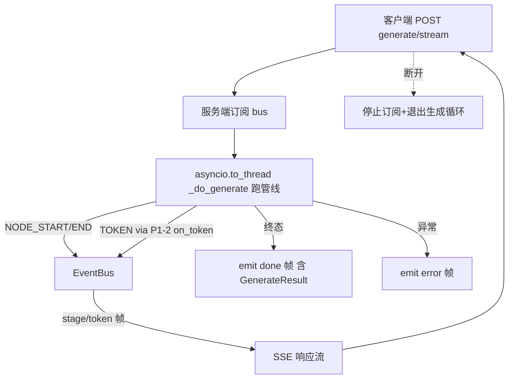

# SSE 进度 / 流式端点（P1-3 子任务）

> 归属：Role 1 PM（`specs/<feature-slug>/<NAME>.md`）
> 关联：阶段一 `specs/PHASE1_PLAN.md` 的 P1-3；依赖 W0 的 **P1-1 事件总线**（EB-01~04）与 **P1-2 流式调用**（ST-01~05）。
> 性质：**开发就绪的子任务 spec**（含 `## Acceptance Criteria` + `## Test Scenarios`，每条 AC 1:1 映射回归用例）。
> 已拍板前提：SSE 直接挂在现有 `asyncio.to_thread(_do_generate)` 之上、由事件总线驱动（见 PHASE1_PLAN §1 关键排序决策），**不必等 W2 异步 Job 化**。前端消费侧见 `FRONTEND_PANEL_SPEC.md`（P1-5），取消侧见 `CANCEL_SPEC.md`（P1-4）。
> Wave：W1（与 P1-4/P1-5 同波，端到端一次验收）。

---

## 1. 范围与边界

本 spec 只覆盖「**服务端把管线进度事件以 SSE 推给前端**」：

### 要做什么
1. 新增 `web/routes/stream.py`（或扩展 `web/routes/problems.py`）：`POST /api/problems/{identifier}/generate/stream`，`media_type="text/event-stream"`。
2. 服务端从 `infrastructure.events.bus` 订阅事件，按统一 schema 转发为 SSE 帧。
3. 帧类型：`stage`（NODE_START/NODE_END 含 duration_ms + node 名）、`token`（code_generator_node 的 token 块）、`done`（终态，等价于 `GenerateResult`）、`error`（结构化错误）。
4. `web/schemas.py` 增加 `SSEEvent` / `StreamStageEvent` / `StreamTokenEvent` / `StreamDoneEvent` 数据类（或 TypedDict），供前后端共用。
5. `web/api.py` 注册新路由模块。

### 不做什么（本任务边界）
- 取消逻辑（属 P1-4）：本端点只转发；收到客户端断开时停止订阅并退出生成循环，但不实现 cancellation token 本身。
- 前端 UI（属 P1-5）：本任务只保证服务端吐出合规 SSE。
- 异步 Job 状态机（属 P1-6）：W1 的 SSE 由 `asyncio.to_thread` 驱动即可，不引入 job store。
- 模型流式调用实现（属 P1-2）：本任务消费其产出的 token 事件，不实现流式本身。

---

## 2. 处理流程（mermaid）

---

## 3. 组件与契约（供 Dev 实现参考，非代码）

### 3.1 SSE 帧 schema（建议放 `web/schemas.py`）
- `event: "stage"` → `data: {"type":"stage","node":str,"phase":"start"|"end","duration_ms":float|null}`
- `event: "token"` → `data: {"type":"token","node":"code_generator_node","token":str}`
- `event: "done"` → `data: {"type":"done","result":<GenerateResult 字段>}`
- `event: "error"` → `data: {"type":"error","category":"timeout"|"compile"|"verify"|"other","message":str}`
- 每帧以 `\n\n` 分隔（SSE 标准）；`node` 取 `infrastructure/constants.NodeName` 规范名（与 EB-04 一致）。

### 3.2 端点 `web/routes/stream.py`
- `async def stream_generate(identifier: str)`：`StreamingResponse(...)`；内部 `bus.subscribe(handler)` 把事件转 SSE 帧；`await asyncio.to_thread(_do_generate, identifier)` 跑管线；`_do_generate` 复用 `web/routes/problems.py` 现有实现（保持 CLI/API 同路径）。
- 客户端断开：`StreamingResponse` 的 generator 在 `await request.is_disconnected()` 或订阅异常时 `bus.unsubscribe` 并 `return`，**不抛未捕获异常**、不崩服务。
- `done` 帧的 `result` 须与现有 `GenerateResult`（`web/schemas.py:119`）字段等价（identifier/task_name/file/build_result/success/category/content/verified/verify_result/verify_details），保证前端拿到与旧阻塞端点一致的数据。

### 3.3 复用点
- `_do_generate` 已存在于 `web/routes/problems.py:271`，本任务**不改其业务逻辑**，只在其外层包 SSE 转发。
- 事件来自 P1-1 的 `bus`；token 事件来自 P1-2 的 `on_token` 回调（见 EVENT_BUS_SPEC §3.3）。

---

## 4. Acceptance Criteria

### SE-01 — 生成完成前客户端收到阶段与 token 事件
- **Given** 一次 coding 题生成（two-sum 类），客户端消费 SSE。
- **When** 生成尚未结束。
- **Then** 客户端已收到 ≥1 条 `stage` 事件（含 `node` 与 `phase`），且（若底层为流式模型）收到 ≥1 条 `token` 事件；非流式模型至少收到 `stage` 事件（token 可缺，但 `stage` 必到）。

### SE-02 — 流以明确 done/error 结束且携带等价终态
- **Given** 同上生成。
- **When** 管线结束（成功或失败）。
- **Then** 流以 `done`（成功）或 `error`（失败）帧结束；`done` 帧 `result` 字段集合与 `GenerateResult` 一致（可断言 `result.task_name`/`result.success` 等存在），非裸文本。

### SE-03 — 客户端中途断开不崩服务、终态仍落盘
- **Given** 生成进行中，客户端在首个 `stage` 后主动断开。
- **When** 服务端检测到断开。
- **Then** 服务端 `unsubscribe` 并干净退出生成循环（HTTP 连接正常关闭，进程不抛未捕获异常、日志无 traceback）；已写出的 `.go`（若有）保留在 `output/go-code/<task>`。

---

## 5. Test Scenarios（映射回归用例）

> 回归用例位置：`web/tests/test_generate_stream_regression.py`（用 FastAPI `TestClient` 发起 SSE，收集帧；管线用 stub 注入事件，复用 `test_verifier_regression.py` 的 stub LLM 手法）。

| 场景 | 覆盖 AC | 说明 |
|------|---------|------|
| TestClient 连 SSE，断言首帧为 stage、且出现 token（流式 stub）或 stage 序列 | SE-01 | 收集帧列表，断言含 `event: stage` 且（流式时）含 `event: token` |
| 跑完一次，断言末帧为 done 且 result 含 task_name/success | SE-02 | 解析末帧 `data` 为 JSON，断言 `type==done` 且字段齐 |
| 客户端读到首帧即关闭连接，断言服务端无异常、`.go` 仍在 | SE-03 | 用 `response.iter_lines` 读一帧后 `break`；断言 TestClient 上下文无异常、`output/go-code/<task>` 文件存在（若走到写出） |

---

## 6. 依赖与注意

- 依赖：P1-1（事件总线已 emit NODE_START/END/TOKEN）、P1-2（token 事件由 `on_token` 产出）。
- 注意：SSE 与现有阻塞端点 `POST /api/problems/{id}/generate` **并存**，不删除旧端点（P1-5 前端切到 SSE，但 CLI/其他调用方仍可用旧端点）。
- 注意：帧分隔必须为标准 `\n\n`；前端 `EventSource` 仅支持 GET，故本端点用 `fetch` + `ReadableStream` 消费（POST + SSE 需手动读流），前端 spec 会据此设计。
- 注意：客户端断开检测用 `request.is_disconnected()` 轮询或 generator 退出；不要依赖前端发 cancel（那是 P1-4）。
- 注意：终态 `done` 字段须与 `GenerateResult` 对齐，便于 P1-5 与 P1-8（used_model/escalated）复用同一结构。

---

## 8. 人类校验指引（Manual Acceptance）

除 `web/tests/test_generate_stream_regression.py` 的回归测试外，每条 AC 须可由人类按以下步骤手动验收。
**环境**：`uvicorn web.main:app --port 8000` 启动；浏览器开 `http://127.0.0.1:8000/ui`；进入任意已缓存题目详情（如 two-sum）。

| AC | 人类校验步骤 | 通过判定 | 失败判定 |
|----|------------|---------|---------|
| SE-01 | 点「生成 Go 代码」→ 观察面板：阶段进度区是否立即出现并随 SSE 高亮当前节点；代码区是否开始逐字追加 | 立即进入进行中态、阶段列表逐节点高亮、代码区 token 流式增长 | 空白屏/死转圈、或结果一次性整段出现 |
| SE-02 | 等生成结束 → 观察末态：流以「完成 ✓ / 编译未通过」或错误文案结束；终态含 task_name 与编译结果 | 流有明确 done/error 终态，数据字段与旧阻塞端点一致 | 流卡死无终态、或只吐裸文本无结构 |
| SE-03 | 生成进行中（代码区正在写）直接关浏览器标签 → 看 uvicorn 终端无 traceback、进程不退出；检查 `output/go-code/<task>` 已写出的 `.go` 仍在 | 服务端存活、日志无未捕获异常、`.go` 文件保留 | 服务端 500/崩溃、或 `.go` 丢失 |
