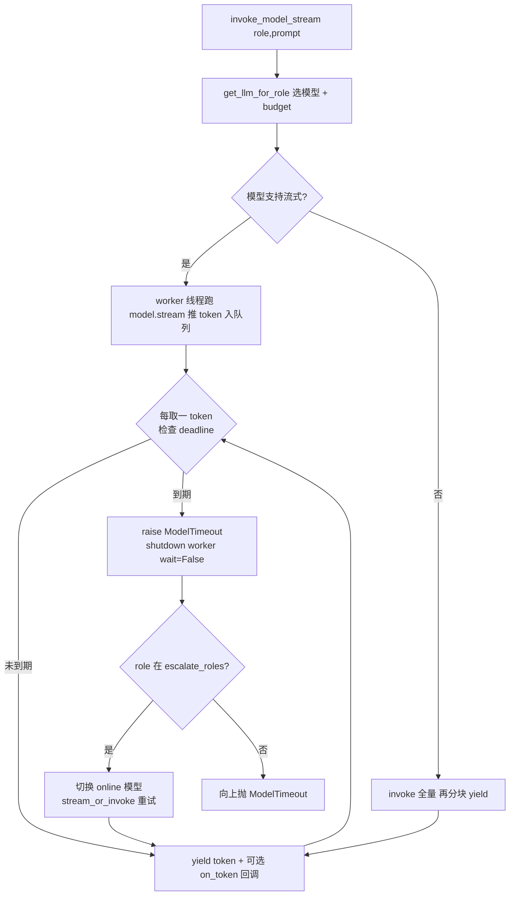

# 流式模型调用（P1-2 子任务）

> 归属：Role 1 PM（`specs/<feature-slug>/<NAME>.md`）
> 关联：阶段一 `specs/PHASE1_PLAN.md` 的 P1-2；与 P1-1（事件总线）为 W0 地基双件。
> 性质：**开发就绪的子任务 spec**（含 `## Acceptance Criteria` + `## Test Scenarios`，每条 AC 1:1 映射回归用例）。
> 已拍板前提：P1-2 无待定设计项。核心约束 = 在开启流式的同时**保留 wall-clock 超时守护**（解决 `infrastructure/config.py:_invoke_with_timeout` 当前刻意关流式的权衡）。

---

## 1. 范围与边界

本 spec 只覆盖「**模型调用的流式化 + 超时守护 + 升级**」这一底层能力：

### 要做什么
1. 新增 `invoke_model_stream(role, prompt, retry_count=0, difficulty=None, on_token=None, **kwargs)`：返回 token 迭代器（`str` 序列，每个为模型产出的文本片段）。
2. **保留 wall-clock 超时守护**：流式调用同样受 `models.yaml` 各模型 `timeout` 约束；到期必须中断（raise `ModelTimeout`），不能因 httpx read-timeout 被流式「绕开」而挂死。
3. **升级行为对齐 `invoke_model`**：到期触发 `ModelTimeout` 后，escalatable 角色自动切换到 online 模型（逻辑同 `infrastructure/config.py:216-245` 的 `invoke_model`）。
4. **非流式降级**：若底层模型/配置不支持流式，退化为「先 `invoke` 全量、再按块 yield」。

### 不做什么（本任务边界）
- token 事件的「消费侧展示」（SSE 转发、前端 typewriter）——属 P1-3 / P1-5。
- 取消/中止（生成中点停）——属 P1-4（但本任务的 `on_token` 钩子可为 P1-4 提供可中断检查点）。
- 默认模型 / thinking 调优——属 P1-9。

---

## 2. 处理流程（mermaid）

---

## 3. 组件与契约（供 Dev 实现参考，非代码）

### 3.1 入口 `infrastructure/config.py`
- 新增 `invoke_model_stream(...)`，签名对齐 `invoke_model(role, prompt, retry_count=0, difficulty=None, **kwargs)`，并增 `on_token: Callable[[str], None] | None = None`。
- **超时守护实现（关键）**：`model.stream(...)` 不触发 httpx read-timeout（见现有注释 `config.py:195-199`），故需自管 wall-clock：
  - 推荐：worker 线程跑 `model.stream(prompt)`，逐块 `queue.put(chunk)`；主线程 `queue.get(timeout=...)` 并在每次 yield 前检查 `time.monotonic() > deadline`；到期 `raise ModelTimeout` 并 `ex.shutdown(wait=False)`（与现有 `_invoke_with_timeout` 的「留挂起请求在后台」策略一致）。
  - 不允许无 deadline 的裸 `for chunk in model.stream(...)`。
- **升级逻辑**：`except ModelTimeout` 分支完全复用 `invoke_model` 的升级代码（`config.py:233-245`）：`role in _ESCALATE_ROLES` 且 online != local 时，换 online 模型重试（online 同样走流式或退化 invoke）。
- **非流式降级**：若 `model` 无 stream 能力或配置 `stream: false`，则 `resp = model.invoke(prompt)` 后按固定大小（如每 N 字符/每行）yield，并仍受 budget 守护（invoke 已自带超时）。

### 3.2 token 契约
- yield 类型为 `str`（chunk 的 `.content`）。调用方（节点）负责累加为完整文本以还原 `response.content` 语义。
- `on_token`：每 yield 前调用一次（可选），供 P1-1 总线 emit `TOKEN` 事件；本任务不强制传入，保持可独立测试。

### 3.3 节点适配（最小约定，同 PR 薄封装）
- `code_generator_node` 改为：
  `chunks = list(invoke_model_stream(PromptKey.CODE_GENERATOR, prompt, difficulty=state.get(StateKey.DIFFICULTY), on_token=token_emitter))`，然后 `FINAL_OUTPUT = "".join(chunks)`。
- 此适配确保现有 `response.content` 消费方（`code_executor_node` / `code_verifier_node`）零改动；也为 P1-3 直接订阅总线拿 token 铺路。
- 同理 `code_fixer_node`、`general_assistant_node` 可后续切换；本任务至少覆盖 `code_generator_node` 的流式+累加。

### 3.4 事件类型（与 P1-1 对齐）
- `EventType.TOKEN` 由 P1-1 在 `infrastructure/constants.py` 定义；本任务仅引用。若 P1-1 尚未合入，可临时本地定义并标注 TODO 不重复定义，合入时统一。

---

## 4. Acceptance Criteria

### ST-01 — 首个 token 早于完整内容
- **Given** stub 流式模型（逐字符 yield）。
- **When** 消费 `invoke_model_stream` 迭代器。
- **Then** 在拿到完整拼接文本之前，已收到 ≥1 个 token（首个 token 延迟远小于总时长）。

### ST-02 — 超时即中断并升级
- **Given** 本地模型 budget 设为极小值（如 0.01s），stub 流式缓慢。
- **When** 调用 `invoke_model_stream`。
- **Then** 在 budget 内 raise `ModelTimeout`；且若 `role` 属 `escalate_roles`，最终在 online 模型上拿到结果（行为与 `invoke_model` 超时升级一致），不挂死。

### ST-03 — 流式/非流式终态一致
- **Given** 同一 coding 题，分别用流式 / 非流式（降级）两条路径跑完整管线。
- **When** 比对终态。
- **Then** 两者 `FINAL_OUTPUT` 拼接文本一致，且下游编译/验证结果相同（无因流式引入的字符截断/重复）。

### ST-04 — 非流式降级可用
- **Given** 模型/配置标记不支持流式。
- **When** 调用 `invoke_model_stream`。
- **Then** 仍按块 yield 完整文本（非抛 `NotImplementedError`），且受 budget 守护。

### ST-05 — on_token 回调被逐 token 调用
- **Given** 传入 `on_token=collect`。
- **When** 流式产出。
- **Then** `collect` 被调用次数 == yield token 数，顺序一致（为 P1-1 token 事件与 P1-3 SSE 提供钩子）。

---

## 5. Test Scenarios（映射回归用例）

> 回归用例位置：`features/solver/tests/test_streaming_regression.py`（参照 `test_verifier_regression.py` 用 stub LLM）。

| 场景 | 覆盖 AC | 说明 |
|------|---------|------|
| stub 流式逐字符 → 首个 token 早于全量 | ST-01 | 断言 yield 序中首个 token 索引 < 末尾 |
| budget 极小 + 慢 stub → ModelTimeout + online 升级拿到结果 | ST-02 | 断言最终结果非空且来自 online |
| 流式 vs 降级 跑同题 → FINAL_OUTPUT 与 verify 一致 | ST-03 | 两条路径比对终态 |
| 标记不支持流式 → 分块 yield 完整文本 | ST-04 | 断言不抛错且文本完整 |
| on_token 计数 == token 数 | ST-05 | 断言回调调用次数 |

---

## 6. 依赖与注意

- 依赖：无（可与 P1-1 并行）。建议同批 W0 交付，使 W1（SSE）可直接订阅 `TOKEN` 事件。
- 注意：绝不能因开启流式而让调用「挂死超过 budget」——这是本任务核心验收（ST-02）；worker 线程 `shutdown(wait=False)` 与现有 `invoke` 分支策略保持一致。
- 注意：升级重试同样须受 online 的 budget 守护（复用 `_TIMEOUT_BY_OLLAMA_MODEL`）。
- 注意：`on_token` 默认 `None`，保证 P1-2 可脱离 P1-1 独立单测；集成时的 token 事件由节点层传入（见 §3.3）。
